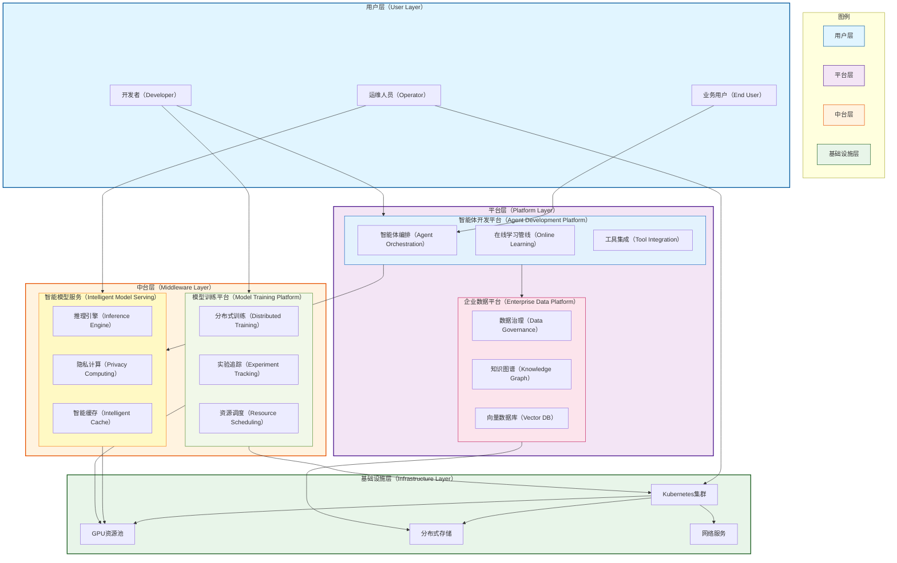

# OpenEAAP

<!--
<p align="center">
  
</p>
-->


<p align="center">
  <strong>开放企业AI智能体平台</strong><br/>
  <em>用智能体构建企业AI的未来</em>
</p>

<p align="center">
  <a href="#"></a>
  <a href="#许可证"></a>
  <a href="#"></a>
  <a href="#"></a>
  <a href="README.md"></a>
</p>

---

## 🎯 目标

**OpenEAAP（开放企业AI智能体平台）** 是一个开源的云原生平台，旨在为企业提供生产就绪的AI智能体能力。我们的使命是通过提供一个全面的生态系统来实现企业AI的民主化，该生态系统支持持续学习、智能自动化以及跨垂直业务、基础设施和AI领域的无缝集成。

AI在网络安全和企业运营中的变革力量应该是可访问的、可扩展的和可持续的。OpenEAAP弥合了前沿AI研究与现实企业部署之间的鸿沟，提供了一个强大的中台平台，将AI潜力转化为竞争优势。

---

## 🔥 为什么选择OpenEAAP?

### 企业AI面临的挑战

现代企业在采用AI时面临关键痛点:

* **碎片化的AI基础设施**: 团队在模型开发、数据管理和部署方面使用的工具互不连接
* **有限的学习能力**: 传统机器学习系统缺乏持续学习和适应机制
* **数据孤岛**: 企业知识分散在各个系统中,难以构建有效的AI应用
* **部署复杂性**: 从原型到生产级AI服务的过渡仍然过于复杂
* **安全和隐私顾虑**: 企业AI必须满足严格的安全、合规和隐私要求

### OpenEAAP的解决方案

OpenEAAP通过统一的企业级平台解决这些挑战:

* **统一的AI开发体验** - 从数据摄入到模型部署的一体化平台
* **持续学习架构** - 从生产反馈中学习和改进的智能体
* **企业级数据平台** - 自动化数据治理、知识图谱和向量数据库
* **生产就绪的基础设施** - Kubernetes原生部署,支持自动扩展和高可用性
* **隐私优先设计** - 内置数据隔离、加密和合规框架
* **开放标准与可扩展性** - 支持自定义模型、工具和集成的插件架构

---

## ✨ 核心功能特性

### 🤖 智能体开发平台

构建具有终身学习能力的复杂AI智能体:

* **多智能体编排**: 协调专业化智能体处理复杂工作流
* **在线学习管线**: 从用户反馈和生产数据中持续改进
* **工具集成框架**: 可扩展的插件系统,支持外部API和服务
* **对话管理**: 高级对话状态跟踪和上下文处理
* **记忆系统**: 长期和短期记忆,支持检索增强生成（RAG）

### 📊 企业数据平台

将原始数据转化为AI就绪的知识:

* **自动化数据治理**: 模式检测、质量监控和血缘追踪
* **知识图谱构建**: 自动实体抽取和关系映射
* **向量数据库服务**: 高性能相似度搜索和混合检索
* **数据反馈闭环**: 捕获生产交互以改进模型
* **特征工程**: 自动化特征提取和ML模型服务

### 🚀 云原生AI基础设施

高效、可扩展的AI工作负载基础设施:

* **多租户GPU调度**: 细粒度资源分配和公平共享调度
* **模型服务引擎**: 低延迟推理,支持自动批处理和缓存
* **开发环境**: 预配置的Jupyter、VSCode和IDE集成
* **AI的CI/CD**: 自动化测试、版本控制和部署管道
* **可观测性栈**: AI服务的全面指标、日志和追踪

### 🧠 智能模型服务

高性能推理与高级优化:

* **隐私保护推理**: 支持联邦学习和差分隐私
* **智能缓存**: 针对频繁查询的多级缓存层次结构
* **请求路由**: 基于成本、延迟和准确性的动态模型选择
* **安全传输**: 敏感数据的端到端加密
* **多模型服务**: A/B测试和渐进式发布能力

### 🎓 模型训练平台

简化自定义模型的训练流程:

* **资源配额管理**: 跨团队和项目的公平分配
* **分布式训练**: 内置支持PyTorch DDP、DeepSpeed和Horovod
* **实验追踪**: 集成MLflow实现版本控制和可重现性
* **超参数调优**: 使用Optuna和Ray Tune进行自动优化
* **数据集管理**: 版本化数据集,支持高效加载和预处理

---

## 🏗️ 架构概览

OpenEAAP遵循云原生微服务架构,专为可扩展性和弹性而设计。该平台组织为五个核心层:



**核心组件:**

1. **智能体开发平台**: 构建、训练和部署具有持续学习能力的智能体
2. **企业数据平台**: 统一的数据治理、知识管理和向量搜索
3. **智能模型服务**: 生产级推理,支持隐私保护、缓存和路由
4. **模型训练平台**: 分布式训练基础设施和实验管理
5. **云基础设施**: Kubernetes原生基础,支持GPU调度和存储

详细的架构文档请参阅 [docs/architecture.md](docs/architecture.md)。

---

## 🚀 快速开始

### 前置要求

- **Go** >= 1.21 (后端服务)
- **Python** >= 3.9 (AI/ML组件)
- **Docker** >= 20.10
- **Kubernetes** >= 1.24 (生产部署)
- **NVIDIA GPU** 配备 CUDA >= 11.8 (模型训练/服务)

### 安装

#### 安装CLI工具

```bash
# 安装 OpenEAAP CLI (Go)
go install github.com/openeaap/openeaap/cmd/eaap@latest

# 安装 Python SDK
pip install openeaap-sdk
````

#### 使用Docker Compose快速启动

```bash
# 克隆仓库
git clone https://github.com/openeaap/openeaap.git
cd openeaap

# 启动本地开发环境
docker-compose up -d

# 验证安装
eaap version
eaap status
```

#### 在Kubernetes上生产部署

```bash
# 添加Helm仓库
helm repo add openeaap https://charts.openeaap.io
helm repo update

# 安装OpenEAAP
helm install openeaap openeaap/openeaap \
  --namespace openeaap \
  --create-namespace \
  --set global.domain=your-domain.com

# 检查部署状态
kubectl get pods -n openeaap
```

---

## 💡 使用示例

### 示例1: 构建安全分析智能体

创建一个智能体,分析安全日志并提供威胁洞察:

```python
from openeaap.agent import Agent, Tool
from openeaap.data import VectorStore
from openeaap.llm import ChatModel

# 初始化向量存储用于知识检索
knowledge_base = VectorStore(
    collection="security_knowledge",
    embedding_model="bge-large-zh-v1.5"
)

# 定义自定义工具
class ThreatIntelligenceTool(Tool):
    def execute(self, query: str) -> dict:
        # 查询外部威胁情报API
        return {"threats": [...], "severity": "high"}

# 创建具有RAG能力的智能体
security_agent = Agent(
    name="SecurityAnalyst",
    llm=ChatModel("gpt-4"),
    tools=[ThreatIntelligenceTool()],
    memory=knowledge_base,
    learning_mode="online"  # 启用持续学习
)

# 处理安全事件
result = security_agent.chat(
    """分析这个可疑的登录事件:
    - 用户: admin@company.com
    - IP: 45.142.212.61
    - 时间: 2026-01-14 03:42:18 UTC
    - 失败尝试: 2分钟内15次
    """
)

print(result.response)
# 输出: "检测到来自已知恶意IP的高严重性暴力破解攻击..."
print(result.confidence_score)  # 0.94
print(result.sources)  # ["threat_db", "cve_2024_1234", "historical_incidents"]

# 智能体自动从此交互中学习
security_agent.add_feedback(
    interaction_id=result.id,
    feedback="correct_analysis",
    expert_annotation="确认为APT28模式"
)
```

### 示例2: 数据处理管线

构建自动化数据管线,摄入文档、提取实体并构建知识图谱:

```python
from openeaap.data import DataPipeline, KnowledgeGraph
from openeaap.processing import DocumentParser, EntityExtractor

# 创建数据处理管线
pipeline = DataPipeline(name="enterprise_knowledge")

# 定义处理阶段
pipeline.add_stage(
    DocumentParser(
        formats=["pdf", "docx", "html"],
        chunk_size=512,
        overlap=50
    )
)

pipeline.add_stage(
    EntityExtractor(
        model="bert-base-ner",
        entity_types=["person", "organization", "location", "product"]
    )
)

# 连接到知识图谱
kg = KnowledgeGraph(database="neo4j://localhost:7687")
pipeline.add_sink(kg)

# 处理文档批次
results = pipeline.process(
    source="s3://company-docs/security-policies/",
    metadata={"department": "security", "year": 2026}
)

print(f"已处理 {results.documents} 个文档")
print(f"提取了 {results.entities} 个实体")
print(f"创建了 {results.relationships} 个关系")

# 查询知识图谱
related_policies = kg.query(
    """
    MATCH (p:Policy)-[:RELATES_TO]->(threat:Threat)
    WHERE threat.severity = 'critical'
    RETURN p.name, p.last_updated
    ORDER BY p.last_updated DESC
    LIMIT 5
    """
)
```

### 示例3: 隐私保护的模型部署

部署具有差分隐私和安全推理的敏感模型:

```python
from openeaap.serving import ModelServer, PrivacyConfig
from openeaap.models import FineTunedModel

# 加载微调模型
model = FineTunedModel.load("./models/customer_sentiment_analyzer")

# 配置隐私保护推理
privacy_config = PrivacyConfig(
    differential_privacy=True,
    epsilon=1.0,  # 隐私预算
    delta=1e-5,
    secure_aggregation=True,
    homomorphic_encryption=False  # 可选,用于更高安全性
)

# 部署具有缓存和路由的模型
server = ModelServer(
    model=model,
    privacy=privacy_config,
    cache_strategy="semantic",  # 缓存相似查询
    routing_policy="cost_optimized",  # 平衡成本与延迟
    max_batch_size=32,
    timeout_ms=500
)

# 启动服务
server.start(host="0.0.0.0", port=8080)

# 客户端使用
from openeaap.client import InferenceClient

client = InferenceClient("http://localhost:8080")
result = client.predict(
    text="产品质量超出了我的预期!",
    return_confidence=True
)

print(result.sentiment)  # "positive"
print(result.confidence)  # 0.92
print(result.latency_ms)  # 23 (受益于缓存)
```

### 示例4: 多智能体协作

编排多个专业化智能体解决复杂的安全事件响应:

```python
from openeaap.agent import MultiAgentSystem, Agent

# 定义专业化智能体
detective_agent = Agent(
    name="Detective",
    role="事件调查和证据收集",
    llm="gpt-4",
    tools=["log_analyzer", "network_scanner"]
)

analyst_agent = Agent(
    name="Analyst",
    role="威胁分类和影响评估",
    llm="claude-3",
    tools=["threat_intel", "vulnerability_db"]
)

responder_agent = Agent(
    name="Responder",
    role="缓解策略和行动计划",
    llm="gpt-4",
    tools=["firewall_api", "user_management"]
)

# 创建多智能体系统
incident_response = MultiAgentSystem(
    agents=[detective_agent, analyst_agent, responder_agent],
    coordinator="hierarchical",  # 或 "democratic"
    communication_protocol="shared_memory"
)

# 处理安全事件
response = incident_response.execute(
    task="""
    调查并响应潜在的数据泄露:
    - 检测到异常出站流量: 15GB到未知IP
    - 受损用户: developer_john
    - 时间窗口: 最近6小时
    """,
    max_iterations=10
)

# 系统自动协调智能体:
# 1. Detective: 分析日志,发现可疑命令
# 2. Analyst: 分类为内部威胁,评估数据泄露
# 3. Responder: 禁用账户,阻止IP,触发备份恢复

print(response.summary)
print(response.actions_taken)
print(response.agent_interactions)  # 完整协作记录
```

---

## 📚 文档资源

* **[架构指南](docs/architecture.md)** - 详细的系统设计和组件规范
* **[API参考](docs/api/)** - 所有服务的完整API文档
* **[用户指南](docs/user-guide/)** - 分步教程和最佳实践
* **[开发指南](docs/development/)** - 贡献指南和开发环境设置
* **[部署指南](docs/deployment/)** - 生产部署策略

---

### 开发环境设置

```bash
# 克隆您的fork
git clone https://github.com/turtacn/openeaap.git
cd openeaap

# 安装开发依赖
make dev-setup

# 运行测试
make test

# 启动本地开发环境
make dev-up
```


## 📄 许可证

OpenEAAP采用 **Apache License 2.0** 许可。完整详情请参见 [LICENSE](LICENSE)。

```
Copyright 2026 OpenEAAP Contributors

根据Apache许可证2.0版("许可证")获得许可;
除非遵守许可证,否则您不得使用此文件。
您可以在以下网址获得许可证副本:

    http://www.apache.org/licenses/LICENSE-2.0

除非适用法律要求或书面同意,否则根据许可证分发的软件
是在"按原样"基础上分发的,不附带任何明示或暗示的保证或条件。
请参阅许可证以了解许可证下的特定语言管理权限和限制。
```

---

## 🙏 致谢

OpenEAAP站在巨人的肩膀上。我们感谢:

* **Kubernetes社区** 提供云原生基础设施模式
* **LangChain** 和 **LlamaIndex** 提供智能体框架灵感
* **Ray** 和 **Kubeflow** 提供分布式ML基础设施
* **Anthropic**、**OpenAI** 和 **Google** 推进LLM能力

---

## 🔗 快速链接

* 📘 [英文文档](README.md)
* 📙 [中文文档](README-zh.md)
* 🏛️ [架构概览](docs/architecture.md)
* 🚀 [快速开始指南](docs/getting-started.md)
* 💬 [社区论坛](https://community.openeaap.io)


---

## 📖 参考资料

本文档在设计和实现过程中参考了以下资源:

### 智能体框架与开发

[1] LangChain - Building applications with LLMs through composability
[https://github.com/langchain-ai/langchain](https://github.com/langchain-ai/langchain)

[2] LlamaIndex - Data framework for LLM applications
[https://github.com/run-llama/llama_index](https://github.com/run-llama/llama_index)

[3] AutoGPT - An experimental open-source attempt to make GPT-4 autonomous
[https://github.com/Significant-Gravitas/AutoGPT](https://github.com/Significant-Gravitas/AutoGPT)

[4] Microsoft Semantic Kernel - Integrate AI into apps
[https://github.com/microsoft/semantic-kernel](https://github.com/microsoft/semantic-kernel)

[5] Anthropic Claude - Constitutional AI and helpful, harmless, and honest AI
[https://www.anthropic.com/claude](https://www.anthropic.com/claude)

### 云原生AI基础设施

[6] Kubernetes - Production-Grade Container Orchestration
[https://kubernetes.io/](https://kubernetes.io/)

[7] Kubeflow - Machine Learning Toolkit for Kubernetes
[https://www.kubeflow.org/](https://www.kubeflow.org/)

[8] Ray - Distributed computing framework for ML workloads
[https://www.ray.io/](https://www.ray.io/)

[9] KServe - Standardized Serverless ML Inference Platform
[https://kserve.github.io/website/](https://kserve.github.io/website/)

[10] NVIDIA Triton Inference Server - AI model serving
[https://github.com/triton-inference-server/server](https://github.com/triton-inference-server/server)

### 数据平台与向量数据库

[11] Milvus - Vector database for AI applications
[https://milvus.io/](https://milvus.io/)

[12] Weaviate - Vector search engine
[https://weaviate.io/](https://weaviate.io/)

[13] Qdrant - Vector similarity search engine
[https://qdrant.tech/](https://qdrant.tech/)

[14] Neo4j - Graph database platform
[https://neo4j.com/](https://neo4j.com/)

[15] Apache Airflow - Platform for data pipeline orchestration
[https://airflow.apache.org/](https://airflow.apache.org/)

### 模型训练与优化

[16] PyTorch - Machine learning framework
[https://pytorch.org/](https://pytorch.org/)

[17] DeepSpeed - Deep learning optimization library
[https://www.deepspeed.ai/](https://www.deepspeed.ai/)

[18] Horovod - Distributed deep learning training framework
[https://github.com/horovod/horovod](https://github.com/horovod/horovod)

[19] MLflow - Platform for ML lifecycle management
[https://mlflow.org/](https://mlflow.org/)

[20] Weights & Biases - Developer tools for ML
[https://wandb.ai/](https://wandb.ai/)

### 隐私计算与联邦学习

[21] OpenMined PySyft - Privacy-preserving ML framework
[https://github.com/OpenMined/PySyft](https://github.com/OpenMined/PySyft)

[22] TensorFlow Federated - Framework for federated learning
[https://www.tensorflow.org/federated](https://www.tensorflow.org/federated)

[23] Flower - Federated learning framework
[https://flower.dev/](https://flower.dev/)

[24] Differential Privacy - Google's DP library
[https://github.com/google/differential-privacy](https://github.com/google/differential-privacy)

### 企业AI最佳实践

[25] Google - Machine Learning Systems Design
[https://developers.google.com/machine-learning/guides/rules-of-ml](https://developers.google.com/machine-learning/guides/rules-of-ml)

[26] Microsoft - Responsible AI principles
[https://www.microsoft.com/en-us/ai/responsible-ai](https://www.microsoft.com/en-us/ai/responsible-ai)

[27] AWS - Well-Architected Framework for ML
[https://aws.amazon.com/architecture/well-architected/](https://aws.amazon.com/architecture/well-architected/)

[28] MLOps Community - Best practices for production ML
[https://mlops.community/](https://mlops.community/)

