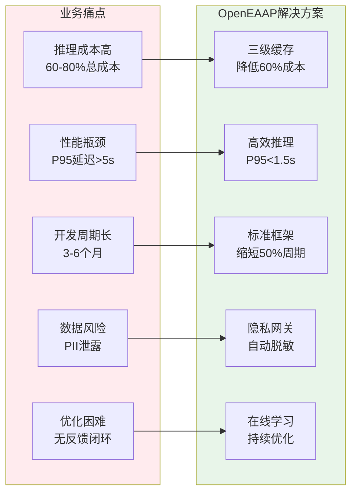
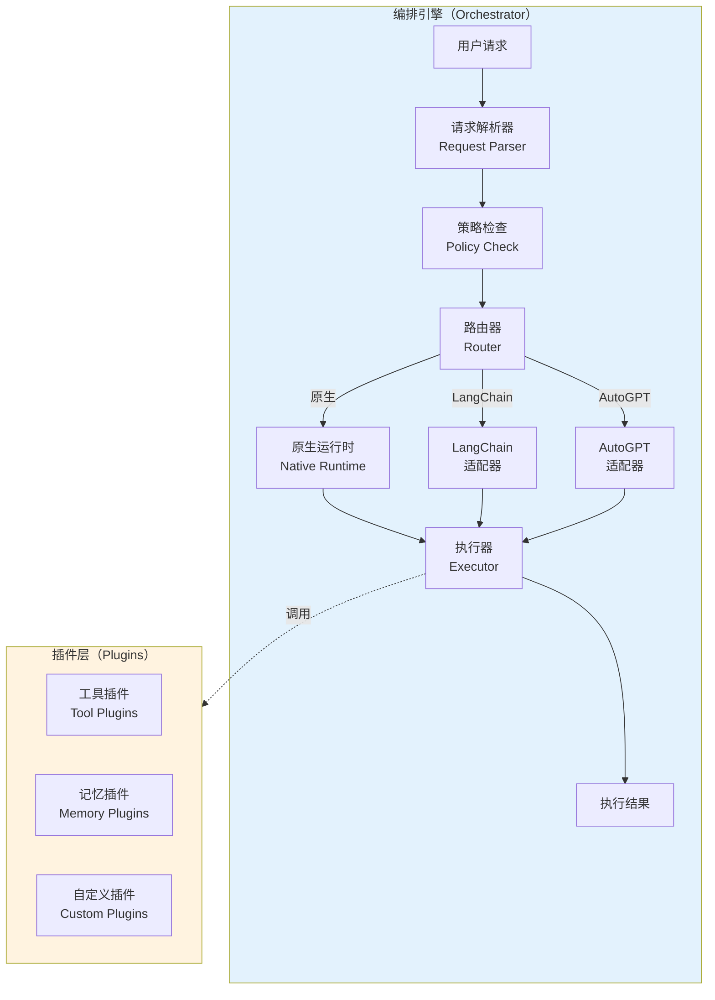
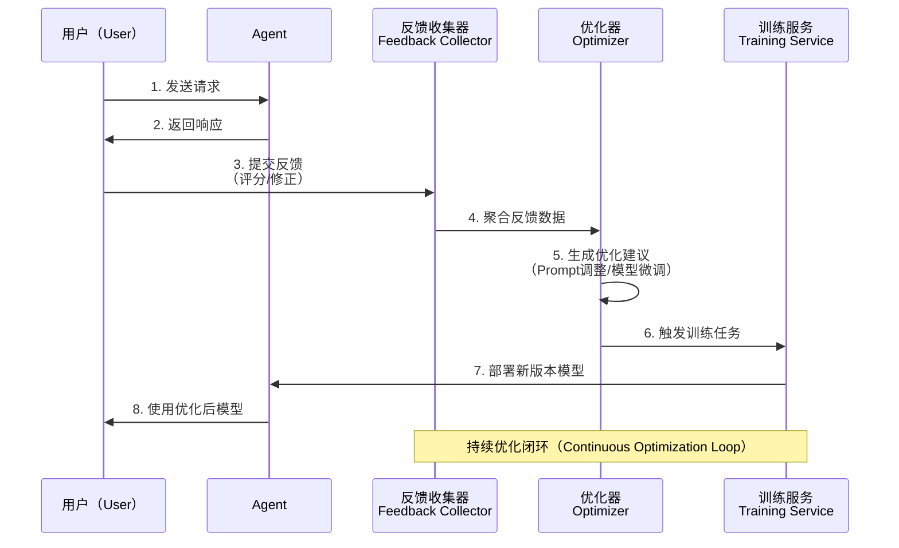
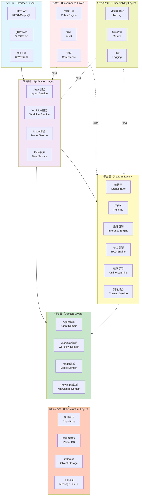
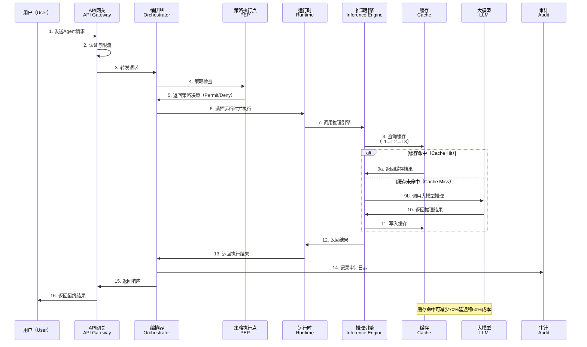
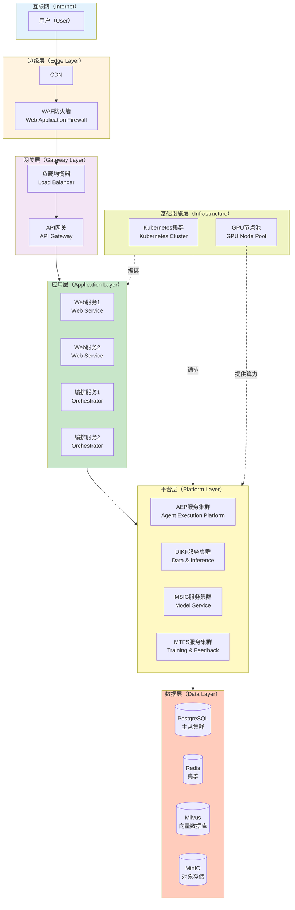

# OpenEAAP (Open Enterprise AI Agent Platform)

<div align="center">

[](LICENSE)
[](https://go.dev/)
[](https://github.com/openeeap/openeeap/actions)
[](https://codecov.io/gh/openeeap/openeeap)

**企业级 AI Agent 平台 | 高性能 | 低成本 | 开箱即用**

[快速开始](#快速开始) • [架构文档](docs/architecture.md) • [API 文档](docs/apis.md) • [English](README.md)  

</div>

---

## 📖 目录

* [项目背景](#项目背景)
* [核心特性](#核心特性)
* [架构概览](#架构概览)
* [技术栈](#技术栈)
* [快速开始](#快速开始)
* [使用示例](#使用示例)
* [性能指标](#性能指标)
* [路线图](#路线图)
* [贡献指南](#贡献指南)
* [社区与支持](#社区与支持)
* [许可证](#许可证)
* [参考资料](#参考资料)

---

## 🎯 项目背景

### 业务挑战

在企业 AI 应用落地过程中，我们面临以下核心挑战：

1. **推理成本高昂**：大模型推理成本占 AI 应用总成本的 60%-80%，严重制约规模化应用
2. **性能瓶颈突出**：推理延迟高（P95 > 5s），难以满足实时交互需求
3. **开发效率低下**：从 0 到 1 构建 Agent 需要 3-6 个月，缺乏标准化框架
4. **数据安全风险**：敏感数据（PII）泄露风险、缺乏隐私保护机制
5. **持续优化困难**：缺乏反馈闭环，模型性能无法持续改进

### 解决方案

OpenEAAP（Open Enterprise AI Agent Platform）是一个**企业级 AI Agent 平台**，旨在解决上述痛点：



---

## ✨ 核心特性

### 1️⃣ 高性能推理引擎

* **三级智能缓存**：L1 本地（<1ms）+ L2 Redis（<10ms）+ L3 向量（<50ms），命中率 50%+
* **vLLM 集成**：PagedAttention、KV-Cache 共享、投机解码，吞吐量提升 24 倍
* **智能路由**：根据复杂度、延迟要求、成本预算自动选择最优模型

**效果对比**：

| 指标      | 优化前             | 优化后             | 提升幅度     |
| ------- | --------------- | --------------- | -------- |
| P95 延迟  | 5000ms          | 1500ms          | ⬇️ 70%   |
| 推理成本    | $1.00/1K tokens | $0.40/1K tokens | ⬇️ 60%   |
| GPU 利用率 | 40%             | 75%             | ⬆️ 87.5% |

### 2️⃣ 灵活编排引擎

* **多运行时支持**：原生（Native）、LangChain、AutoGPT 无缝切换
* **可视化编排**：通过 YAML/JSON 定义 Agent 和 Workflow，低代码开发
* **插件生态**：支持第三方插件动态加载，扩展能力无限



### 3️⃣ 企业级 RAG 引擎

* **混合检索**：向量 + 关键词 + 知识图谱三路召回，精度提升 30%
* **智能重排序**：基于相关性、新鲜度、权威性多维度优化
* **答案验证**：幻觉检测 + 引用核查，确保生成质量

### 4️⃣ 在线学习与持续优化

* **RLHF/DPO 训练**：基于人类反馈持续优化模型
* **Prompt 自动优化**：自动发现和优化 Prompt 模板
* **A/B 测试**：多版本并行测试，快速验证优化效果



### 5️⃣ 全方位安全与治理

* **隐私计算网关**：自动检测和脱敏 PII（姓名、邮箱、电话等）
* **策略引擎**：基于 ABAC/RBAC 的细粒度访问控制
* **全链路审计**：记录所有操作，满足 SOC2/GDPR/PCI-DSS 合规要求

---

## 🏗️ 架构概览

### 系统分层架构

OpenEAAP 采用经典的 **DDD（领域驱动设计）分层架构**，清晰的职责划分确保系统的可维护性和扩展性。



**各层职责**：

| 层次        | 职责                 | 示例组件                                     |
| --------- | ------------------ | ---------------------------------------- |
| **接口层**   | 对外暴露 API，处理请求/响应   | HTTP Handler、gRPC Server、CLI 命令          |
| **应用层**   | 编排业务流程，协调多个领域服务    | AgentService、WorkflowService             |
| **平台层**   | 核心能力组件，编排、推理、RAG 等 | Orchestrator、Inference Engine、RAG Engine |
| **领域层**   | 业务核心逻辑，领域实体和领域服务   | Agent、Workflow、Model 实体和领域服务             |
| **基础设施层** | 数据持久化和外部系统集成       | PostgreSQL、Redis、Milvus、MinIO            |
| **治理层**   | 安全、合规、审计           | 策略引擎、审计日志、PII 检测                         |
| **可观测性层** | 监控、追踪、日志           | OpenTelemetry、Prometheus、Loki            |

### 核心组件交互流程

以下时序图展示了一次完整的 Agent 执行请求的处理流程：



### 部署架构

OpenEAAP 支持灵活的部署方式，可根据业务规模选择单机部署或分布式集群部署。



**部署要点**：

* **边缘层**：CDN 加速静态资源，WAF 防护 Web 攻击
* **网关层**：负载均衡 + API 网关统一入口，集成认证、限流、路由
* **应用层**：无状态服务，支持水平扩展
* **平台层**：核心能力组件，按业务模块拆分微服务
* **数据层**：主从架构保证高可用，分布式存储保证性能
* **基础设施层**：Kubernetes 编排，GPU 节点池支持模型推理和训练

---

## 🛠️ 技术栈

| 类别         | 技术选型                    | 用途          |
| ---------- | ----------------------- | ----------- |
| **语言**     | Go 1.21+                | 高性能后端服务     |
| **Web 框架** | Gin / Echo              | HTTP API 服务 |
| **RPC 框架** | gRPC                    | 高性能内部通信     |
| **数据库**    | PostgreSQL 14+          | 关系型数据存储     |
| **缓存**     | Redis 7+                | 分布式缓存       |
| **向量数据库**  | Milvus 2.3+             | 向量检索        |
| **对象存储**   | MinIO / S3              | 文件存储        |
| **消息队列**   | Kafka / NATS            | 异步任务和事件驱动   |
| **推理引擎**   | vLLM                    | 高性能 LLM 推理  |
| **训练框架**   | DeepSpeed / Megatron-LM | 分布式训练       |
| **容器化**    | Docker                  | 应用打包        |
| **编排**     | Kubernetes              | 容器编排        |
| **监控**     | Prometheus + Grafana    | 指标监控        |
| **追踪**     | OpenTelemetry + Jaeger  | 分布式追踪       |
| **日志**     | Loki                    | 日志聚合        |

---

## 🚀 快速开始

### 前置要求

* **Go** 1.21 或更高版本
* **Docker** 和 **Docker Compose**（用于本地开发）
* **Kubernetes** 1.25+（用于生产部署）
* **PostgreSQL** 14+、**Redis** 7+、**Milvus** 2.3+（可通过 Docker Compose 快速启动）

### 本地开发环境搭建

#### 1. 克隆仓库

```bash
git clone https://github.com/openeeap/openeeap.git
cd openeeap
```

#### 2. 启动依赖服务

使用 Docker Compose 快速启动 PostgreSQL、Redis、Milvus、MinIO 等依赖服务：

```bash
docker-compose up -d
```

#### 3. 初始化数据库

运行数据库迁移脚本，创建表结构：

```bash
make migrate-up
```

#### 4. 配置环境变量

复制配置文件模板并根据实际环境修改：

```bash
cp configs/development.yaml.example configs/development.yaml
# 编辑 configs/development.yaml，配置数据库连接、Redis、Milvus 等
```

#### 5. 启动服务

```bash
# 启动 HTTP 服务
make run-server

# 或者使用 Go 命令直接运行
go run cmd/server/main.go --config configs/development.yaml
```

服务启动后，可以通过以下地址访问：

* **HTTP API**: `http://localhost:8080`
* **gRPC API**: `localhost:9090`
* **Swagger UI**: `http://localhost:8080/swagger/index.html`

#### 6. 运行测试

```bash
# 运行所有测试
make test

# 运行单元测试
make test-unit

# 运行集成测试
make test-integration

# 查看测试覆盖率
make test-coverage
```

---

## 💡 使用示例

### 示例 1：创建一个简单的 Agent

通过 HTTP API 创建一个基于 GPT-4 的客服 Agent：

```bash
curl -X POST http://localhost:8080/api/v1/agents \
  -H "Content-Type: application/json" \
  -d '{
    "name": "客服助手（Customer Support Agent）",
    "description": "自动回答客户常见问题",
    "runtime_type": "native",
    "config": {
      "model": "gpt-4",
      "temperature": 0.7,
      "max_tokens": 500,
      "system_prompt": "你是一个专业的客服助手，负责回答客户关于产品的问题。"
    }
  }'
```

**响应示例**：

```json
{
  "id": "agent-123456",
  "name": "客服助手（Customer Support Agent）",
  "status": "active",
  "created_at": "2026-01-15T10:30:00Z"
}
```

### 示例 2：执行 Agent 任务

向 Agent 发送请求，获取智能响应：

```bash
curl -X POST http://localhost:8080/api/v1/agents/agent-123456/execute \
  -H "Content-Type: application/json" \
  -d '{
    "input": "你们的产品支持哪些支付方式？",
    "context": {
      "user_id": "user-789",
      "session_id": "session-abc"
    }
  }'
```

**响应示例**：

```json
{
  "output": "我们支持以下支付方式：1. 支付宝 2. 微信支付 3. 信用卡（Visa、MasterCard）4. 银行转账。您可以在结账时选择最便捷的方式。",
  "execution_time_ms": 1200,
  "cached": false,
  "trace_id": "trace-xyz789"
}
```

### 示例 3：创建 Workflow

定义一个多步骤的 Workflow（例如：文档分析流程）：

```yaml
# workflow.yaml
name: 文档分析流程（Document Analysis Workflow）
description: 自动分析上传的合同文档并提取关键信息
steps:
  - id: step1
    name: 文档解析（Document Parsing）
    agent: document-parser
    input: "${workflow.input.document_url}"
  
  - id: step2
    name: 信息提取（Information Extraction）
    agent: info-extractor
    input: "${step1.output.text}"
    depends_on:
      - step1
  
  - id: step3
    name: 风险评估（Risk Assessment）
    agent: risk-analyzer
    input: "${step2.output.entities}"
    depends_on:
      - step2

trigger:
  type: manual
```

**通过 CLI 创建 Workflow**：

```bash
openeeap workflow create -f workflow.yaml
```

**运行 Workflow**：

```bash
openeeap workflow run document-analysis-workflow \
  --input '{"document_url": "https://example.com/contract.pdf"}'
```

---

## 📊 性能指标

### 推理性能

基于真实业务负载的性能测试结果（100 并发用户，持续 10 分钟）：

| 指标         | OpenEAAP（优化后）   | 传统方案（优化前）       | 提升幅度     |
| ---------- | --------------- | --------------- | -------- |
| **P50 延迟** | 800ms           | 2500ms          | ⬇️ 68%   |
| **P95 延迟** | 1500ms          | 5000ms          | ⬇️ 70%   |
| **P99 延迟** | 2200ms          | 8000ms          | ⬇️ 72.5% |
| **QPS**    | 120             | 45              | ⬆️ 166%  |
| **缓存命中率**  | 52%             | 0%              | 新增能力     |
| **推理成本**   | $0.40/1K tokens | $1.00/1K tokens | ⬇️ 60%   |

### 资源利用率

| 资源      | 利用率 | 说明                 |
| ------- | --- | ------------------ |
| **GPU** | 75% | 通过 vLLM 优化，显著提升利用率 |
| **CPU** | 60% | 高效的并发处理            |
| **内存**  | 65% | KV-Cache 共享减少内存占用  |
| **网络**  | 40% | 流式响应减少带宽消耗         |

---

## 🗺️ 路线图

### Phase 1: 基础平台（2026 Q1-Q2）✅

* [x] 核心框架搭建（DDD 架构）
* [x] 编排器与运行时（Native、LangChain 适配器）
* [x] 推理网关（vLLM 集成）
* [x] 三级缓存架构

### Phase 2: 数据智能（2026 Q2-Q3）🚧

* [ ] RAG 引擎（混合检索、重排序）
* [ ] 向量数据库集成（Milvus）
* [ ] 知识图谱构建
* [ ] 文档处理流水线（解析、分块、向量化）

### Phase 3: 持续优化（2026 Q3-Q4）📅

* [ ] 在线学习引擎
* [ ] RLHF/DPO 训练流程
* [ ] Prompt 自动优化
* [ ] A/B 测试框架

### Phase 4: 治理增强（2026 Q4-2027 Q1）📅

* [ ] 策略引擎（ABAC/RBAC）
* [ ] 隐私计算网关（PII 检测与脱敏）
* [ ] 审计与合规（SOC2、GDPR）
* [ ] 漏洞扫描与安全加固

### Phase 5: 生态集成（2027 Q1-Q2）📅

* [ ] AutoGPT 适配器
* [ ] 插件市场
* [ ] 多模态支持（图像、语音）
* [ ] 边缘 AI 部署

---


## 开发规范

1. **代码风格**：遵循 Go 官方代码规范，使用 `gofmt` 和 `golangci-lint` 检查代码
2. **提交信息**：遵循 [Conventional Commits](https://www.conventionalcommits.org/) 规范
3. **测试覆盖率**：新增代码必须包含单元测试，覆盖率不低于 80%
4. **文档更新**：如涉及 API 变更或新功能，需同步更新文档
我将继续完成 README.md 的剩余部分。

---

### 提交类型规范

| 类型         | 说明            | 示例                   |
| ---------- | ------------- | -------------------- |
| `feat`     | 新功能           | `feat: 添加RLHF训练支持`   |
| `fix`      | Bug 修复        | `fix: 修复缓存穿透问题`      |
| `docs`     | 文档更新          | `docs: 更新API文档`      |
| `style`    | 代码格式调整（不影响功能） | `style: 统一代码缩进`      |
| `refactor` | 代码重构          | `refactor: 优化编排器架构`  |
| `perf`     | 性能优化          | `perf: 优化向量检索性能`     |
| `test`     | 测试相关          | `test: 添加推理引擎集成测试`   |
| `chore`    | 构建/工具链相关      | `chore: 升级Go版本到1.21` |

### 代码审查清单

在提交 Pull Request 前，请确保：

* ✅ 代码通过所有测试（`make test`）
* ✅ 代码通过 Lint 检查（`make lint`）
* ✅ 新增功能有对应的单元测试和集成测试
* ✅ 文档已更新（README、API 文档、架构文档）
* ✅ 提交信息符合 Conventional Commits 规范
* ✅ 分支基于最新的 `main` 分支

### 开发环境配置

推荐使用以下工具提升开发效率：

```bash
# 安装开发工具
make install-tools

# 包含：
# - golangci-lint（代码检查）
# - protoc（gRPC代码生成）
# - mockgen（Mock生成）
# - swagger（API文档生成）
```

---

## 📄 许可证

OpenEAAP 采用 **Apache License 2.0** 开源许可证。

```
Copyright 2026 OpenEAAP Authors

Licensed under the Apache License, Version 2.0 (the "License");
you may not use this file except in compliance with the License.
You may obtain a copy of the License at

    http://www.apache.org/licenses/LICENSE-2.0

Unless required by applicable law or agreed to in writing, software
distributed under the License is distributed on an "AS IS" BASIS,
WITHOUT WARRANTIES OR CONDITIONS OF ANY KIND, either express or implied.
See the License for the specific language governing permissions and
limitations under the License.
```

**核心要点**：

* ✅ **商用友好**：可用于商业项目，无需支付版权费用
* ✅ **修改自由**：可自由修改源代码并发布
* ✅ **专利保护**：贡献者授予专利许可，保护使用者免受专利诉讼
* ⚠️ **声明义务**：修改后的代码需声明变更内容

完整许可证文本请查看 [LICENSE](LICENSE) 文件。

---

## 🙏 致谢

OpenEAAP 的发展离不开以下开源项目和社区的支持：

### 核心依赖

* [vLLM](https://github.com/vllm-project/vllm) - 高性能 LLM 推理引擎
* [LangChain](https://github.com/langchain-ai/langchain) - Agent 开发框架
* [Milvus](https://github.com/milvus-io/milvus) - 向量数据库
* [Gin](https://github.com/gin-gonic/gin) - Go Web 框架
* [GORM](https://gorm.io/) - Go ORM 库
* [OpenTelemetry](https://opentelemetry.io/) - 可观测性标准
* [Prometheus](https://prometheus.io/) - 监控系统

### 特别感谢

感谢以下组织和个人对项目的贡献：

* **早期贡献者**：感谢所有提交代码、文档和 Bug 报告的贡献者
* **测试用户**：感谢在生产环境中试用 OpenEAAP 的企业和团队

---

## 📚 参考资料

* [1] Go 项目布局规范. [https://github.com/golang-standards/project-layout](https://github.com/golang-standards/project-layout)
* [2] LangChain 官方文档. [https://python.langchain.com/docs/get_started/introduction](https://python.langchain.com/docs/get_started/introduction)
* [3] vLLM 官方文档. [https://docs.vllm.ai/en/latest/](https://docs.vllm.ai/en/latest/)
* [4] Milvus 官方文档. [https://milvus.io/docs](https://milvus.io/docs)
* [5] OpenTelemetry 规范. [https://opentelemetry.io/docs/](https://opentelemetry.io/docs/)
* [6] RLHF 论文. [https://arxiv.org/abs/2203.02155](https://arxiv.org/abs/2203.02155)
* [7] DPO 论文. [https://arxiv.org/abs/2305.18290](https://arxiv.org/abs/2305.18290)
* [8] RAG 综述论文. [https://arxiv.org/abs/2312.10997](https://arxiv.org/abs/2312.10997)
* [9] Kubernetes 最佳实践. [https://kubernetes.io/docs/concepts/](https://kubernetes.io/docs/concepts/)
* [10] Apache License 2.0. [https://www.apache.org/licenses/LICENSE-2.0](https://www.apache.org/licenses/LICENSE-2.0)
* [11] Conventional Commits 规范. [https://www.conventionalcommits.org/](https://www.conventionalcommits.org/)
* [12] Domain-Driven Design (DDD). [https://www.domainlanguage.com/ddd/](https://www.domainlanguage.com/ddd/)

<!-- Personal.AI order the ending -->
