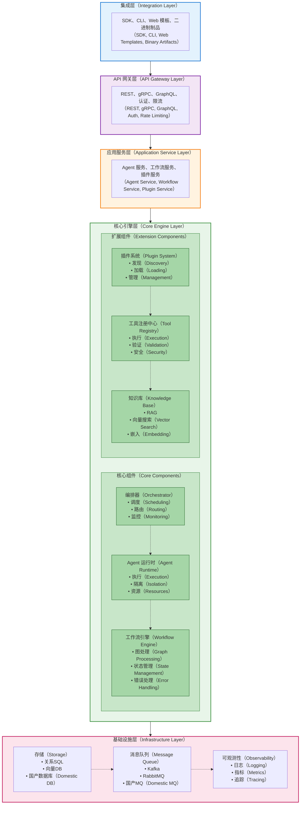

<!--
<p align="center">
  
</p>
-->

<p align="center">
  <strong>开放企业级 AI Agent 平台</strong><br>
  最易集成、轻量化、企业就绪的 AI Agent 框架
</p>

<p align="center">
  <a href="https://github.com/turtacn/OpenEAAP/actions"></a>
  <a href="https://github.com/turtacn/OpenEAAP/blob/main/LICENSE"></a>
  <a href="https://github.com/turtacn/OpenEAAP/releases"></a>
  <a href="https://goreportcard.com/report/github.com/turtacn/OpenEAAP"></a>
  <a href="https://pkg.go.dev/github.com/turtacn/OpenEAAP"></a>
</p>

<p align="center">
  <a href="README.md">English Documentation</a> •
  <a href="#快速开始">快速开始</a> •
  <a href="docs/architecture.md">架构设计</a> •
  <a href="#文档">文档</a> •
</p>

---

## 使命

OpenEAAP 旨在解决企业在多个产品和复杂场景中部署 AI Agent 能力时面临的**关键集成挑战**。与单体化平台不同，OpenEAAP 提供了一个**模块化、轻量级、高度可集成**的基础设施，支持：

* **快速集成**：SDK、CLI、组件服务、Web 模板和二进制制品
* **多场景支持**：私有化/SaaS、信创/国际化、中小客户/大客户
* **高性能**：轻量级 Go 核心，最小化开销
* **企业就绪**：内置安全、治理和可观测性
* **插件生态**：可扩展架构支持自定义能力

## 为什么选择 OpenEAAP？

### 行业痛点

现代企业在 AI Agent 落地过程中面临诸多挑战：

1. **能力碎片化**：每个产品各自构建 Agent 系统，重复造轮子
2. **集成复杂度高**：现有平台多为单体架构，难以嵌入到多样化业务场景
3. **部署场景多元**：需要同时支持多种部署模式（私有化、SaaS、信创等）
4. **企业约束严格**：安全、合规、治理要求各异
5. **技术锁定风险**：厂商特定方案限制灵活性和自主可控性

### OpenEAAP 解决方案

OpenEAAP 通过独特的架构设计解决这些问题：

| 特性       | 传统平台           | OpenEAAP                  |
| -------- | -------------- | ------------------------- |
| **集成性**  | 单体化，全有或全无      | 模块化，按需选择                  |
| **部署方式** | 单一模式（通常为 SaaS） | 多模式（嵌入式/独立服务）             |
| **性能**   | 重运行时，高开销       | 轻量核心，优化执行                 |
| **可扩展性** | 有限的插件支持        | 丰富的插件生态                   |
| **多语言**  | 单一 SDK         | Go、Python、Java、JavaScript |
| **企业特性** | 基础功能           | 安全、治理、可观测性                |
| **国产化**  | 仅国际化           | 信创兼容                      |

### 核心差异化优势

1. **极致的可集成性** 

   * **多形态分发**：SDK 库、CLI 工具、微服务、Web 组件、二进制制品
   * **灵活部署**：嵌入应用或作为独立服务运行
   * **最小依赖**：清晰架构，可选功能

2. **轻量化与高性能** 

   * **Go 核心引擎**：编译型二进制，快速启动，低内存占用
   * **高效执行**：优化的编排和状态管理
   * **可扩展设计**：分布式运行时支持水平扩展

3. **企业级能力** 

   * **安全优先**：RBAC、策略执行、审计日志
   * **可观测性**：结构化日志、指标、分布式追踪
   * **多租户**：隔离的执行环境
   * **合规性**：支持各类监管要求

4. **开发者体验** 

   * **简洁 API**：所有 SDK 提供直观接口
   * **丰富示例**：生产就绪的模板和样例
   * **完整文档**：架构指南、教程、API 参考

## 核心特性

### 核心能力

* **多 Agent 编排**：协调多个具有不同角色和能力的 AI Agent
* **工作流引擎**：定义复杂的、有状态的工作流，支持可视化工具
* **插件系统**：可扩展的架构支持工具、集成和自定义逻辑
* **知识管理**：RAG（检索增强生成）与向量数据库
* **工具注册中心**：内置和自定义工具支持 Agent 操作
* **LLM 集成**：支持 OpenAI、Anthropic、Azure 和国产大模型

### 集成选项

* **Go SDK**：原生 Go 库，完整功能支持
* **Python SDK**：符合 Python 习惯的接口，适配 ML/AI 工作流
* **Java SDK**：企业级 Java 集成
* **JavaScript SDK**：浏览器和 Node.js 支持
* **CLI 工具**：命令行接口用于运维和自动化
* **Web 组件**：React、Vue、Angular 集成模板
* **gRPC/REST API**：语言无关的服务接口

### 企业特性

* **认证与授权**：JWT、OAuth2、RBAC、基于策略的访问控制
* **可观测性**：Prometheus 指标、OpenTelemetry 追踪、结构化日志
* **多租户**：资源隔离、配额管理
* **审计日志**：全面的活动追踪，满足合规需求
* **安全性**：静态/传输加密、密钥管理、沙箱执行
* **国际化**：多语言 UI 和文档

### 部署灵活性

* **容器化**：Docker 镜像、Kubernetes 清单、Helm Charts
* **云原生**：支持 AWS、Azure、GCP 和国内所有云厂商
* **私有化**：完全自主控制的本地部署
* **信创**：兼容国产基础设施（信创生态）

## 快速开始

### 安装

#### 使用 Go

```bash
# 安装 CLI 工具
go install github.com/turtacn/OpenEAAP/cmd/openeaap@latest

# 或作为库依赖添加
go get github.com/turtacn/OpenEAAP
```

#### 使用 Python

```bash
pip install openeaap
```

#### 使用 Docker

```bash
docker pull turtacn/openeaap:latest
docker run -p 8080:8080 turtacn/openeaap:latest
```

### 基础用法

#### 创建第一个 Agent（Go）

```go
package main

import (
    "context"
    "fmt"
    "log"

    "github.com/turtacn/OpenEAAP/pkg/agent"
    "github.com/turtacn/OpenEAAP/pkg/llm"
    "github.com/turtacn/OpenEAAP/pkg/orchestrator"
)

func main() {
    // 初始化编排器
    orch, err := orchestrator.New(orchestrator.Config{
        LogLevel: "info",
    })
    if err != nil {
        log.Fatal(err)
    }
    defer orch.Shutdown()

    // 配置 LLM 提供商
    llmProvider, err := llm.NewOpenAI(llm.OpenAIConfig{
        APIKey: "your-api-key",
        Model:  "gpt-4",
    })
    if err != nil {
        log.Fatal(err)
    }

    // 创建简单的对话 Agent
    conversationalAgent := agent.NewConversableAgent(agent.Config{
        Name:        "Assistant",
        Description: "一个有帮助的 AI 助手",
        LLM:         llmProvider,
        SystemPrompt: "你是一个有帮助的助手。请简洁友好地回答问题。",
    })

    // 注册 Agent
    if err := orch.RegisterAgent(conversationalAgent); err != nil {
        log.Fatal(err)
    }

    // 执行简单对话
    ctx := context.Background()
    response, err := orch.Execute(ctx, orchestrator.Request{
        AgentName: "Assistant",
        Message:   "什么是 OpenEAAP？",
    })
    if err != nil {
        log.Fatal(err)
    }

    fmt.Printf("Agent: %s\n", response.Content)
}
```

#### 创建多 Agent 工作流（Python）

```python
from openeaap import Orchestrator, Agent, Workflow
from openeaap.llm import OpenAI
from openeaap.tools import WebSearch, Calculator

# 初始化编排器
orch = Orchestrator(config={"log_level": "info"})

# 配置 LLM
llm = OpenAI(api_key="your-api-key", model="gpt-4")

# 创建专业化的 Agent
researcher = Agent(
    name="Researcher",
    role="研究专家",
    llm=llm,
    tools=[WebSearch()],
    goal="从可靠来源查找准确信息"
)

analyst = Agent(
    name="Analyst",
    role="数据分析师",
    llm=llm,
    tools=[Calculator()],
    goal="分析数据并提供洞察"
)

writer = Agent(
    name="Writer",
    role="内容撰写者",
    llm=llm,
    goal="创建清晰、引人入胜的内容"
)

# 定义工作流
workflow = Workflow(name="研究报告生成器")
workflow.add_step(researcher, "研究主题")
workflow.add_step(analyst, "分析研究发现")
workflow.add_step(writer, "撰写综合报告")

# 执行工作流
result = orch.execute_workflow(
    workflow,
    input={"topic": "AI 对软件开发的影响"}
)

print(result.output)
```

#### 作为服务使用（CLI）

```bash
# 启动 OpenEAAP 服务器
openeaap server start --port 8080

# 在另一个终端，通过 CLI 交互
openeaap agent create \
  --name "CodeReviewer" \
  --role "高级软件工程师" \
  --description "审查代码质量和最佳实践"

# 执行任务
openeaap execute \
  --agent "CodeReviewer" \
  --input "请审查这个函数: def add(a, b): return a + b"

# 或使用 REST API
curl -X POST http://localhost:8080/api/v1/execute \
  -H "Content-Type: application/json" \
  -d '{
    "agent_name": "CodeReviewer",
    "message": "请审查这个函数: def add(a, b): return a + b"
  }'
```

#### 集成到 Web 应用（React）

```jsx
import { OpenEAAPClient, AgentChat } from '@openeaap/react';

function App() {
  const client = new OpenEAAPClient({
    apiUrl: 'http://localhost:8080',
    apiKey: 'your-api-key'
  });

  return (
    <div className="App">
      <h1>客户支持助手</h1>
      <AgentChat
        client={client}
        agentName="SupportAgent"
        welcomeMessage="您好！有什么可以帮助您的吗？"
        theme="light"
      />
    </div>
  );
}

export default App;
```

## 文档

### 入门指南

* [安装指南](docs/getting-started.md)
* [核心概念](docs/core-concepts.md)
* [第一个 Agent](docs/first-agent.md)

### 架构设计

* [架构概览](docs/architecture.md)
* [组件设计](docs/components.md)
* [集成模式](docs/integration-guide.md)

### 开发指南

* [插件开发](docs/plugin-development.md)
* [API 参考](docs/apis.md)
* [SDK 指南](docs/sdk-guides.md)

### 部署指南

* [部署指南](docs/deployment-guide.md)
* [Docker 部署](docs/docker-deployment.md)
* [Kubernetes 部署](docs/kubernetes-deployment.md)
* [信创部署](docs/xinchuang-deployment.md)

### 示例

* [示例库](examples/)
* [多 Agent 系统](examples/multi-agent/)
* [工作流自动化](examples/workflow/)
* [企业集成](examples/integration/)

## 架构概览

OpenEAAP 遵循**分层、模块化架构**，旨在实现最大的灵活性和集成能力：



详细架构文档请参见 [docs/architecture.md](docs/architecture.md)。

### 代码结构

```text
OpenEAAP/
├── README.md                    # English documentation
├── README-zh.md                 # Chinese documentation
├── LICENSE                      # Apache 2.0 License
├── logo.png                     # Project logo
├── .gitignore
├── Makefile                     # Build automation
├── go.mod                       # Go module definition
├── go.sum
│
├── cmd/                         # Command-line applications
│   ├── openeaap/               # Main CLI tool
│   │   └── main.go
│   ├── server/                 # API server
│   │   └── main.go
│   └── migrate/                # Database migration tool
│       └── main.go
│
├── pkg/                         # Public library code
│   ├── orchestrator/           # Core orchestration engine
│   │   ├── orchestrator.go
│   │   ├── scheduler.go
│   │   ├── executor.go
│   │   └── state_manager.go
│   ├── plugin/                 # Plugin system
│   │   ├── interface.go
│   │   ├── loader.go
│   │   ├── registry.go
│   │   └── manager.go
│   ├── runtime/                # Runtime environment
│   │   ├── runtime.go
│   │   ├── context.go
│   │   ├── sandbox.go
│   │   └── resource_pool.go
│   ├── agent/                  # Agent core
│   │   ├── agent.go
│   │   ├── base_agent.go
│   │   ├── conversable_agent.go
│   │   └── tool_agent.go
│   ├── workflow/               # Workflow engine
│   │   ├── workflow.go
│   │   ├── graph.go
│   │   ├── node.go
│   │   └── edge.go
│   ├── tool/                   # Tool system
│   │   ├── tool.go
│   │   ├── registry.go
│   │   ├── executor.go
│   │   └── builtin/
│   ├── knowledge/              # Knowledge management
│   │   ├── knowledge_base.go
│   │   ├── retriever.go
│   │   ├── embedder.go
│   │   └── vector_store/
│   ├── llm/                    # LLM integrations
│   │   ├── interface.go
│   │   ├── openai.go
│   │   ├── azure.go
│   │   ├── anthropic.go
│   │   └── domestic/          # 国产 LLM
│   ├── gateway/                # API Gateway
│   │   ├── gateway.go
│   │   ├── router.go
│   │   ├── middleware/
│   │   └── handler/
│   ├── storage/                # Storage layer
│   │   ├── interface.go
│   │   ├── postgres.go
│   │   ├── mysql.go
│   │   └── domestic/          # 国产数据库
│   ├── mq/                     # Message queue
│   │   ├── interface.go
│   │   ├── kafka.go
│   │   ├── rabbitmq.go
│   │   └── domestic/          # 国产MQ
│   ├── auth/                   # Authentication & Authorization
│   │   ├── auth.go
│   │   ├── jwt.go
│   │   ├── rbac.go
│   │   └── policy.go
│   ├── observability/          # Observability
│   │   ├── logger.go
│   │   ├── metrics.go
│   │   ├── tracing.go
│   │   └── telemetry.go
│   ├── config/                 # Configuration management
│   │   ├── config.go
│   │   ├── loader.go
│   │   └── validator.go
│   ├── errors/                 # Error definitions
│   │   ├── errors.go
│   │   └── codes.go
│   ├── constants/              # Constants
│   │   └── constants.go
│   └── types/                  # Common types
│       ├── agent_types.go
│       ├── workflow_types.go
│       ├── plugin_types.go
│       └── common_types.go
│
├── internal/                    # Private application code
│   ├── app/                    # Application service layer
│   │   ├── agent_service.go
│   │   ├── workflow_service.go
│   │   ├── plugin_service.go
│   │   └── knowledge_service.go
│   ├── domain/                 # Domain layer
│   │   ├── agent/
│   │   ├── workflow/
│   │   ├── plugin/
│   │   └── knowledge/
│   └── infrastructure/         # Infrastructure layer
│       ├── persistence/
│       ├── messaging/
│       └── cache/
│
├── api/                         # API definitions
│   ├── openapi/                # OpenAPI specs
│   │   └── openapi.yaml
│   ├── proto/                  # gRPC protobuf
│   │   └── agent.proto
│   └── graphql/                # GraphQL schemas
│       └── schema.graphql
│
├── sdk/                         # Multi-language SDKs
│   ├── go/                     # Go SDK (symlink to pkg/)
│   ├── python/                 # Python SDK
│   │   ├── setup.py
│   │   ├── openeaap/
│   │   └── examples/
│   ├── java/                   # Java SDK
│   │   ├── pom.xml
│   │   ├── src/
│   │   └── examples/
│   └── javascript/             # JavaScript SDK
│       ├── package.json
│       ├── src/
│       └── examples/
│
├── web/                         # Web components
│   ├── console/                # Admin console
│   │   ├── package.json
│   │   ├── src/
│   │   └── public/
│   └── templates/              # Integration templates
│       ├── react/
│       ├── vue/
│       └── angular/
│
├── deployments/                 # Deployment configurations
│   ├── docker/
│   │   ├── Dockerfile
│   │   └── docker-compose.yml
│   ├── kubernetes/
│   │   ├── deployment.yaml
│   │   ├── service.yaml
│   │   └── configmap.yaml
│   └── helm/
│       └── openeaap/
│
├── configs/                     # Configuration files
│   ├── config.yaml
│   ├── config.dev.yaml
│   └── config.prod.yaml
│
├── scripts/                     # Build and utility scripts
│   ├── build.sh
│   ├── test.sh
│   ├── lint.sh
│   └── release.sh
│
├── docs/                        # Documentation
│   ├── architecture.md         # Architecture design
│   ├── apis.md                 # API documentation
│   ├── getting-started.md      # Getting started guide
│   ├── integration-guide.md    # Integration guide
│   ├── plugin-development.md   # Plugin development guide
│   ├── deployment-guide.md     # Deployment guide
│   ├── contributing.md         # Contributing guidelines
│   └── images/                 # Documentation images
│
├── examples/                    # Example applications
│   ├── quickstart/
│   ├── multi-agent/
│   ├── workflow/
│   ├── plugin/
│   └── integration/
│
├── test/                        # Test suites
│   ├── unit/
│   ├── integration/
│   ├── e2e/
│   └── benchmark/
│
└── third_party/                 # Third-party dependencies
    └── plugins/

```


### 开发环境设置

```bash
# 克隆仓库
git clone https://github.com/turtacn/OpenEAAP.git
cd OpenEAAP

# 安装依赖
make deps

# 运行测试
make test

# 构建二进制文件
make build

# 运行 lint
make lint
```

### OpenEAAP vs 其他框架：五大核心差异

| 特性维度          | LangChain  | AutoGen      | CrewAI     | MetaGPT    | **OpenEAAP**      |
| ------------- | ---------- | ------------ | ---------- | ---------- | ----------------- |
| **核心定位**      | LLM 应用开发框架 | 多 Agent 对话研究 | 角色协作框架     | 软件开发 Agent | 企业级集成平台           |
| **主要语言**      | Python     | Python       | Python     | Python     | **Go + 多语言 SDK**  |
| **集成难度**      | 中等（依赖多）    | 中等           | 简单（场景限定）   | 复杂（专用场景）   | **极简（模块化）**       |
| **部署模式**      | 嵌入式        | 嵌入式          | 嵌入式        | 嵌入式        | **嵌入式 + 独立服务**    |
| **性能**        | 中等（Python） | 中等（Python）   | 中等（Python） | 中等（Python） | **高（Go 编译型）**     |
| **企业特性**      | 基础         | 研究级          | 基础         | 基础         | **完整（安全/治理/审计）**  |
| **多租户**       | ❌          | ❌            | ❌          | ❌          | **✅**             |
| **可观测性**      | 基础         | 基础           | 基础         | 基础         | **企业级（指标/追踪/日志）** |
| **信创支持**      | ❌          | ❌            | ❌          | ❌          | **✅**             |
| **Plugin 生态** | 丰富         | 有限           | 有限         | 专用         | **企业级 Plugin 市场** |
| **学习曲线**      | 陡峭         | 中等           | 平缓         | 陡峭         | **平缓（多 SDK）**     |
| **生产就绪度**     | 中等         | 研究级          | 中等         | 研究级        | **生产级**           |
| **扩展性**       | 中等         | 有限           | 有限         | 有限         | **高（插件系统）**       |
| **活跃度**     | ⭐⭐⭐⭐⭐      | ⭐⭐⭐⭐         | ⭐⭐⭐        | ⭐⭐⭐        |  (新项目)         |


#### **定位差异**：完整平台 vs 开发工具

* **其他框架**：提供"积木"，你需要自己搭建"房子"
* **OpenEAAP**：提供"精装房"，安全、监控、部署全包

#### **技术栈**：Go vs Python

* **启动速度**：50ms vs 2-5秒（**快 10-25 倍**）
* **内存占用**：20MB vs 150MB（**节省 5-7 倍**）
* **并发性能**：500 RPS vs 50-80 RPS（**强 6-10 倍**）
* **部署**：单一二进制 vs 需要 Python 环境

#### **集成能力**：多形态 vs 单一形态

* **其他框架**：只有 Python 库，嵌入式集成
* **OpenEAAP**：Go/Python/Java/JS SDK + CLI + REST/gRPC + Web组件 + K8s

#### **企业特性**：生产级 vs 实验级

* **其他框架**：基础功能，需自己补充安全、监控、多租户
* **OpenEAAP**：开箱即用的认证、加密、审计、追踪、告警、合规

#### **信创支持**：OpenEAAP 独有

* **其他框架**：不支持国产化环境
* **OpenEAAP**：支持国产 OS/数据库/中间件/芯片/LLM（**唯一选择**）


## 参考资料

OpenEAAP 受到以下领先 AI Agent 框架的启发并借鉴了相关思想：

* [LangChain](https://github.com/langchain-ai/langchain) - 全面的 LLM 应用框架
* [AutoGen](https://github.com/microsoft/autogen) - 多 Agent 对话框架
* [CrewAI](https://github.com/joaomdmoura/crewAI) - 基于角色的 Agent 协作
* [MetaGPT](https://github.com/geekan/MetaGPT) - 多 Agent 软件开发