# OpenEAAP

<!--
<p align="center">
  
</p>
-->

<p align="center">
  <strong>Open Enterprise AI Agent Platform</strong><br/>
  <em>Building the Future of Enterprise AI with Intelligent Agents</em>
</p>

<p align="center">
  <a href="#"></a>
  <a href="#license"></a>
  <a href="#"></a>
  <a href="#"></a>
  <a href="README-zh.md"></a>
</p>

---

## 🎯 Mission Statement

**OpenEAAP (Open Enterprise AI Agent Platform)** is an open-source, cloud-native platform designed to empower enterprises with production-ready AI agent capabilities. Our mission is to democratize enterprise AI by providing a comprehensive ecosystem that enables continuous learning, intelligent automation, and seamless integration across security, cloud, and AI domains.

We believe that AI's transformative power in cybersecurity and enterprise operations should be accessible, scalable, and sustainable. OpenEAAP bridges the gap between cutting-edge AI research and real-world enterprise deployment, offering a robust middleware platform that turns AI potential into competitive advantage.

---

## 🔥 Why OpenEAAP?

### The Enterprise AI Challenge

Modern enterprises face critical pain points when adopting AI:

* **Fragmented AI Infrastructure**: Teams struggle with disconnected tools for model development, data management, and deployment
* **Limited Learning Capability**: Traditional ML systems lack continuous learning and adaptation mechanisms
* **Data Silos**: Enterprise knowledge scattered across systems, making it difficult to build effective AI applications
* **Deployment Complexity**: Moving from prototype to production-grade AI services remains prohibitively complex
* **Security & Privacy Concerns**: Enterprise AI must meet stringent security, compliance, and privacy requirements

### The OpenEAAP Solution

OpenEAAP addresses these challenges through a unified, enterprise-grade platform:

✅ **Unified AI Development Experience** - From data ingestion to model deployment in one cohesive platform
✅ **Continuous Learning Architecture** - Agents that learn and improve from production feedback
✅ **Enterprise-Grade Data Platform** - Automated data governance, knowledge graphs, and vector databases
✅ **Production-Ready Infrastructure** - Kubernetes-native deployment with auto-scaling and high availability
✅ **Privacy-First Design** - Built-in data isolation, encryption, and compliance frameworks
✅ **Open Standards & Extensibility** - Plugin architecture supporting custom models, tools, and integrations

---

## ✨ Key Features

### 🤖 Agent Development Platform

Build sophisticated AI agents with lifelong learning capabilities:

* **Multi-Agent Orchestration**: Coordinate specialized agents for complex workflows
* **Online Learning Pipeline**: Continuous improvement from user feedback and production data
* **Tool Integration Framework**: Extensible plugin system for external APIs and services
* **Conversation Management**: Advanced dialogue state tracking and context handling
* **Memory Systems**: Long-term and short-term memory with retrieval-augmented generation (RAG)

### 📊 Enterprise Data Platform

Transform raw data into AI-ready knowledge:

* **Automated Data Governance**: Schema detection, quality monitoring, and lineage tracking
* **Knowledge Graph Construction**: Automatic entity extraction and relationship mapping
* **Vector Database Service**: High-performance similarity search with hybrid retrieval
* **Data Feedback Loop**: Capture production interactions for model improvement
* **Feature Engineering**: Automated feature extraction and serving for ML models

### 🚀 Cloud-Native AI Infrastructure

Efficient, scalable infrastructure for AI workloads:

* **Multi-Tenant GPU Scheduling**: Fine-grained resource allocation and fair-share scheduling
* **Model Serving Engine**: Low-latency inference with automatic batching and caching
* **Development Environments**: Pre-configured Jupyter, VSCode, and IDE integrations
* **CI/CD for AI**: Automated testing, versioning, and deployment pipelines
* **Observability Stack**: Comprehensive metrics, logging, and tracing for AI services

### 🧠 Intelligent Model Serving

High-performance inference with advanced optimization:

* **Privacy-Preserving Inference**: Federated learning and differential privacy support
* **Intelligent Caching**: Multi-level cache hierarchy for frequent queries
* **Request Routing**: Dynamic model selection based on cost, latency, and accuracy
* **Secure Transmission**: End-to-end encryption for sensitive data
* **Multi-Model Serving**: A/B testing and gradual rollout capabilities

### 🎓 Model Training Platform

Streamlined training for custom models:

* **Resource Quota Management**: Fair allocation across teams and projects
* **Distributed Training**: Built-in support for PyTorch DDP, DeepSpeed, and Horovod
* **Experiment Tracking**: Integrated MLflow for versioning and reproducibility
* **Hyperparameter Tuning**: Automated optimization with Optuna and Ray Tune
* **Dataset Management**: Versioned datasets with efficient loading and preprocessing

---

## 🏗️ Architecture Overview

OpenEAAP follows a cloud-native, microservices architecture designed for scalability and resilience. The platform is organized into five core layers:

```mermaid
graph TB
    %% 图例
    subgraph Legend[图例]
        L1[用户层]
        L2[平台层]
        L3[中台层]
        L4[基础设施层]
        style L1 fill:#e1f5ff,stroke:#01579b
        style L2 fill:#f3e5f5,stroke:#4a148c
        style L3 fill:#fff3e0,stroke:#e65100
        style L4 fill:#e8f5e9,stroke:#1b5e20
    end

    %% 用户层
    subgraph UL[用户层（User Layer）]
        DEV[开发者（Developer）]
        OPS[运维人员（Operator）]
        USER[业务用户（End User）]
    end

    %% 平台层
    subgraph PL[平台层（Platform Layer）]
        subgraph ADP[智能体开发平台（Agent Development Platform）]
            ADP1[智能体编排（Agent Orchestration）]
            ADP2[在线学习管线（Online Learning）]
            ADP3[工具集成（Tool Integration）]
        end
        
        subgraph EDP[企业数据平台（Enterprise Data Platform）]
            EDP1[数据治理（Data Governance）]
            EDP2[知识图谱（Knowledge Graph）]
            EDP3[向量数据库（Vector DB）]
        end
    end

    %% 中台层
    subgraph ML[中台层（Middleware Layer）]
        subgraph IMS[智能模型服务（Intelligent Model Serving）]
            IMS1[推理引擎（Inference Engine）]
            IMS2[隐私计算（Privacy Computing）]
            IMS3[智能缓存（Intelligent Cache）]
        end
        
        subgraph MTP[模型训练平台（Model Training Platform）]
            MTP1[分布式训练（Distributed Training）]
            MTP2[实验追踪（Experiment Tracking）]
            MTP3[资源调度（Resource Scheduling）]
        end
    end

    %% 基础设施层
    subgraph IL[基础设施层（Infrastructure Layer）]
        K8S[Kubernetes集群]
        GPU[GPU资源池]
        STORAGE[分布式存储]
        NETWORK[网络服务]
    end

    %% 连接关系
    DEV --> ADP
    DEV --> MTP
    OPS --> IMS
    OPS --> K8S
    USER --> ADP1
    
    ADP --> EDP
    ADP --> IMS
    EDP --> STORAGE
    IMS --> GPU
    MTP --> GPU
    MTP --> K8S
    
    K8S --> GPU
    K8S --> STORAGE
    K8S --> NETWORK

    %% 样式定义
    style UL fill:#e1f5ff,stroke:#01579b,stroke-width:2px
    style PL fill:#f3e5f5,stroke:#4a148c,stroke-width:2px
    style ML fill:#fff3e0,stroke:#e65100,stroke-width:2px
    style IL fill:#e8f5e9,stroke:#1b5e20,stroke-width:2px
    
    style ADP fill:#e3f2fd,stroke:#1565c0
    style EDP fill:#fce4ec,stroke:#c2185b
    style IMS fill:#fff9c4,stroke:#f57f17
    style MTP fill:#f1f8e9,stroke:#558b2f
```



**Core Components:**

1. **Agent Development Platform**: Build, train, and deploy intelligent agents with continuous learning
2. **Enterprise Data Platform**: Unified data governance, knowledge management, and vector search
3. **Intelligent Model Serving**: Production-grade inference with privacy, caching, and routing
4. **Model Training Platform**: Distributed training infrastructure with experiment management
5. **Cloud Infrastructure**: Kubernetes-native foundation with GPU scheduling and storage

For detailed architecture documentation, see [docs/architecture.md](docs/architecture.md).

---

## 🚀 Getting Started

### Prerequisites

* **Go** >= 1.21 (for backend services)
* **Python** >= 3.9 (for AI/ML components)
* **Docker** >= 20.10
* **Kubernetes** >= 1.24 (for production deployment)
* **NVIDIA GPU** with CUDA >= 11.8 (for model training/serving)

### Installation

#### Install CLI Tools

```bash
# Install OpenEAAP CLI (Go)
go install github.com/openeaap/openeaap/cmd/eaap@latest

# Install Python SDK
pip install openeaap-sdk
```

#### Quick Start with Docker Compose

```bash
# Clone the repository
git clone https://github.com/openeaap/openeaap.git
cd openeaap

# Start local development environment
docker-compose up -d

# Verify installation
eaap version
eaap status
```

#### Production Deployment on Kubernetes

```bash
# Add Helm repository
helm repo add openeaap https://charts.openeaap.io
helm repo update

# Install OpenEAAP
helm install openeaap openeaap/openeaap \
  --namespace openeaap \
  --create-namespace \
  --set global.domain=your-domain.com

# Check deployment status
kubectl get pods -n openeaap
```

---

## 💡 Usage Examples

### Example 1: Building a Security Analysis Agent

Create an intelligent agent that analyzes security logs and provides threat insights:

```python
from openeaap.agent import Agent, Tool
from openeaap.data import VectorStore
from openeaap.llm import ChatModel

# Initialize vector store for knowledge retrieval
knowledge_base = VectorStore(
    collection="security_knowledge",
    embedding_model="bge-large-zh-v1.5"
)

# Define custom tools
class ThreatIntelligenceTool(Tool):
    def execute(self, query: str) -> dict:
        # Query external threat intelligence API
        return {"threats": [...], "severity": "high"}

# Create agent with RAG capabilities
security_agent = Agent(
    name="SecurityAnalyst",
    llm=ChatModel("gpt-4"),
    tools=[ThreatIntelligenceTool()],
    memory=knowledge_base,
    learning_mode="online"  # Enable continuous learning
)

# Process security event
result = security_agent.chat(
    """Analyze this suspicious login event:
    - User: admin@company.com
    - IP: 45.142.212.61
    - Time: 2026-01-14 03:42:18 UTC
    - Failed attempts: 15 in 2 minutes
    """
)

print(result.response)
# Output: "High-severity brute force attack detected from known malicious IP..."
print(result.confidence_score)  # 0.94
print(result.sources)  # ["threat_db", "cve_2024_1234", "historical_incidents"]

# Agent automatically learns from this interaction
security_agent.add_feedback(
    interaction_id=result.id,
    feedback="correct_analysis",
    expert_annotation="Confirmed APT28 pattern"
)
```

### Example 2: Data Processing Pipeline

Build an automated data pipeline that ingests documents, extracts entities, and builds a knowledge graph:

```python
from openeaap.data import DataPipeline, KnowledgeGraph
from openeaap.processing import DocumentParser, EntityExtractor

# Create data processing pipeline
pipeline = DataPipeline(name="enterprise_knowledge")

# Define processing stages
pipeline.add_stage(
    DocumentParser(
        formats=["pdf", "docx", "html"],
        chunk_size=512,
        overlap=50
    )
)

pipeline.add_stage(
    EntityExtractor(
        model="bert-base-ner",
        entity_types=["person", "organization", "location", "product"]
    )
)

# Connect to knowledge graph
kg = KnowledgeGraph(database="neo4j://localhost:7687")
pipeline.add_sink(kg)

# Process document batch
results = pipeline.process(
    source="s3://company-docs/security-policies/",
    metadata={"department": "security", "year": 2026}
)

print(f"Processed {results.documents} documents")
print(f"Extracted {results.entities} entities")
print(f"Created {results.relationships} relationships")

# Query the knowledge graph
related_policies = kg.query(
    """
    MATCH (p:Policy)-[:RELATES_TO]->(threat:Threat)
    WHERE threat.severity = 'critical'
    RETURN p.name, p.last_updated
    ORDER BY p.last_updated DESC
    LIMIT 5
    """
)
```

### Example 3: Model Deployment with Privacy Preservation

Deploy a sensitive model with differential privacy and secure inference:

```python
from openeaap.serving import ModelServer, PrivacyConfig
from openeaap.models import FineTunedModel

# Load fine-tuned model
model = FineTunedModel.load("./models/customer_sentiment_analyzer")

# Configure privacy-preserving inference
privacy_config = PrivacyConfig(
    differential_privacy=True,
    epsilon=1.0,  # Privacy budget
    delta=1e-5,
    secure_aggregation=True,
    homomorphic_encryption=False  # Optional for higher security
)

# Deploy model with caching and routing
server = ModelServer(
    model=model,
    privacy=privacy_config,
    cache_strategy="semantic",  # Cache similar queries
    routing_policy="cost_optimized",  # Balance cost vs latency
    max_batch_size=32,
    timeout_ms=500
)

# Start serving
server.start(host="0.0.0.0", port=8080)

# Client usage
from openeaap.client import InferenceClient

client = InferenceClient("http://localhost:8080")
result = client.predict(
    text="The product quality exceeded my expectations!",
    return_confidence=True
)

print(result.sentiment)  # "positive"
print(result.confidence)  # 0.92
print(result.latency_ms)  # 23 (benefited from cache)
```

### Example 4: Multi-Agent Collaboration

Orchestrate multiple specialized agents to solve complex security incident response:

```python
from openeaap.agent import MultiAgentSystem, Agent

# Define specialized agents
detective_agent = Agent(
    name="Detective",
    role="Incident investigation and evidence collection",
    llm="gpt-4",
    tools=["log_analyzer", "network_scanner"]
)

analyst_agent = Agent(
    name="Analyst",
    role="Threat classification and impact assessment",
    llm="claude-3",
    tools=["threat_intel", "vulnerability_db"]
)

responder_agent = Agent(
    name="Responder",
    role="Mitigation strategy and action planning",
    llm="gpt-4",
    tools=["firewall_api", "user_management"]
)

# Create multi-agent system
incident_response = MultiAgentSystem(
    agents=[detective_agent, analyst_agent, responder_agent],
    coordinator="hierarchical",  # or "democratic"
    communication_protocol="shared_memory"
)

# Handle security incident
response = incident_response.execute(
    task="""
    Investigate and respond to potential data exfiltration:
    - Unusual outbound traffic detected: 15GB to unknown IP
    - Compromised user: developer_john
    - Time window: Last 6 hours
    """,
    max_iterations=10
)

# System automatically coordinates agents:
# 1. Detective: Analyzes logs, finds suspicious commands
# 2. Analyst: Classifies as insider threat, assesses data exposure
# 3. Responder: Disables account, blocks IP, triggers backup restore

print(response.summary)
print(response.actions_taken)
print(response.agent_interactions)  # Full collaboration transcript
```

---

## 📚 Documentation

* **[Architecture Guide](docs/architecture.md)** - Detailed system design and component specifications
* **[API Reference](docs/api/)** - Complete API documentation for all services
* **[User Guide](docs/user-guide/)** - Step-by-step tutorials and best practices
* **[Development Guide](docs/development/)** - Contributing guidelines and development setup
* **[Deployment Guide](docs/deployment/)** - Production deployment strategies

---

### Development Setup

```bash
# Clone your fork
git clone https://github.com/turtacn/openeaap.git
cd openeaap

# Install development dependencies
make dev-setup

# Run tests
make test

# Start local development environment
make dev-up
```

---

## 📄 License

OpenEAAP is licensed under the **Apache License 2.0**. See [LICENSE](LICENSE) for full details.

```
Copyright 2026 OpenEAAP Contributors

Licensed under the Apache License, Version 2.0 (the "License");
you may not use this file except in compliance with the License.
You may obtain a copy of the License at

    http://www.apache.org/licenses/LICENSE-2.0

Unless required by applicable law or agreed to in writing, software
distributed under the License is distributed on an "AS IS" BASIS,
WITHOUT WARRANTIES OR CONDITIONS OF ANY KIND, either express or implied.
See the License for the specific language governing permissions and
limitations under the License.
```

---

## 🙏 Acknowledgments

OpenEAAP stands on the shoulders of giants. We are grateful to:

* The **Kubernetes community** for cloud-native infrastructure patterns
* **LangChain** and **LlamaIndex** for agent framework inspiration
* **Ray** and **Kubeflow** for distributed ML infrastructure
* **Anthropic**, **OpenAI**, and **Google** for advancing LLM capabilities

---

## 🔗 Quick Links

* 📘 [English Documentation](README.md)
* 📙 [中文文档](README-zh.md)
* 🏛️ [Architecture Overview](docs/architecture.md)
* 🚀 [Getting Started Guide](docs/getting-started.md)
* 💬 [Community Forum](https://community.openeaap.io)

---


## 📖 参考资料

本文档在设计和实现过程中参考了以下资源:

### 智能体框架与开发

[1] LangChain - Building applications with LLMs through composability
[https://github.com/langchain-ai/langchain](https://github.com/langchain-ai/langchain)

[2] LlamaIndex - Data framework for LLM applications
[https://github.com/run-llama/llama_index](https://github.com/run-llama/llama_index)

[3] AutoGPT - An experimental open-source attempt to make GPT-4 autonomous
[https://github.com/Significant-Gravitas/AutoGPT](https://github.com/Significant-Gravitas/AutoGPT)

[4] Microsoft Semantic Kernel - Integrate AI into apps
[https://github.com/microsoft/semantic-kernel](https://github.com/microsoft/semantic-kernel)

[5] Anthropic Claude - Constitutional AI and helpful, harmless, and honest AI
[https://www.anthropic.com/claude](https://www.anthropic.com/claude)

### 云原生AI基础设施

[6] Kubernetes - Production-Grade Container Orchestration
[https://kubernetes.io/](https://kubernetes.io/)

[7] Kubeflow - Machine Learning Toolkit for Kubernetes
[https://www.kubeflow.org/](https://www.kubeflow.org/)

[8] Ray - Distributed computing framework for ML workloads
[https://www.ray.io/](https://www.ray.io/)

[9] KServe - Standardized Serverless ML Inference Platform
[https://kserve.github.io/website/](https://kserve.github.io/website/)

[10] NVIDIA Triton Inference Server - AI model serving
[https://github.com/triton-inference-server/server](https://github.com/triton-inference-server/server)

### 数据平台与向量数据库

[11] Milvus - Vector database for AI applications
[https://milvus.io/](https://milvus.io/)

[12] Weaviate - Vector search engine
[https://weaviate.io/](https://weaviate.io/)

[13] Qdrant - Vector similarity search engine
[https://qdrant.tech/](https://qdrant.tech/)

[14] Neo4j - Graph database platform
[https://neo4j.com/](https://neo4j.com/)

[15] Apache Airflow - Platform for data pipeline orchestration
[https://airflow.apache.org/](https://airflow.apache.org/)

### 模型训练与优化

[16] PyTorch - Machine learning framework
[https://pytorch.org/](https://pytorch.org/)

[17] DeepSpeed - Deep learning optimization library
[https://www.deepspeed.ai/](https://www.deepspeed.ai/)

[18] Horovod - Distributed deep learning training framework
[https://github.com/horovod/horovod](https://github.com/horovod/horovod)

[19] MLflow - Platform for ML lifecycle management
[https://mlflow.org/](https://mlflow.org/)

[20] Weights & Biases - Developer tools for ML
[https://wandb.ai/](https://wandb.ai/)

### 隐私计算与联邦学习

[21] OpenMined PySyft - Privacy-preserving ML framework
[https://github.com/OpenMined/PySyft](https://github.com/OpenMined/PySyft)

[22] TensorFlow Federated - Framework for federated learning
[https://www.tensorflow.org/federated](https://www.tensorflow.org/federated)

[23] Flower - Federated learning framework
[https://flower.dev/](https://flower.dev/)

[24] Differential Privacy - Google's DP library
[https://github.com/google/differential-privacy](https://github.com/google/differential-privacy)

### 企业AI最佳实践

[25] Google - Machine Learning Systems Design
[https://developers.google.com/machine-learning/guides/rules-of-ml](https://developers.google.com/machine-learning/guides/rules-of-ml)

[26] Microsoft - Responsible AI principles
[https://www.microsoft.com/en-us/ai/responsible-ai](https://www.microsoft.com/en-us/ai/responsible-ai)

[27] AWS - Well-Architected Framework for ML
[https://aws.amazon.com/architecture/well-architected/](https://aws.amazon.com/architecture/well-architected/)

[28] MLOps Community - Best practices for production ML
[https://mlops.community/](https://mlops.community/)

