# OpenEAAP AI Data 全景图与参考架构

基于OpenEAAP项目的实际架构，将从**参考模型（RM）**、**参考架构（RA）**和**参考实现（RI）**三个维度，为您呈现AI Data的完整全景图。

## 一、AI Data 参考模型（RM - Reference Model）

### 1.1 核心能力模型

OpenEAAP采用**五大能力中台**架构，其中**DIKF（Data Intelligence & Knowledge Fabric）数据智能与知识编织平台**是AI Data能力的核心承载者 [1](#0-0) 。

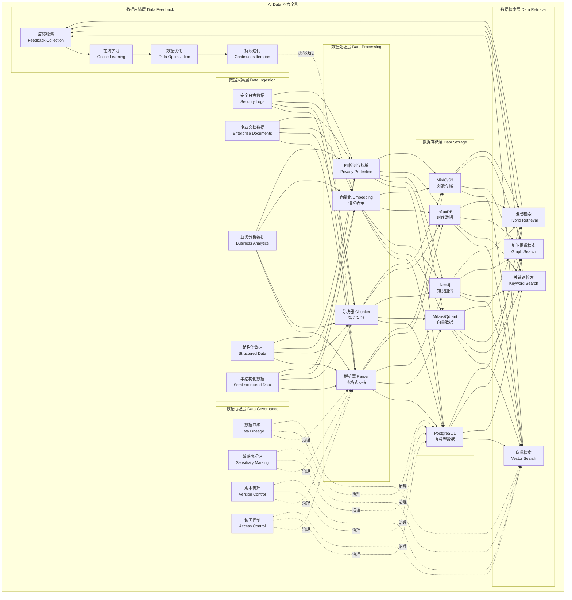

### 1.2 数据类型处理能力矩阵

根据OpenEAAP的架构设计，针对不同数据类型提供专门的处理能力 [2](#0-1) ：

| 数据类型 | 处理策略 | 存储方案 | 检索方式 | 应用场景 |
|---------|---------|---------|---------|---------|
| **安全日志数据** | 解析 → 结构化 → 时序存储 | InfluxDB + PostgreSQL | 时间范围 + 关键词 | SOC威胁分析、异常检测 |
| **企业文档数据** | 解析 → 分块 → 向量化 → PII脱敏 | PostgreSQL + Milvus + MinIO | 向量检索 + 混合检索 | 智能文档问答、知识管理 |
| **业务分析数据** | 聚合 → 指标提取 → 图谱构建 | PostgreSQL + Neo4j | SQL + 图查询 | 业务洞察、关联分析 |
| **结构化数据** | Schema验证 → 索引构建 | PostgreSQL | SQL查询 | 事务处理、报表生成 |
| **半结构化数据** | JSON/XML解析 → 扁平化 | PostgreSQL JSONB + Milvus | 混合检索 | API数据、配置文件 |

### 1.3 AI Agent发展脉络中的数据演进

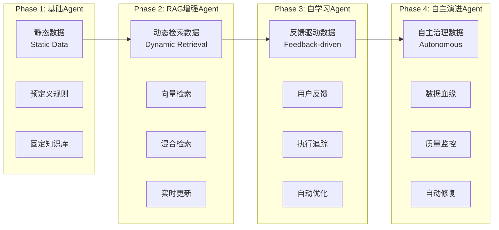

OpenEAAP当前处于**Phase 2向Phase 3过渡**阶段，已实现RAG引擎和反馈收集机制 [3](#0-2) 。

## 二、AI Data 参考架构（RA - Reference Architecture）

### 2.1 分层架构设计

OpenEAAP采用**七层DDD架构**，AI Data能力贯穿所有层次 [4](#0-3) ：

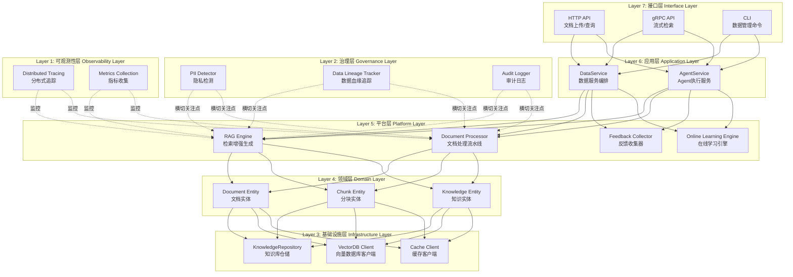

### 2.2 数据处理流水线架构

OpenEAAP实现了完整的数据处理流水线，支持从摄取到应用的全生命周期管理 [5](#0-4) ：

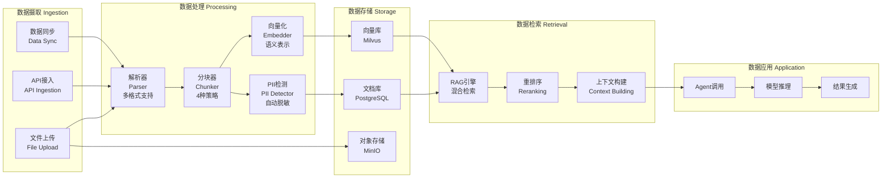

**分块策略详解** [6](#0-5) ：

| 策略 | 说明 | 适用场景 |
|-----|------|---------|
| **固定长度** | 按固定Token数分块 | 通用文档、API文档 |
| **语义边界** | 按段落、章节分块 | 结构化文档、技术规范 |
| **滑动窗口** | 重叠分块，避免信息丢失 | 长篇文档、法律合同 |
| **层次分块** | 多粒度分块（句子、段落、章节） | 复杂文档、学术论文 |

### 2.3 数据血缘与治理架构

OpenEAAP实现了完整的数据血缘追踪机制，确保数据的可追溯性和合规性 [7](#0-6) ：

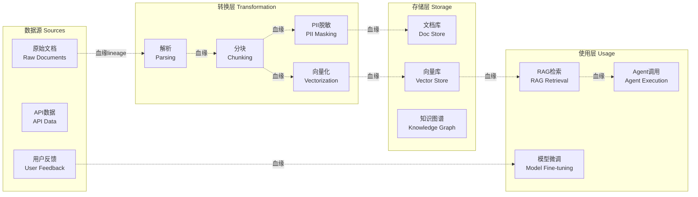

### 2.4 数据反馈闭环架构

OpenEAAP构建了从业务反馈到数据优化的全自动化闭环 [8](#0-7) ：

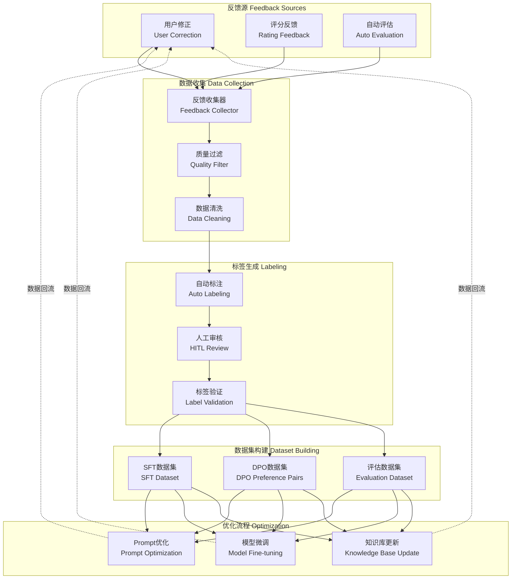

## 三、AI Data 参考实现（RI - Reference Implementation）

### 3.1 RAG引擎核心实现

OpenEAAP的RAG引擎实现了完整的检索增强生成流程 [9](#0-8) ：

**核心接口定义：** [10](#0-9) 

**RAG请求响应模型：** [11](#0-10) 

**完整RAG查询流程实现：** [12](#0-11) 

该实现包含6个关键阶段：
1. **查询理解**（Query Understanding） [13](#0-12) 
2. **检索阶段**（Retrieval） [14](#0-13) 
3. **重排序阶段**（Reranking） [15](#0-14) 
4. **上下文构建**（Context Building） [16](#0-15) 
5. **生成阶段**（Generation） [17](#0-16) 
6. **验证阶段**（Verification） [18](#0-17) 

### 3.2 检索策略实现

OpenEAAP支持四种检索模式 [19](#0-18) ：

- **向量检索（Vector Search）**：基于语义相似度的检索
- **关键词检索（Keyword Search）**：基于精确匹配的检索  
- **混合检索（Hybrid Retrieval）**：结合向量和关键词的检索
- **知识图谱检索（Graph Search）**：基于关系的检索

检索实现包含智能上下文长度控制 [20](#0-19) 。

### 3.3 流式RAG实现

OpenEAAP提供流式RAG查询能力，支持实时响应 [21](#0-20) ：

**流式响应模型：** [22](#0-21) 

### 3.4 答案验证机制

OpenEAAP实现了多维度的答案验证机制 [23](#0-22) ：

**验证实现：** [24](#0-23) 

验证维度包括：
- **幻觉检测（Hallucination Detection）**：检查答案是否脱离检索内容
- **引用有效性（Citation Validity）**：验证答案是否引用了检索到的内容
- **事实核查（Fact Check）**：检查答案的合理性

### 3.5 三级缓存架构实现

OpenEAAP实现了业界领先的三级缓存架构，显著降低推理成本和延迟 [25](#0-24) ：

**缓存层级策略：**

| 层级 | 存储介质 | 匹配策略 | 命中率 | 延迟 | 实现路径 |
|-----|---------|---------|--------|------|---------|
| **L1本地缓存** | 进程内存 | 精确Hash匹配 | 20-30% | <1ms | Go map + LRU淘汰 |
| **L2语义缓存** | Redis集群 | 语义Hash | 30-40% | <10ms | Redis客户端 |
| **L3向量缓存** | Milvus | 余弦相似度 | 10-20% | <50ms | Milvus客户端 |

**性能优势：**
- 累计缓存命中率：**60-90%**
- P95延迟降低：**70%**
- 推理成本降低：**60%** [26](#0-25) 

### 3.6 数据存储选型实现

OpenEAAP针对不同数据类型选择最优存储方案 [27](#0-26) ：

| 数据类型 | 存储技术 | 用途 |
|---------|---------|------|
| **关系数据** | PostgreSQL | 用户、Agent、执行记录等结构化数据 |
| **向量数据** | Milvus/Qdrant | 文档向量、Embedding |
| **图数据** | Neo4j | 知识图谱、数据血缘 |
| **时序数据** | InfluxDB | Trace、指标、日志 |
| **缓存** | Redis | L2语义缓存、会话状态 |
| **对象存储** | MinIO/S3 | 原始文档、模型文件 |

## 四、针对具体场景的AI Data应用

### 4.1 安全日志数据场景（SOC Copilot）

OpenEAAP提供了完整的安全运营智能助手实现 [28](#0-27) ：

**数据流架构：** [29](#0-28) 

**核心能力：**
- 威胁情报查询：集成SIEM、TI平台API
- 日志关联分析：RAG检索 + LLM推理
- 历史案例检索：向量检索 + 知识图谱
- 响应建议生成：基于案例库的Prompt工程
- 人在回路（HITL）：关键操作需人工审核

**效果指标：**
- 分析耗时：从30分钟降至<5分钟
- 误报率：从40%降至<15%
- 响应速度：从2小时降至<30分钟 [30](#0-29) 

### 4.2 企业文档数据场景

OpenEAAP实现了智能文档问答系统 [31](#0-30) ：

**文档处理流程：** [32](#0-31) 

处理流程包括：
1. 文档解析（支持PDF、Word、Markdown等）
2. PII检测与自动脱敏
3. 智能分块（4种策略）
4. 向量化（生成Embedding）

## 五、AI Data演进路线图

基于OpenEAAP的路线图 [33](#0-32) ：

### Phase 1: 基础平台（2026 Q1-Q2）✅ 已完成
- 核心框架搭建（DDD架构）
- 编排器与运行时
- 推理网关（vLLM集成）
- 三级缓存架构

### Phase 2: 数据智能（2026 Q2-Q3）🚧 进行中
- RAG引擎（混合检索、重排序）
- 向量数据库集成（Milvus）
- 知识图谱构建
- 文档处理流水线

### Phase 3: 持续优化（2026 Q3-Q4）📅 规划中
- 在线学习引擎
- RLHF/DPO训练流程
- Prompt自动优化
- A/B测试框架

### Phase 4: 治理增强（2026 Q4-2027 Q1）📅 规划中
- 策略引擎（ABAC/RBAC）
- 隐私计算网关（PII检测与脱敏）
- 审计与合规（SOC2、GDPR）

## Notes

OpenEAAP项目为AI Data提供了完整的**参考模型、参考架构和参考实现**，特别值得关注的是：

1. **DIKF平台**是AI Data能力的核心载体，实现了从数据摄取到应用的全生命周期管理

2. **三级缓存架构**是性能优化的关键创新，通过L1本地缓存（<1ms）、L2语义缓存（<10ms）、L3向量缓存（<50ms）实现60-90%的命中率

3. **数据反馈闭环**建立了从用户反馈到模型优化的自动化流程，支持RLHF/DPO训练和Prompt自动优化

4. **多策略分块机制**针对不同文档类型提供4种分块策略，确保语义完整性

5. **数据血缘追踪**实现了从数据源到最终应用的全链路可追溯，满足合规要求

6. 针对**安全日志、企业文档、业务分析**等不同数据类型，OpenEAAP提供了差异化的存储和检索方案

该架构已在实际代码中得到验证，可作为构建企业级AI Data平台的重要参考。

### Citations

**File:** docs/architecture.md (L20-20)
```markdown
| **DIKF**     | Data Intelligence & Knowledge Fabric       | 数据智能与知识编织平台         |
```

**File:** docs/architecture.md (L749-791)
```markdown
### 4.2 数据智能与知识编织平台（DIKF）

#### 4.2.1 组件架构

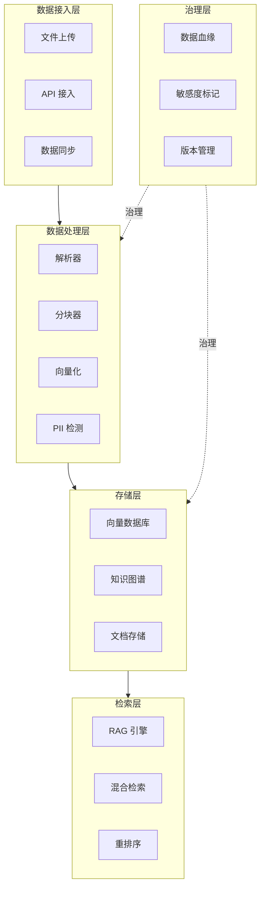
```

**File:** docs/architecture.md (L873-914)
```markdown

OpenEAAP 构建了从业务反馈到数据优化的全自动化闭环：

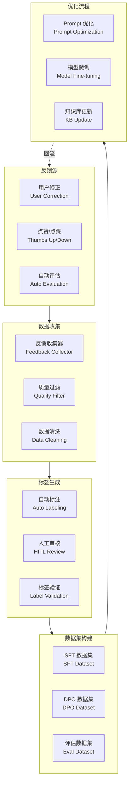
```

**File:** docs/architecture.md (L1112-1164)
```markdown
#### 4.3.3 三级缓存架构

为降低重复查询成本，OpenEAAP 设计了三级缓存架构：

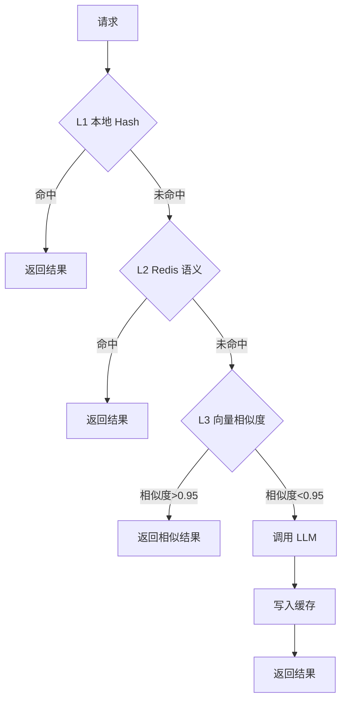

**缓存策略**:

| 层级     | 存储    | 匹配方式    | 命中率    | 延迟     |
| ------ | ----- | ------- | ------ | ------ |
| **L1** | 进程内存  | 精确 Hash | 20-30% | < 1ms  |
| **L2** | Redis | 语义 Hash | 30-40% | < 10ms |
| **L3** | 向量数据库 | 余弦相似度   | 10-20% | < 50ms |

**缓存接口**:

```go
// 缓存管理器接口
type CacheManager interface {
    // 查询缓存
    Get(ctx context.Context, key string) (*CachedResult, error)
    
    // 语义查询（L2/L3）
    GetSemantic(ctx context.Context, query string, threshold float64) (*CachedResult, error)
    
    // 写入缓存
    Set(ctx context.Context, key string, value *CachedResult, ttl time.Duration) error
    
    // 失效缓存
    Invalidate(ctx context.Context, key string) error
}

// 缓存结果
type CachedResult struct {
    Key        string    // 缓存键
    Value      string    // 缓存值
    Embedding  []float64 // 向量（用于 L3）
    Similarity float64   // 相似度（L3 命中时）
    TTL        time.Duration // 过期时间
    CreatedAt  time.Time // 创建时间
}
```
```

**File:** docs/architecture.md (L1454-1556)
```markdown
## 5. 关键业务场景设计

### 5.1 安全运营智能助手（SOC Copilot）

#### 5.1.1 场景描述

安全运营智能助手面向 SOC（Security Operations Center）团队，提供智能化的威胁检测、事件分析、响应建议等能力。

#### 5.1.2 业务流程

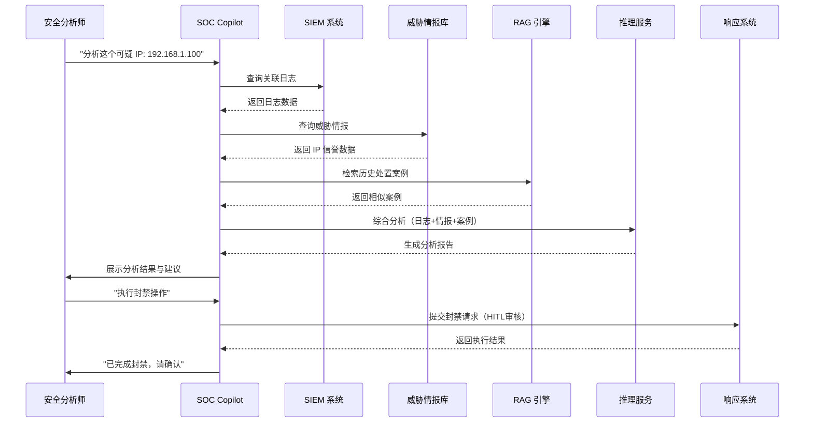

#### 5.1.3 核心能力

| 能力             | 说明         | 技术实现              |
| -------------- | ---------- | ----------------- |
| **威胁情报查询**     | 自动查询多源威胁情报 | 集成 SIEM、TI 平台 API |
| **日志关联分析**     | 多维度日志关联    | RAG 检索 + LLM 推理   |
| **历史案例检索**     | 检索相似历史案例   | 向量检索 + 知识图谱       |
| **响应建议生成**     | 生成处置建议     | 基于案例库的 Prompt 工程  |
| **人在回路（HITL）** | 关键操作需人工审核  | Workflow 审批机制     |
| **持续学习**       | 从处置反馈中学习   | 在线学习引擎            |

#### 5.1.4 技术架构

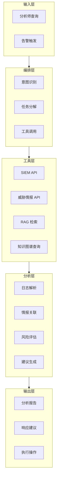

#### 5.1.5 效果指标

| 指标        | 基线    | 目标      | 说明         |
| --------- | ----- | ------- | ---------- |
| **分析耗时**  | 30 分钟 | < 5 分钟  | 从告警到初步分析报告 |
| **误报率**   | 40%   | < 15%   | 降低误报，提升准确性 |
| **响应速度**  | 2 小时  | < 30 分钟 | 从分析到执行响应   |
| **知识复用率** | -     | > 60%   | 历史案例被引用比例  |

```

**File:** docs/architecture.md (L1557-1642)
```markdown
### 5.2 智能文档问答系统

#### 5.2.1 场景描述

基于企业内部文档（政策、规范、手册等）构建智能问答系统，支持员工快速获取信息。

#### 5.2.2 业务流程

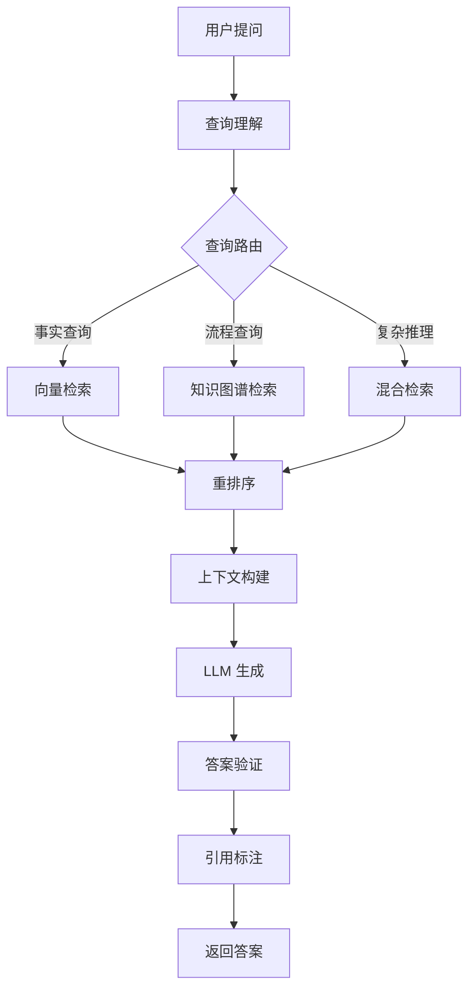

#### 5.2.3 核心技术

**文档预处理**:

```go
// 文档处理流程
type DocumentProcessor struct {
    parser     Parser
    chunker    Chunker
    embedder   Embedder
    piiDetector PIIDetector
}

func (p *DocumentProcessor) Process(ctx context.Context, doc *Document) (*ProcessedDocument, error) {
    // 1. 解析文档
    parsedDoc, err := p.parser.Parse(ctx, doc)
    if err != nil {
        return nil, err
    }
    
    // 2. PII 检测与脱敏
    cleanedDoc, err := p.piiDetector.Mask(ctx, parsedDoc.Text, nil)
    if err != nil {
        return nil, err
    }
    
    // 3. 智能分块
    chunks, err := p.chunker.Chunk(ctx, cleanedDoc)
    if err != nil {
        return nil, err
    }
    
    // 4. 向量化
    for _, chunk := range chunks {
        embedding, err := p.embedder.Embed(ctx, chunk.Text)
        if err != nil {
            return nil, err
        }
        chunk.Embedding = embedding
    }
    
    return &ProcessedDocument{
        Original: doc,
        Chunks:   chunks,
    }, nil
}
```

**智能分块策略**:

| 策略       | 说明              | 适用场景  |
| -------- | --------------- | ----- |
| **固定长度** | 按固定 Token 数分块   | 通用文档  |
| **语义边界** | 按段落、章节分块        | 结构化文档 |
| **滑动窗口** | 重叠分块，避免信息丢失     | 长篇文档  |
| **层次分块** | 多粒度分块（句子、段落、章节） | 复杂文档  |

```

**File:** docs/architecture.md (L1985-1995)
```markdown
### 7.2 存储选型

| 数据类型     | 存储技术          | 说明                  |
| -------- | ------------- | ------------------- |
| **关系数据** | PostgreSQL    | 用户、Agent、执行记录等结构化数据 |
| **向量数据** | Milvus/Qdrant | 文档向量、Embedding      |
| **图数据**  | Neo4j         | 知识图谱、数据血缘           |
| **时序数据** | InfluxDB      | Trace、指标、日志         |
| **缓存**   | Redis         | L2 语义缓存、会话状态        |
| **对象存储** | MinIO/S3      | 原始文档、模型文件           |

```

**File:** docs/architecture.md (L1996-2034)
```markdown
### 7.3 数据血缘图谱

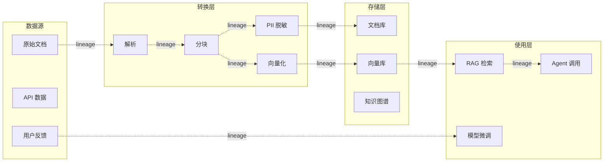
```

**File:** README-zh.md (L85-96)
```markdown
* **三级智能缓存**：L1 本地（<1ms）+ L2 Redis（<10ms）+ L3 向量（<50ms），命中率 50%+
* **vLLM 集成**：PagedAttention、KV-Cache 共享、投机解码，吞吐量提升 24 倍
* **智能路由**：根据复杂度、延迟要求、成本预算自动选择最优模型

**效果对比**：

| 指标      | 优化前             | 优化后             | 提升幅度     |
| ------- | --------------- | --------------- | -------- |
| P95 延迟  | 5000ms          | 1500ms          | ⬇️ 70%   |
| 推理成本    | $1.00/1K tokens | $0.40/1K tokens | ⬇️ 60%   |
| GPU 利用率 | 40%             | 75%             | ⬆️ 87.5% |

```

**File:** README-zh.md (L176-264)
```markdown

OpenEAAP 采用经典的 **DDD（领域驱动设计）分层架构**，清晰的职责划分确保系统的可维护性和扩展性。

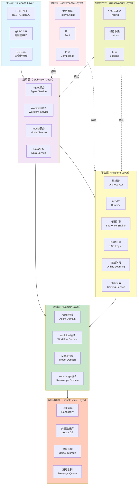

**各层职责**：

| 层次        | 职责                 | 示例组件                                     |
| --------- | ------------------ | ---------------------------------------- |
| **接口层**   | 对外暴露 API，处理请求/响应   | HTTP Handler、gRPC Server、CLI 命令          |
| **应用层**   | 编排业务流程，协调多个领域服务    | AgentService、WorkflowService             |
| **平台层**   | 核心能力组件，编排、推理、RAG 等 | Orchestrator、Inference Engine、RAG Engine |
| **领域层**   | 业务核心逻辑，领域实体和领域服务   | Agent、Workflow、Model 实体和领域服务             |
| **基础设施层** | 数据持久化和外部系统集成       | PostgreSQL、Redis、Milvus、MinIO            |
| **治理层**   | 安全、合规、审计           | 策略引擎、审计日志、PII 检测                         |
| **可观测性层** | 监控、追踪、日志           | OpenTelemetry、Prometheus、Loki            |

### 核心组件交互流程

以下时序图展示了一次完整的 Agent 执行请求的处理流程：

```

**File:** README-zh.md (L614-650)
```markdown
## 🗺️ 路线图

### Phase 1: 基础平台（2026 Q1-Q2）✅

* [x] 核心框架搭建（DDD 架构）
* [x] 编排器与运行时（Native、LangChain 适配器）
* [x] 推理网关（vLLM 集成）
* [x] 三级缓存架构

### Phase 2: 数据智能（2026 Q2-Q3）🚧

* [ ] RAG 引擎（混合检索、重排序）
* [ ] 向量数据库集成（Milvus）
* [ ] 知识图谱构建
* [ ] 文档处理流水线（解析、分块、向量化）

### Phase 3: 持续优化（2026 Q3-Q4）📅

* [ ] 在线学习引擎
* [ ] RLHF/DPO 训练流程
* [ ] Prompt 自动优化
* [ ] A/B 测试框架

### Phase 4: 治理增强（2026 Q4-2027 Q1）📅

* [ ] 策略引擎（ABAC/RBAC）
* [ ] 隐私计算网关（PII 检测与脱敏）
* [ ] 审计与合规（SOC2、GDPR）
* [ ] 漏洞扫描与安全加固

### Phase 5: 生态集成（2027 Q1-Q2）📅

* [ ] AutoGPT 适配器
* [ ] 插件市场
* [ ] 多模态支持（图像、语音）
* [ ] 边缘 AI 部署

```

**File:** internal/platform/rag/rag_engine.go (L14-106)
```go
// RAGEngine 定义 RAG 引擎接口
type RAGEngine interface {
	// Query 执行完整的 RAG 查询流程
	Query(ctx context.Context, req *RAGRequest) (*RAGResponse, error)

	// QueryStream 执行流式 RAG 查询
	QueryStream(ctx context.Context, req *RAGRequest) (<-chan *RAGChunk, error)

	// HealthCheck 健康检查
	HealthCheck(ctx context.Context) error
}

// RAGRequest 定义 RAG 请求
type RAGRequest struct {
	Query           string            // 用户查询
	CollectionName  string            // 知识库名称
	TopK            int               // 检索数量
	RetrievalMode   RetrievalMode     // 检索模式
	RerankEnabled   bool              // 是否启用重排序
	ModelName       string            // 生成模型名称
	Temperature     float32           // 生成温度
	MaxTokens       int               // 最大生成长度
	Metadata        map[string]string // 元数据过滤
	VerifyEnabled   bool              // 是否启用答案验证
}

// RAGResponse 定义 RAG 响应
type RAGResponse struct {
	Answer          string              // 生成的答案
	RetrievedChunks []*RetrievedChunk   // 检索到的文档块
	Sources         []string            // 引用来源
	Confidence      float32             // 置信度
	Latency         LatencyBreakdown    // 延迟分解
	Verified        bool                // 是否通过验证
	VerifyResult    *VerifyResult       // 验证结果
}

// RAGChunk 定义流式响应块
type RAGChunk struct {
	Type    ChunkType // 块类型
	Content string    // 内容
	Done    bool      // 是否完成
	Error   error     // 错误
}

// ChunkType 定义块类型
type ChunkType string

const (
	ChunkTypeRetrieval ChunkType = "retrieval" // 检索阶段
	ChunkTypeGenerate  ChunkType = "generate"  // 生成阶段
	ChunkTypeVerify    ChunkType = "verify"    // 验证阶段
	ChunkTypeError     ChunkType = "error"     // 错误
)

// RetrievalMode 定义检索模式
type RetrievalMode string

const (
	RetrievalModeVector  RetrievalMode = "vector"  // 向量检索
	RetrievalModeKeyword RetrievalMode = "keyword" // 关键词检索
	RetrievalModeHybrid  RetrievalMode = "hybrid"  // 混合检索
	RetrievalModeGraph   RetrievalMode = "graph"   // 知识图谱检索
)

// RetrievedChunk 定义检索到的文档块
type RetrievedChunk struct {
	ChunkID    string            // 块ID
	DocumentID string            // 文档ID
	Content    string            // 内容
	Score      float32           // 相关性分数
	Metadata   map[string]string // 元数据
	Source     string            // 来源
}

// LatencyBreakdown 定义延迟分解
type LatencyBreakdown struct {
	QueryUnderstanding time.Duration // 查询理解
	Retrieval          time.Duration // 检索
	Reranking          time.Duration // 重排序
	ContextBuilding    time.Duration // 上下文构建
	Generation         time.Duration // 生成
	Verification       time.Duration // 验证
	Total              time.Duration // 总延迟
}

// VerifyResult 定义验证结果
type VerifyResult struct {
	HasHallucination bool     // 是否存在幻觉
	CitationValid    bool     // 引用是否有效
	FactCheckPassed  bool     // 事实检查是否通过
	Issues           []string // 问题列表
}
```

**File:** internal/platform/rag/rag_engine.go (L154-259)
```go
// Query 执行完整的 RAG 查询流程
func (r *ragEngineImpl) Query(ctx context.Context, req *RAGRequest) (*RAGResponse, error) {
	startTime := time.Now()

	// 创建 Span
	span := r.tracer.StartSpan(ctx, "RAGEngine.Query")
	defer span.End()
	span.AddTag("query", req.Query)
	span.AddTag("collection", req.CollectionName)

	// 应用默认值
	r.applyDefaults(req)

	// 验证请求
	if err := r.validateRequest(req); err != nil {
		return nil, errors.Wrap(err, errors.CodeInvalidArgument, "invalid RAG request")
	}

	var latency LatencyBreakdown

	// 1. 查询理解（可选，当前简化为直接使用原始查询）
	queryStart := time.Now()
	processedQuery := r.understandQuery(ctx, req.Query)
	latency.QueryUnderstanding = time.Since(queryStart)

	// 2. 检索阶段
	retrievalStart := time.Now()
	retrievedChunks, err := r.retrieveChunks(ctx, processedQuery, req)
	if err != nil {
		span.SetStatus(trace.StatusError, err.Error())
		return nil, errors.Wrap(err, errors.CodeInternal, "retrieval failed")
	}
	latency.Retrieval = time.Since(retrievalStart)

	r.logger.Info(ctx, "retrieval completed",
		"query", req.Query,
		"chunks_count", len(retrievedChunks),
		"latency_ms", latency.Retrieval.Milliseconds())

	// 3. 重排序阶段（可选）
	if req.RerankEnabled && r.reranker != nil {
		rerankStart := time.Now()
		retrievedChunks, err = r.rerankChunks(ctx, processedQuery, retrievedChunks)
		if err != nil {
			r.logger.Warn(ctx, "reranking failed, using original order", "error", err)
		}
		latency.Reranking = time.Since(rerankStart)
	}

	// 4. 上下文构建阶段
	contextStart := time.Now()
	ragContext := r.buildContext(ctx, retrievedChunks, req)
	latency.ContextBuilding = time.Since(contextStart)

	// 5. 生成阶段
	generationStart := time.Now()
	answer, sources, err := r.generateAnswer(ctx, req.Query, ragContext, req)
	if err != nil {
		span.SetStatus(trace.StatusError, err.Error())
		return nil, errors.Wrap(err, errors.CodeInternal, "generation failed")
	}
	latency.Generation = time.Since(generationStart)

	// 6. 验证阶段（可选）
	var verifyResult *VerifyResult
	verified := true
	if req.VerifyEnabled {
		verifyStart := time.Now()
		verifyResult, err = r.verifyAnswer(ctx, req.Query, answer, retrievedChunks)
		if err != nil {
			r.logger.Warn(ctx, "verification failed", "error", err)
		} else {
			verified = verifyResult.HasHallucination == false &&
				verifyResult.CitationValid &&
				verifyResult.FactCheckPassed
		}
		latency.Verification = time.Since(verifyStart)
	}

	latency.Total = time.Since(startTime)

	// 计算置信度
	confidence := r.calculateConfidence(retrievedChunks, verified)

	response := &RAGResponse{
		Answer:          answer,
		RetrievedChunks: retrievedChunks,
		Sources:         sources,
		Confidence:      confidence,
		Latency:         latency,
		Verified:        verified,
		VerifyResult:    verifyResult,
	}

	r.logger.Info(ctx, "RAG query completed",
		"query", req.Query,
		"answer_length", len(answer),
		"confidence", confidence,
		"verified", verified,
		"total_latency_ms", latency.Total.Milliseconds())

	span.AddTag("confidence", fmt.Sprintf("%.2f", confidence))
	span.AddTag("verified", verified)

	return response, nil
}
```

**File:** internal/platform/rag/rag_engine.go (L261-341)
```go
// QueryStream 执行流式 RAG 查询
func (r *ragEngineImpl) QueryStream(ctx context.Context, req *RAGRequest) (<-chan *RAGChunk, error) {
	chunkChan := make(chan *RAGChunk, 10)

	go func() {
		defer close(chunkChan)

		// 应用默认值
		r.applyDefaults(req)

		// 1. 检索阶段
		chunkChan <- &RAGChunk{Type: ChunkTypeRetrieval, Content: "开始检索相关文档...", Done: false}

		processedQuery := r.understandQuery(ctx, req.Query)
		retrievedChunks, err := r.retrieveChunks(ctx, processedQuery, req)
		if err != nil {
			chunkChan <- &RAGChunk{Type: ChunkTypeError, Error: err, Done: true}
			return
		}

		chunkChan <- &RAGChunk{
			Type:    ChunkTypeRetrieval,
			Content: fmt.Sprintf("检索完成，找到 %d 个相关文档块", len(retrievedChunks)),
			Done:    false,
		}

		// 2. 重排序（可选）
		if req.RerankEnabled && r.reranker != nil {
			retrievedChunks, _ = r.rerankChunks(ctx, processedQuery, retrievedChunks)
		}

		// 3. 构建上下文
		ragContext := r.buildContext(ctx, retrievedChunks, req)

		// 4. 流式生成
		chunkChan <- &RAGChunk{Type: ChunkTypeGenerate, Content: "", Done: false}

		answerChan, err := r.generator.GenerateStream(ctx, &GenerateRequest{
			Query:       req.Query,
			Context:     ragContext,
			ModelName:   req.ModelName,
			Temperature: req.Temperature,
			MaxTokens:   req.MaxTokens,
		})

		if err != nil {
			chunkChan <- &RAGChunk{Type: ChunkTypeError, Error: err, Done: true}
			return
		}

		fullAnswer := ""
		for genChunk := range answerChan {
			if genChunk.Error != nil {
				chunkChan <- &RAGChunk{Type: ChunkTypeError, Error: genChunk.Error, Done: true}
				return
			}
			fullAnswer += genChunk.Content
			chunkChan <- &RAGChunk{Type: ChunkTypeGenerate, Content: genChunk.Content, Done: false}
		}

		// 5. 验证（可选）
		if req.VerifyEnabled {
			chunkChan <- &RAGChunk{Type: ChunkTypeVerify, Content: "验证答案中...", Done: false}
			verifyResult, err := r.verifyAnswer(ctx, req.Query, fullAnswer, retrievedChunks)
			if err == nil {
				verified := verifyResult.HasHallucination == false &&
					verifyResult.CitationValid &&
					verifyResult.FactCheckPassed
				chunkChan <- &RAGChunk{
					Type:    ChunkTypeVerify,
					Content: fmt.Sprintf("验证完成，结果: %v", verified),
					Done:    true,
				}
			}
		} else {
			chunkChan <- &RAGChunk{Type: ChunkTypeGenerate, Content: "", Done: true}
		}
	}()

	return chunkChan, nil
}
```

**File:** internal/platform/rag/rag_engine.go (L389-410)
```go
// buildContext 构建 RAG 上下文
func (r *ragEngineImpl) buildContext(ctx context.Context, chunks []*RetrievedChunk, req *RAGRequest) string {
	var contextBuilder string
	currentLength := 0

	for i, chunk := range chunks {
		chunkText := fmt.Sprintf("[文档 %d] 来源: %s\n%s\n\n", i+1, chunk.Source, chunk.Content)

		// 控制上下文长度
		if currentLength+len(chunkText) > r.config.MaxContextLength {
			r.logger.Warn(ctx, "context truncated due to length limit",
				"max_length", r.config.MaxContextLength,
				"chunks_included", i)
			break
		}

		contextBuilder += chunkText
		currentLength += len(chunkText)
	}

	return contextBuilder
}
```

**File:** internal/platform/rag/rag_engine.go (L431-461)
```go
func (r *ragEngineImpl) verifyAnswer(ctx context.Context, query, answer string, chunks []*RetrievedChunk) (*VerifyResult, error) {
	// 简化实现：基于规则的验证
	result := &VerifyResult{
		HasHallucination: false,
		CitationValid:    true,
		FactCheckPassed:  true,
		Issues:           []string{},
	}

	// 检查答案长度
	if len(answer) < 10 {
		result.Issues = append(result.Issues, "答案过短")
		result.FactCheckPassed = false
	}

	// 检查是否引用了检索到的内容
	hasReference := false
	for _, chunk := range chunks {
		if contains(answer, chunk.Content[:min(50, len(chunk.Content))]) {
			hasReference = true
			break
		}
	}

	if !hasReference {
		result.Issues = append(result.Issues, "答案未引用检索到的内容，可能存在幻觉")
		result.HasHallucination = true
	}

	return result, nil
}
```
