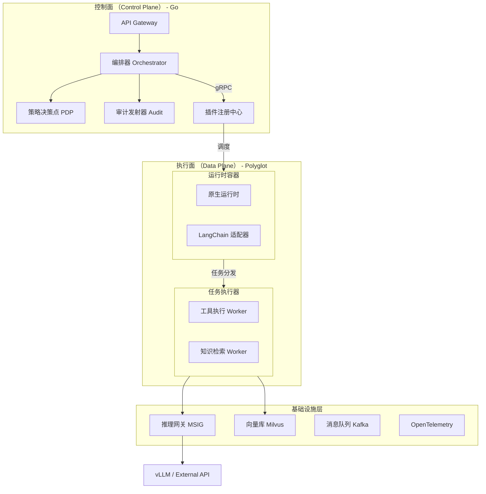
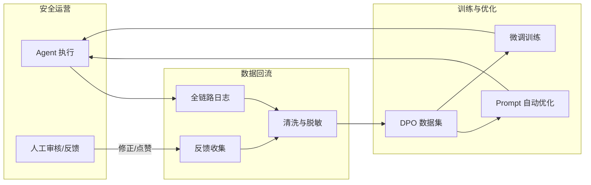
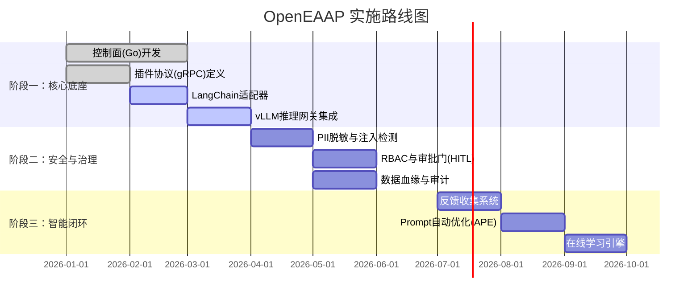

# OpenEAAP 架构设计文档

我们这里通过 `OpenEAAP` 企业级(AI Agent / Agentic AI)平台，来阐述AI赋能业务这个任务

以下是基于 OpenEAAP 架构设计文档整理的英文缩写术语表格：

**OpenEAAP 术语缩写表**

| 缩写 | 全称 | 中文含义 | 备注 |
| --- | --- | --- | --- |
| **OpenEAAP** | Open Enterprise AI Agent Platform | 开放企业级 AI 智能体平台 | 平台名称 |
| **PoC** | Proof of Concept | 概念验证 | 项目初期的原型验证阶段 |
| **AEP** | Agent Engineering Platform | 智能体工程平台 | 负责 Agent 编排与管理 |
| **DIKF** | Data Intelligence & Knowledge Fabric | 数据智能与知识编织 | 负责数据处理与 RAG |
| **ADI** | AI Developer Infrastructure | AI 开发者基础设施 | 提供开发环境与算力调度 |
| **MSIG** | Model Serving & Inference Gateway | 模型服务与推理网关 | 负责模型推理与路由 |
| **MTFS** | Model Training & Fine-tuning Service | 模型训练与微调服务 | 负责模型训练与优化 |
| **RAG** | Retrieval-Augmented Generation | 检索增强生成 | 结合外部知识库提升 LLM 生成质量的技术 |
| **ReAct** | Reason + Act | 推理 + 行动 | 一种让 Agent 结合推理与工具调用的模式 |
| **COT** | Chain of Thought | 思维链 | 引导 LLM 一步步推理的 Prompt 技术 |
| **TOT** | Tree of Thoughts | 思维树 | 引导 LLM 进行多路径探索的推理技术 |
| **APE** | Automatic Prompt Engineering | 自动提示词工程 | 自动优化 Prompt 的技术 |
| **RLHF** | Reinforcement Learning from Human Feedback | 基于人类反馈的强化学习 | 利用人工反馈微调模型的技术 |
| **DPO** | Direct Preference Optimization | 直接偏好优化 | 一种无需训练奖励模型的偏好对齐算法 |
| **vLLM** | vLLM (Versatile Large Language Model serving) | vLLM 推理引擎 | 一个高吞吐、低延迟的 LLM 推理库 |
| **PDP** | Policy Decision Point | 策略决策点 | 负责安全策略判定与拦截的组件 |
| **RBAC** | Role-Based Access Control | 基于角色的访问控制 | 一种权限管理模型 |
| **PII** | Personally Identifiable Information | 个人身份信息 | 需脱敏的敏感数据（如手机号、身份证号） |
| **HITL** | Human-in-the-Loop | 人在回路 | 关键环节需人工介入确认的机制 |
| **SIEM** | Security Information and Event Management | 安全信息与事件管理 | 安全运营中的核心监控与告警系统 |
| **SOP** | Standard Operating Procedure | 标准作业程序 | 标准化的操作流程文档 |
| **SSE** | Server-Sent Events | 服务器推送事件 | 用于流式传输数据的 HTTP 技术 |
| **HPA** | Horizontal Pod Autoscaler | 水平 Pod 自动扩缩容 | Kubernetes 中根据负载自动调整副本数的机制 |
| **HA** | High Availability | 高可用 | 系统持续无中断运行的能力 |
| **DR** | Disaster Recovery | 灾难恢复 | 系统在灾难发生后恢复数据的能力 |


## 目录

1. [概述](https://www.google.com/search?q=%231-%E6%A6%82%E8%BF%B0)
2. [平台能力全景（五个子方向）](https://www.google.com/search?q=%232-%E5%B9%B3%E5%8F%B0%E8%83%BD%E5%8A%9B%E5%85%A8%E6%99%AF%E4%BA%94%E5%A4%A7%E6%94%AF%E6%9F%B1)
3. [系统架构设计](https://www.google.com/search?q=%233-%E7%B3%BB%E7%BB%9F%E6%9E%B6%E6%9E%84%E8%AE%BE%E8%AE%A1)
4. [核心组件详细设计](https://www.google.com/search?q=%234-%E6%A0%B8%E5%BF%83%E7%BB%84%E4%BB%B6%E8%AF%A6%E7%BB%86%E8%AE%BE%E8%AE%A1)
5. [关键技术设计：高性能与闭环](https://www.google.com/search?q=%235-%E5%85%B3%E9%94%AE%E6%8A%80%E6%9C%AF%E8%AE%BE%E8%AE%A1%E9%AB%98%E6%80%A7%E8%83%BD%E4%B8%8E%E9%97%AD%E7%8E%AF)
6. [安全与治理架构](https://www.google.com/search?q=%236-%E5%AE%89%E5%85%A8%E4%B8%8E%E6%B2%BB%E7%90%86%E6%9E%B6%E6%9E%84)
7. [关键业务场景：安全运营](https://www.google.com/search?q=%237-%E5%85%B3%E9%94%AE%E4%B8%9A%E5%8A%A1%E5%9C%BA%E6%99%AF%E5%AE%89%E5%85%A8%E8%BF%90%E8%90%A5-copilot)
8. [部署架构](https://www.google.com/search?q=%238-%E9%83%A8%E7%BD%B2%E6%9E%B6%E6%9E%84)
9. [项目结构与交付](https://www.google.com/search?q=%239-%E9%A1%B9%E7%9B%AE%E7%BB%93%E6%9E%84%E4%B8%8E%E4%BA%A4%E4%BB%98)

---

## 1. 概述

### 1.1 设计目标

OpenEAAP 旨在构建一个**企业级 AI 智能体编排与交付底座**，解决 AI 在安全与业务落地中 **“PoC 容易，生产困难”** 的痛点。

核心定位是：

* **做厚能力中台**：下沉推理、数据、治理等通用能力，避免重复造轮子。
* **赋能安全业务**：通过内建的安全策略与闭环机制，让 AI 能力可控、可信。
* **开放生态兼容**：不搞封闭体系，通过适配器架构兼容 LangChain 等主流生态。

### 1.2 核心设计原则

| 原则 | 说明 | 来源 |
| --- | --- | --- |
| **控制面与执行面分离** | **控制面**（Go）负责高并发编排、策略与审计；**执行面**（Python/Polyglot）负责推理与业务逻辑，确保系统稳定性与扩展性。 |  |
| **插件化运行时** | 核心不直接绑定特定框架，通过 **gRPC 插件协议** 挂载运行时，既支持原生高性能 Agent，也能无缝运行 LangChain/AutoGPT 生态。 |  |
| **安全内建 (Security First)** | 在架构底层植入 PII 脱敏、注入检测、RBAC 与审批流，而非应用层外挂。 |  |
| **持续效果闭环** | 建立“反馈-清洗-微调”的自动化管道，支持在线学习与 Prompt 自动调优（APE）。 |  |

---

## 2. 平台能力全景（五个子方向）

基于业务战略，OpenEAAP 划分为五个核心能力中台：

### 2.1 智能体工程平台 (Agent Engineering Platform, AEP)

* **定位**：Agent 全生命周期管理与编排中心。
* **关键能力**：
  * **多模态编排**：支持 ReAct、COT、TOT 等推理模式。
  * **生态适配**：提供标准 SDK 与 LangChain Bridge，一键接入社区能力。
  * **在线学习**：基于反馈自动优化 Agent 策略。


### 2.2 数据智能与知识编织 (Data Intelligence & Knowledge Fabric, DIKF)

* **定位**：面向 AI 的数据生产力平台。
* **关键能力**：
  * **高阶RAG**：混合检索（Dense+Sparse）与重排序（Re-ranking）。
  * **数据治理**：自动化数据分级分类（Data Sensitivity）、血缘追踪。
  * **回流管道**：将业务反馈（Feedback）转化为训练数据集。


### 2.3 AI 开发者基础设施 (AI Developer Infrastructure, ADI)

* **定位**：赋能 AI 研发的基础底座。
* **关键能力**：
  * **云原生环境**：提供标准化的 Notebook 与调试沙箱。
  * **资源调度**：屏蔽底层 GPU/NPU 差异，提供统一算力接口。


### 2.4 模型服务与推理网关 (Model Serving & Inference Gateway, MSIG)

* **定位**：具备隐私、调度、传输及缓存壁垒的高效推理承载。
* **关键能力**：
  * **高性能引擎**：深度集成 **vLLM**，支持 Continuous Batching 与 PagedAttention。
  * **三级缓存**：L1 本地 / L2 Redis / L3 语义缓存，降低重复推理成本。
  * **隐私网关**：出域流量的实时审计与脱敏。


### 2.5 模型训练与微调服务 (Model Training & Fine-tuning Service, MTFS)

* **定位**：稳定、高效的模型演进中心。
* **关键能力**：
  * **Prompt 自动优化 (APE)**：利用日志数据自动迭代 Prompt。
  * **RLHF/DPO 训练流**：基于业务反馈数据进行偏好对齐。
  * **多租户配额**：保障训练任务稳定性。


---

## 3. 系统架构设计

### 3.1 总体架构图 (Control & Data Planes)



### 3.2 插件与生态适配设计

为了兼容生态，OpenEAAP 定义了标准的 **Plugin Protocol**。

* **运行时插件 (Runtime Plugin)**：封装 Agent 的思维逻辑。
* **原生模式**：OpenEAAP 标准 ReAct 实现，高性能。
* **生态模式**：通过 `langchain-bridge` 容器，将 LangChain 的 `AgentExecutor` 封装为 gRPC 服务，OpenEAAP 负责输入清洗和输出审计，LangChain 负责推理循环。


---

## 4. 核心组件详细设计

### 4.1 编排器 (Orchestrator)

* **状态机**：维护 `Pending` -> `Running` -> `Paused (HITL)` -> `Completed` 状态。
* **幂等性**：支持 `Idempotency-Key`，确保网络抖动时不重复执行高危操作。
* **断点恢复**：所有状态持久化至 PostgreSQL，支持崩溃后从断点继续执行。

### 4.2 策略决策点 (PDP)

* **拦截机制**：在 Agent 的每一步思考（Think）和行动（Act）之前进行拦截。
* **规则引擎**：
  * **RBAC**：检查用户是否有权调用特定 Tool。
  * **资源配额**：检查 Token 消耗、API 频次。
  * **合规性**：检查操作对象是否在允许的 Scope 内（如仅允许操作测试网段 IP）。


### 4.3 推理网关 (MSIG) - vLLM 深度集成

* **架构**：
  * **路由层**：基于成本和延迟的智能路由（如简单查询路由至小模型）。
  * **缓存层**：
    * **L1/L2**: 精确匹配缓存。
    * **L3 (Semantic)**: 基于向量相似度的语义缓存，对于安全威胁情报查询等高频重复场景，命中率可达 40%+。
  * **引擎层**：集成 **vLLM**，启用 KV-Cache 共享（Prefix Caching），显著降低多轮对话延迟。


---

## 5. 关键技术设计：高性能与闭环

### 5.1 持续效果闭环 (Continuous Effect Loop)

这是实现“安全能力持续进化”的核心。



1. **显式反馈**：安全专家的“批准”或“修正”操作直接转化为高质量的正/负样本。
2. **Prompt 自动优化 (APE)**：利用累积的成功案例，自动反向优化 System Prompt，并在沙箱中进行 A/B 测试。

### 5.2 数据血缘与治理 (Lineage & Governance)

* **血缘追踪**：记录每一个 Agent 结论的引用来源（Knowledge Chunk ID）和推理依据，确保结果可解释、可追责。
* **敏感度标记**：数据入湖时自动打标（Public/Internal/Confidential），推理时根据用户权限自动过滤。

---

## 6. 安全与治理架构

针对安全业务的高敏感性，构建多层防护体系：

### 6.1 输入防护

* **注入检测**：集成 BERT 分类模型，识别 "Ignore previous instructions" 等 Prompt 注入攻击。
* **沙箱执行**：生成的代码（Python/Bash）必须在隔离的 gVisor 或 Firecracker 沙箱中运行，严禁直接在宿主机执行。

### 6.2 过程管控 (Human-in-the-Loop)

* **审批门 (Approval Gate)**：
  * 定义高危操作（如：封禁 IP、隔离主机）。
  * 编排器识别到高危 Tool 调用时，自动挂起任务，生成审批单。
  * 等待人工通过 API/IM 确认后，恢复执行。


### 6.3 审计 (Auditability)

* **全链路追踪**：基于 **OpenTelemetry**，为每一次 LLM 交互、工具调用生成唯一的 `TraceID`，并关联到 `UserID`。
* **PII 脱敏**：在审计日志落盘前，自动掩盖手机号、IP、AK/SK 等敏感信息。

---

## 7. 关键业务场景：安全运营

**场景描述**：自动响应 SIEM 告警，进行研判和处置。

**执行流程**：

    1. **触发**：SIEM 推送一条“异常登录”告警。
    2. **编排 (AEP)**：启动“安全研判 Agent”。
    3. **知识检索 (DIKF)**：RAG 检索类似历史告警的处置 SOP。
    4. **推理分析 (MSIG)**：调用 vLLM 上的安全微调模型，分析攻击特征。
    5. **工具调用 (Data Plane)**：
       * 调用 `ThreatIntel` 插件查询 IP 信誉。
       * 调用 `CMDB` 插件查询资产负责人。
    6. **决策**：Agent 建议“封禁 IP 1.2.3.4”。
    7. **治理 (Governance)**：PDP 识别为高危操作，触发**审批门**。
    8. **执行**：安全专家在 IM 中点击“批准”，Agent 调用防火墙 API 封禁 IP。
    9. **闭环**：处置结果回流，作为正样本优化模型。

---

## 8. 部署架构

采用云原生部署，实现控制面与执行面的物理隔离。

```yaml
# 部署架构示意
ControlPlane:
  - Deployment: openeaap-api (Go, HPA enabled)
  - Deployment: openeaap-orchestrator (Go, HPA enabled)
  - StatefulSet: postgres (Metadata), redis (Cache)

DataPlane:
  - StatefulSet: msig-inference (Python, GPU Bound, vLLM)
  - Deployment: runtime-worker-python (Python, CPU Bound, LangChain Adapter)
  - Deployment: runtime-worker-go (Go, CPU Bound, Native Agent)

Infrastructure:
  - Kafka: Event Bus
  - Milvus: Vector Database
  - OpenTelemetry Collector: Observability

```

---

## 9. 项目结构与交付

采用单仓多模块结构（Monorepo），清晰分离核心与适配器。

```text
OpenEAAP/
├── cmd/
│   ├── openeaap-server/          # 控制面服务入口 (Go)
│   ├── openeaap-cli/             # 运维命令行工具 (Go)
│   └── worker-runtime/           # 通用运行时 Worker
├── api/
│   ├── proto/                    # gRPC 协议定义 (Plugin, Runtime)
│   └── openapi/                  # REST API 定义
├── internal/                     # 核心业务逻辑 (Go)
│   ├── orchestrator/             # 编排与状态机
│   ├── policy/                   # PDP 策略引擎
│   ├── msig/                     # 推理网关路由与缓存逻辑
│   └── dikf/                     # 知识库管理逻辑
├── pkg/                          # 公共库
│   ├── adapter/                  # 生态适配器接口
│   └── security/                 # PII 脱敏, 注入检测工具
├── plugins/                      # 官方插件集
│   ├── langchain-bridge/         # Python Bridge (Python)
│   ├── security-tools/           # 安全工具集 (VirusTotal, Firewall)
│   └── standard-tools/           # 标准工具 (Search, Calculator)
├── deployments/                  # Helm Charts & Dockerfiles
└── docs/                         # 架构与开发文档

```

### 交付形态

1. **容器镜像**：`openeaap/control-plane` (轻量), `openeaap/runtime-python` (包含常用 ML 库)。
2. **SDK**：提供 Python 和 Go SDK，允许业务方开发自定义 Agent 并注册到平台。
3. **Web 模板**：提供开箱即用的 React 聊天组件，支持流式响应与工具调用卡片渲染。

涵盖了 **实施路线图**、**核心接口契约**、**配置范例** 以及 **开发者扩展指南**。这部分内容旨在指导团队如何将架构图转化为实际的代码落地。

---

## 10. 实施路线图 (Implementation Roadmap)

为了平衡“快速上线”与“长期演进”，建议分三个阶段落地。



### 阶段一：核心底座 (Foundation)

* **目标**：跑通第一个 Agent，支持 LangChain 生态接入，具备基本的 vLLM 推理能力。
* **关键交付**：
  * Go 语言编写的 Orchestrator 与 API Gateway。
  * Python 编写的 `langchain-bridge` 运行时插件。
  * 基于 Container 的 vLLM 部署脚本。


### 阶段二：安全与治理 (Security & Governance)

* **目标**：满足安全业务上线标准，实现数据不泄露、操作可审计。
* **关键交付**：
  * PDP 策略引擎集成（RBAC, Quota）。
  * PII 自动化脱敏管道。
  * 高危操作审批流（Approval Workflow）。


### 阶段三：智能闭环 (Intelligence Loop)

* **目标**：实现“越用越聪明”，数据驱动模型迭代。
* **关键交付**：
  * 用户反馈收集 UI 组件。
  * APE (Automatic Prompt Engineering) 离线任务。
  * SFT 微调流水线集成。


---

## 11. 核心接口定义 (Core Interface Contracts)

这是 **控制面** 与 **执行面** 解耦的关键契约（The Glue），定义在 `api/proto/runtime/v1/runtime.proto`。

### 11.1 运行时插件协议 (Runtime Protocol)

```protobuf
syntax = "proto3";
package openeaap.runtime.v1;

service RuntimeService {
  // 握手：协商协议版本与能力集
  rpc Handshake(HandshakeRequest) returns (HandshakeResponse);
  
  // 执行步骤：核心逻辑
  rpc ExecuteStep(ExecuteStepRequest) returns (ExecuteStepResponse);
  
  // 健康检查
  rpc HealthCheck(HealthCheckRequest) returns (HealthCheckResponse);
}

message ExecuteStepRequest {
  string run_id = 1;      // 运行ID
  string step_id = 2;     // 步骤ID
  string agent_id = 3;    // 调用的Agent定义ID
  
  // 上下文注入 (OpenTelemetry Trace Context)
  map<string, string> trace_context = 4;
  
  // 输入数据 (JSON String)
  string input_payload = 5;
  
  // 动态凭证注入 (最小权限原则)
  map<string, string> ephemeral_credentials = 6;
  
  // 治理约束 (来自 PDP 的决策)
  GovernanceConstraints constraints = 7;
}

message GovernanceConstraints {
  repeated string blocked_tools = 1; // 禁止调用的工具
  bool dry_run = 2;                  // 是否仅试运行
  int32 max_tokens = 3;              // Token 配额
}

message ExecuteStepResponse {
  string output_payload = 1;        // 执行结果
  repeated ToolCall audit_logs = 2; // 工具调用审计日志
  map<string, string> metadata = 3; // 消耗 Token、耗时等
}

```

* **设计意图**：通过 `GovernanceConstraints` 字段，控制面可以将安全策略（如禁止删除操作）强制下发给 Python 运行时，无论运行时使用 LangChain 还是 LlamaIndex，都必须遵守该约束。

---

## 12. 治理配置示例 (Governance Configuration)

OpenEAAP 的安全策略通过 YAML 定义，由 PDP 引擎加载。

### 12.1 安全策略配置 (`policies/security.yaml`)

```yaml
# PII 脱敏规则 (引用 CC 架构)
pii_masking:
  enabled: true
  rules:
    - name: "phone_number"
      regex: "\\b\\d{11}\\b"
      action: "mask"  # 替换为 *******
    - name: "aws_ak"
      regex: "(AKIA|ASIA)[0-9A-Z]{16}"
      action: "redact" # 完全移除

# 审批门规则 (引用 Pro 架构)
approval_gates:
  - tool_pattern: "firewall_block_ip"
    condition: "always"
    approvers: ["group:security-ops"]
    timeout: "1h"

  - tool_pattern: "exec_shell_command"
    condition: "input.cmd contains 'rm' or input.cmd contains 'shutdown'"
    approvers: ["group:sre-leads"]

```

### 12.2 推理路由配置 (`configs/msig.yaml`)

```yaml
# 模型服务网关配置
routing_strategy: "cost_optimized" # cost_optimized | latency_optimized

backends:
  - name: "security-finetuned-72b"
    type: "vllm"
    endpoint: "http://msig-inference-vllm:8000"
    capabilities: ["security_analysis", "code_audit"]
    cost_per_1k: 0.0

  - name: "general-gpt4"
    type: "openai"
    endpoint: "https://api.openai.com/v1"
    capabilities: ["general_chat", "summarization"]
    cost_per_1k: 0.03

# 语义缓存配置
semantic_cache:
  enabled: true
  backend: "redis-vector"
  similarity_threshold: 0.92

```

---

## 13. 开发者扩展指南 (Developer Guide)

如何开发一个新的 **“IP 信誉查询”** 工具并注册到平台？

### 步骤 1：编写工具逻辑 (Python)

使用 OpenEAAP SDK 提供的装饰器，自动处理参数校验和 Schema 生成。

```python
from openeaap.sdk import tool, ToolContext

@tool(
    name="check_ip_reputation",
    description="查询 IP 地址的威胁信誉分",
    args_schema=IPCheckInput # Pydantic Model
)
def check_ip_reputation(ctx: ToolContext, ip_address: str):
    # 1. 自动获取注入的 API Key (安全)
    api_key = ctx.secrets.get("THREAT_INTEL_KEY")
    
    # 2. 执行逻辑
    result = requests.get(f"https://api.threat.com/v1/{ip_address}", headers={"x-api-key": api_key})
    
    # 3. 返回结构化数据
    return {
        "ip": ip_address,
        "score": result.json().get("risk_score"),
        "tags": result.json().get("tags")
    }

```

### 步骤 2：注册到平台

1. 将代码打包为 Docker 镜像 `custom-tools:v1`。
2. 在控制台或 YAML 中声明：

```yaml
plugins:
  - name: "security-tools-pack"
    image: "custom-tools:v1"
    type: "runtime-worker"

```

平台会自动拉起 Worker，并通过 gRPC `Handshake` 发现 `check_ip_reputation` 工具，随后即可在编排器中拖拽使用。

---

## 14. 小结

这份 **OpenEAAP V2.0 融合架构** 是一个兼顾了理想与现实的方案：

1. 它保留了“在线学习”和“数据闭环”作为长期的护城河。
2. 它通过“控制面/执行面分离”解决了困扰企业的 LangChain 版本地狱和并发稳定性问题。
3. 它通过 vLLM、PII 脱敏、RBAC 审批等细节，确保该平台在“安全业务”场景下不仅仅是一个玩具，而是真正的生产力工具。

建议优先启动 **阶段一（核心底座）** 的研发，使用 Go 完成编排器核心，利用 Python 快速适配 LangChain 现有能力，以最快速度发布 MVP 版本供业务试用。

接下来深入到 **数据持久化设计**、**API 契约细节**、**可观测性埋点规范** 以及 **关键组件的 Kubernetes 部署清单**。这些内容是将架构图转化为生产级代码的最后“一公里”。

---

## 15. 数据持久化设计 (Data Persistence Design)

基于 **Pro** 的“控制面与执行面分离”原则，数据存储分为 **元数据存储 (PostgreSQL)**、**向量存储 (Milvus)** 和 **高速缓存 (Redis)**。

### 15.1 控制面元数据 (PostgreSQL Schema)

核心表结构设计，重点关注审计与状态机持久化。

```sql
-- 1. 智能体定义表 (Agent Definitions)
CREATE TABLE agents (
    id UUID PRIMARY KEY DEFAULT gen_random_uuid(),
    name VARCHAR(255) NOT NULL,
    version VARCHAR(50) NOT NULL,
    
    -- 核心配置 (JSONB)，包含 Prompt 模板、工具列表、模型参数
    -- 设计来源
    configuration JSONB NOT NULL,
    
    -- 状态: draft, published, deprecated
    status VARCHAR(50) DEFAULT 'draft',
    created_at TIMESTAMPTZ DEFAULT NOW(),
    updated_at TIMESTAMPTZ DEFAULT NOW()
);

-- 2. 运行实例表 (Runs) - 状态机持久化
CREATE TABLE runs (
    id UUID PRIMARY KEY DEFAULT gen_random_uuid(),
    agent_id UUID REFERENCES agents(id),
    user_id VARCHAR(255) NOT NULL, -- 关联到外部系统的用户
    trace_id VARCHAR(255) NOT NULL, -- OpenTelemetry Trace ID
    
    -- 幂等键，防止网络重试导致重复执行
    idempotency_key VARCHAR(255) UNIQUE,
    
    -- 状态: pending, running, paused(HITL), completed, failed
    status VARCHAR(50) NOT NULL,
    
    -- 输入与输出快照
    input_payload JSONB,
    output_payload JSONB,
    
    created_at TIMESTAMPTZ DEFAULT NOW(),
    finished_at TIMESTAMPTZ
);

-- 3. 审计日志表 (Audit Logs) - 不可变日志
-- 设计来源
CREATE TABLE audit_logs (
    id UUID PRIMARY KEY DEFAULT gen_random_uuid(),
    run_id UUID REFERENCES runs(id),
    
    -- 动作类型: tool_call, llm_invoke, approval_grant
    action_type VARCHAR(50) NOT NULL,
    
    -- 关键元数据: 耗时、Token消耗、工具名称
    metadata JSONB,
    
    -- 脱敏后的输入输出快照
    sanitized_input TEXT,
    sanitized_output TEXT,
    
    created_at TIMESTAMPTZ DEFAULT NOW()
);
-- 审计表只增不改，建议通过分区表按月归档

```

### 15.2 向量知识库 (Milvus Collection)

用于 DIKF (数据智能平台) 的高阶 RAG 检索。

```yaml
# Milvus Collection Schema
collection_name: "enterprise_knowledge"
fields:
  - name: "chunk_id"
    dtype: Int64
    is_primary: true
    auto_id: true
  
  - name: "embedding"
    dtype: FloatVector
    dim: 1536 # 对应 embedding 模型维度
  
  - name: "content"
    dtype: VarChar
    max_length: 65535
  
  # 权限控制字段
  # 用于在检索时进行 Partition 过滤或 Scalar 过滤，实现知识隔离
  - name: "access_group_id" 
    dtype: VarChar 
    max_length: 64
    
  - name: "sensitivity_level"
    dtype: Int8 # 1:Public, 2:Internal, 3:Confidential

```

---

## 16. API 接口详解 (REST API Specification)

控制面通过 REST API 对外服务，支持流式响应 (SSE) 以提升 AI 体验。

### 16.1 运行管理 (Run Management)

**创建运行 (Trigger Run)**

`POST /api/v1/agents/{agent_id}/runs`

```json
// 请求体
{
  "input": "分析 IP 1.2.3.4 的威胁等级",
  "user_id": "user-123",
  "stream": true, // 是否开启流式响应
  "idempotency_key": "req-uuid-v4"
}

```

**流式响应 (SSE Event Stream)**

当 `stream=true` 时，服务器通过 Server-Sent Events 推送执行过程。

```text
event: run_started
data: {"run_id": "run-abc", "status": "running"}

event: step_thought
data: {"content": "我需要先查询威胁情报，然后查询资产库..."}

event: tool_call
data: {"tool": "check_ip_reputation", "input": {"ip": "1.2.3.4"}}

event: tool_result
data: {"output": {"score": 90, "risk": "high"}}

event: governance_intervention
data: {"reason": "检测到高危操作，已挂起等待审批", "approval_id": "apr-xyz"}

event: run_completed
data: {"output": "该 IP 为高危僵尸网络节点，建议立即封禁。"}

```

### 16.2 智能闭环 (Feedback Loop)

用于 AEP (智能体工程平台) 的数据回流。

**提交反馈**
`POST /api/v1/runs/{run_id}/feedback`

```json
{
  "score": -1, // -1: 点踩, 1: 点赞
  "correction": "不应该直接建议封禁，应该建议先隔离观察。", // 专家的修正意见
  "category": "safety_violation" // 反馈类别
}

```

* **后台动作**：此 API 调用会触发异步任务，将 `(Agent Input, Agent Output, Correction)` 作为一个负样本对 (Negative Pair) 存入 DPO 数据集。

---

## 17. 可观测性实战 (Observability Specifications)

基于 **OpenTelemetry** 的标准埋点，确保能看清 AI 的“思考过程”。

### 17.1 Tracing (Span 设计)

一个完整的 Agent 执行链路 (`Trace`) 应包含以下层级：

1. **Root Span**: `Run {trace_id}` (控制面创建)
2.  **Child Span**: `Orchestrator.Plan` (规划)
3.  **Child Span**: `PDP.Evaluate` (策略检查)
4.  **Child Span**: `Agent.Step` (思考与执行循环)
5.  **Child Span**: `LLM.Invoke` (调用 MSIG 网关)
    * Attributes: `llm.model`, `llm.prompt_tokens`, `llm.completion_tokens`
6.  **Child Span**: `Tool.Execute` (调用执行面 Worker)
    * Attributes: `tool.name`, `tool.input_size`

### 17.2 Metrics (Prometheus)

| 指标名称 | 类型 | 标签 (Labels) | 说明 |
| --- | --- | --- | --- |
| `agent_run_total` | Counter | `agent_id`, `status` | 运行总次数及状态分布 |
| `agent_token_usage` | Counter | `agent_id`, `model_name` | Token 消耗统计 (成本核算) |
| `pdp_block_total` | Counter | `policy_rule`, `user_group` | **安全拦截次数** |
| `msig_cache_hit_ratio` | Gauge | `cache_level` (l1/l2/l3) | **语义缓存命中率**，衡量成本优化效果 |
| `vllm_gpu_utilization` | Gauge | `node_ip`, `gpu_id` | 推理算力利用率 |

---

## 18. 部署清单示例 (Kubernetes Manifests)

以下是 **MSIG (推理网关)** 中集成 **vLLM** 的核心部署配置，体现了高性能推理的要求。

### 18.1 vLLM StatefulSet

```yaml
apiVersion: apps/v1
kind: StatefulSet
metadata:
  name: msig-inference-vllm
  namespace: openeaap
spec:
  replicas: 2
  serviceName: "msig-inference"
  selector:
    matchLabels:
      app: msig-inference
  template:
    metadata:
      labels:
        app: msig-inference
    spec:
      containers:
      - name: vllm
        image: vllm/vllm-openai:latest
        command: ["python3", "-m", "vllm.entrypoints.openai.api_server"]
        args:
          - "--model=Qwen/Qwen1.5-72B-Chat"
          - "--tensor-parallel-size=4" # 使用 4 卡并行
          - "--gpu-memory-utilization=0.9"
          - "--max-num-seqs=256" # Continuous Batching 并发数
        env:
          - name: HUGGING_FACE_HUB_TOKEN
            valueFrom:
              secretKeyRef:
                name: hf-token
                key: token
        ports:
          - containerPort: 8000
        resources:
          limits:
            nvidia.com/gpu: "4" # 请求 4 块 GPU
        volumeMounts:
          - mountPath: /dev/shm
            name: dshm
      volumes:
      - name: dshm
        emptyDir:
          medium: Memory # NCCL 通信需要共享内存

```

### 18.2 控制面 Deployment (Control Plane)

```yaml
apiVersion: apps/v1
kind: Deployment
metadata:
  name: openeaap-orchestrator
spec:
  replicas: 3 # 高可用
  selector:
    matchLabels:
      app: orchestrator
  template:
    spec:
      containers:
      - name: orchestrator
        image: openeaap/orchestrator:v2.0
        env:
          - name: DB_HOST
            value: "postgres-rw"
          - name: PLUGIN_REGISTRY_URL
            value: "dns:///openeaap-registry:8080"
          # 强制开启安全特性
          - name: ENABLE_PII_MASKING
            value: "true"
          - name: ENABLE_AUDIT_LOG
            value: "true"

```

---

## 19. 灾难恢复与高可用 (DR & HA)

针对企业级“生产就绪”的要求：

1. **控制面 HA**：`orchestrator` 和 `api-gateway` 无状态，至少 3 副本部署，配合 PodAntiAffinity 跨可用区调度。
2. **执行面隔离**：不同的 Agent Runtime (如 Python vs Node.js) 部署在不同的 Node Pool，防止 Python GIL 或内存泄漏影响核心组件稳定性。
3. **数据备份**：
   * **PostgreSQL**: 使用 Wal-G 进行增量备份至 S3。
   * **Milvus**: 定期 Snapshot 向量索引。

4. **故障降级 (Circuit Breaker)**：
   * 当 **MSIG** 推理网关响应超时 (>30s) 时，编排器自动降级为“兜底回复”模式，提示用户稍后重试，避免请求堆积导致雪崩。


---

## 结语：从架构到代码

至此，OpenEAAP设计包含了：

* **架构图** 指明了方向（控制面/执行面分离）。
* **API 契约** 定义了边界（gRPC 插件协议）。
* **数据Schema** 夯实了基础（审计与状态机）。
* **部署清单** 铺平了落地（vLLM 与 K8s）。
