# OpenEAAP 企业级 AI 智能体应用平台架构设计文档

**版本**: v1.0
**日期**: 2026-01-13
**状态**: 架构设计阶段

---

## 文档摘要

OpenEAAP (Open Enterprise AI Agent Application Platform) 是一个面向企业级应用的 AI 智能体应用平台，专注于为安全、云、AI 等领域提供完整的智能体开发、部署与运营能力。本文档详细阐述了 OpenEAAP 的技术架构、核心组件设计、关键技术方案及实施路径。

---

## 术语表

| 术语/缩写        | 英文全称                                       | 中文释义                |
| ------------ | ------------------------------------------ | ------------------- |
| **AEP**      | Agent Engineering Platform                 | 智能体工程平台             |
| **DIKF**     | Data Intelligence & Knowledge Fabric       | 数据智能与知识编织平台         |
| **MSIG**     | Model Serving & Inference Gateway          | 模型服务与推理网关           |
| **MTFS**     | Model Training & Fine-tuning Service       | 模型训练与微调服务           |
| **ADI**      | AI Developer Infrastructure                | AI 开发者基础设施          |
| **RAG**      | Retrieval-Augmented Generation             | 检索增强生成              |
| **RLHF**     | Reinforcement Learning from Human Feedback | 基于人类反馈的强化学习         |
| **DPO**      | Direct Preference Optimization             | 直接偏好优化              |
| **PDP**      | Policy Decision Point                      | 策略决策点               |
| **PII**      | Personally Identifiable Information        | 个人可识别信息             |
| **SIEM**     | Security Information and Event Management  | 安全信息与事件管理           |
| **SOC**      | Security Operations Center                 | 安全运营中心              |
| **RBAC**     | Role-Based Access Control                  | 基于角色的访问控制           |
| **vLLM**     | -                                          | 高性能大语言模型推理引擎        |
| **KV-Cache** | Key-Value Cache                            | 键值缓存                |
| **ReAct**    | Reasoning and Acting                       | 推理与行动循环             |
| **APE**      | Automatic Prompt Engineer                  | 自动提示词工程             |
| **OPRO**     | Optimization by Prompting                  | 通过提示优化              |
| **HITL**     | Human-In-The-Loop                          | 人在回路                |
| **SFT**      | Supervised Fine-Tuning                     | 监督微调                |
| **DTO**      | Data Transfer Object                       | 数据传输对象              |
| **CLI**      | Command Line Interface                     | 命令行界面               |
| **SDK**      | Software Development Kit                   | 软件开发工具包             |
| **API**      | Application Programming Interface          | 应用程序编程接口            |
| **gRPC**     | gRPC Remote Procedure Call                 | 高性能 RPC 框架          |
| **TGI**      | Text Generation Inference                  | 文本生成推理引擎            |
| **DFX**      | Design for X                               | 面向 X 的设计(可测试性、可靠性等) |

---

## 目录

1. [概述](#1-概述)
2. [领域问题与解决方案全景](#2-领域问题与解决方案全景)
3. [系统架构设计](#3-系统架构设计)
4. [核心组件详细设计](#4-核心组件详细设计)
5. [关键业务场景设计](#5-关键业务场景设计)
6. [关键技术设计](#6-关键技术设计)
7. [数据架构设计](#7-数据架构设计)
8. [安全架构设计](#8-安全架构设计)
9. [可观测性与运维设计](#9-可观测性与运维设计)
10. [部署架构设计](#10-部署架构设计)
11. [项目目录结构](#11-项目目录结构)
12. [预期效果与展望](#12-预期效果与展望)
13. [参考资料](#13-参考资料)

---

## 1. 概述

### 1.1 项目背景

随着大语言模型技术的快速发展，企业对 AI 智能体的需求呈现爆发式增长。然而，当前企业在构建 AI 智能体应用时面临以下核心挑战：

* **技术碎片化**：AI 生态工具繁多(LangChain、AutoGPT、LlamaIndex 等)，缺乏统一平台
* **数据孤岛**：业务数据、知识库、反馈数据分散，难以形成闭环
* **性能瓶颈**：推理成本高、延迟大，难以支撑生产级应用
* **安全合规**：缺乏系统的数据治理、隐私保护、审计机制
* **效果持续性**：缺乏从业务反馈到模型优化的自动化闭环

### 1.2 设计目标

OpenEAAP 旨在构建一个**轻量化、高性能、易集成**的企业级 AI 智能体应用平台，核心设计目标包括：

1. **完整的能力中台**：提供智能体开发、数据智能、推理服务、模型训练、基础设施五大核心能力
2. **生态兼容性**：通过插件化架构兼容主流 AI 框架(LangChain、AutoGPT 等)
3. **持续效果闭环**：建立从业务反馈到模型优化的全自动化流程
4. **安全合规优先**：面向安全业务场景深度定制，满足 SOC2、GDPR 等合规要求
5. **高性能推理**：基于 vLLM 等先进技术，构建技术壁垒

### 1.3 核心价值主张

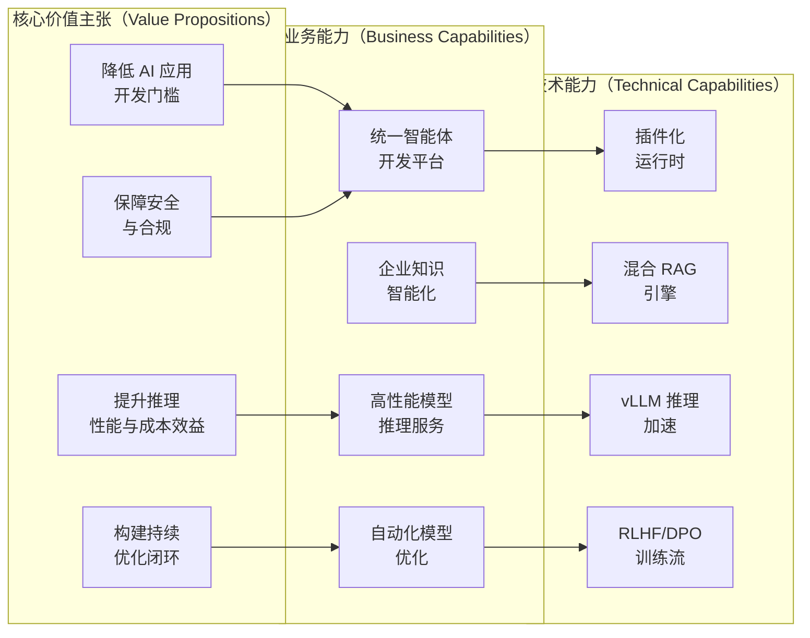

---

## 2. 领域问题与解决方案全景

### 2.1 领域 DFX 问题全景

#### 2.1.1 可开发性问题（Developability）

| 问题类别       | 具体表现                           | 影响         |
| ---------- | ------------------------------ | ---------- |
| **工具碎片化**  | LangChain、AutoGPT、DSPy 等工具各自为战 | 学习成本高，迁移困难 |
| **抽象不统一**  | Agent 概念、Workflow 定义各异         | 代码复用性差     |
| **调试困难**   | 缺乏统一的 Trace、Debug 工具           | 问题定位耗时长    |
| **版本管理混乱** | Prompt、模型、配置版本化缺失              | 回滚困难，风险高   |

#### 2.1.2 可测试性问题（Testability）

| 问题类别        | 具体表现               | 影响        |
| ----------- | ------------------ | --------- |
| **非确定性**    | LLM 输出随机性导致测试不稳定   | 自动化测试可信度低 |
| **评估标准缺失**  | 缺乏统一的 Agent 质量评估指标 | 效果对比困难    |
| **Mock 困难** | 外部 LLM 调用难以模拟      | 单元测试覆盖率低  |
| **回归检测不足**  | 缺乏持续的效果监控          | 性能退化难以发现  |

#### 2.1.3 可靠性问题（Reliability）

| 问题类别      | 具体表现            | 影响      |
| --------- | --------------- | ------- |
| **幻觉问题**  | LLM 输出事实性错误     | 业务风险高   |
| **依赖脆弱**  | 外部 API、模型服务不稳定  | 系统可用性低  |
| **错误传播**  | Agent 链路中错误累积放大 | 最终结果不可用 |
| **恢复能力弱** | 缺乏自动重试、降级机制     | 用户体验差   |

#### 2.1.4 可观测性问题（Observability）

| 问题类别         | 具体表现                  | 影响       |
| ------------ | --------------------- | -------- |
| **黑盒推理**     | LLM 推理过程不透明           | 问题难以排查   |
| **缺乏 Trace** | Agent 执行路径不可追溯        | 审计、优化困难  |
| **成本不可见**    | Token 消耗、API 调用成本难以量化 | 预算失控风险   |
| **效果不可量化**   | 缺乏业务 KPI 与 AI 指标关联    | ROI 难以证明 |

#### 2.1.5 性能问题（Performance）

| 问题类别      | 具体表现                     | 影响       |
| --------- | ------------------------ | -------- |
| **推理延迟高** | 首 Token 延迟 > 1s，总延迟 > 5s | 用户体验差    |
| **吞吐量低**  | 并发能力不足，排队严重              | 无法支撑生产流量 |
| **资源浪费**  | KV-Cache 未共享，GPU 利用率低    | 成本过高     |
| **冷启动慢**  | 模型加载耗时 > 30s             | 弹性伸缩困难   |

#### 2.1.6 安全合规问题（Security & Compliance）

| 问题类别          | 具体表现               | 影响       |
| ------------- | ------------------ | -------- |
| **数据泄露风险**    | PII 数据未脱敏直接输入 LLM  | 合规违规风险   |
| **Prompt 注入** | 恶意用户通过 Prompt 绕过限制 | 系统被滥用    |
| **审计不足**      | 缺乏完整的操作日志          | 无法满足合规要求 |
| **权限控制粗糙**    | 缺乏细粒度的资源隔离         | 数据越权访问   |

### 2.2 解决方案全景

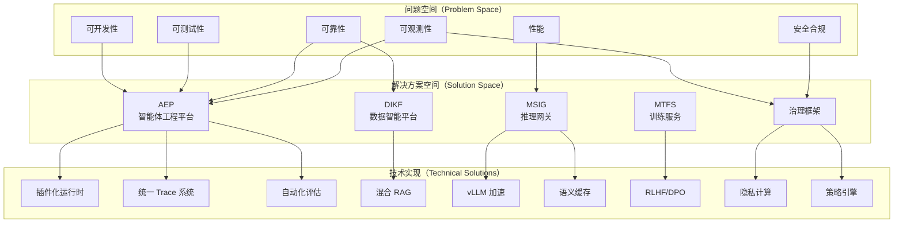

### 2.3 解决方案对比分析

| 维度       | 传统方案               | OpenEAAP 方案      | 优势                |
| -------- | ------------------ | ---------------- | ----------------- |
| **开发模式** | 直接调用 LangChain API | 统一控制面 + 插件运行时    | 兼容生态，可替换          |
| **数据管理** | 分散在各业务系统           | 统一知识编织平台         | 数据复用，闭环优化         |
| **推理性能** | 原生 API 调用          | vLLM + 语义缓存 + 路由 | 延迟降低 70%，成本降低 60% |
| **模型优化** | 手动调整 Prompt        | 自动化 RLHF/DPO 流程  | 持续优化,效果提升 30%     |
| **安全合规** | 应用层自行实现            | 平台级治理框架          | 统一策略，审计完整         |
| **可观测性** | 日志分散               | 统一 Trace + 指标体系  | 端到端可视化            |

---

## 3. 系统架构设计

### 3.1 总体架构

OpenEAAP 采用**分层 + 插件化**的架构设计,核心包含五大能力中台与一个全链路治理层:

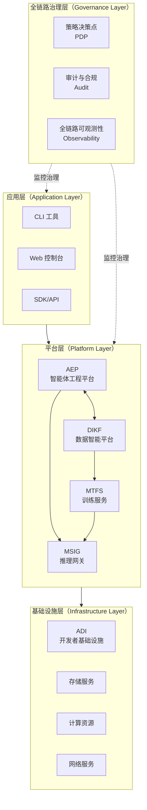

**架构分层说明**:

1. **应用层**: 面向最终用户的交互界面，包括命令行工具、Web 控制台、SDK 等
2. **平台层**: 核心能力中台，提供智能体开发、数据智能、推理服务、模型训练四大核心能力
3. **基础设施层**: 提供计算、存储、网络等基础资源支撑
4. **治理层**: 横向贯穿所有层次，提供策略控制、审计、可观测性能力

### 3.2 核心架构模式

#### 3.2.1 控制面与执行面分离

OpenEAAP 采用**控制面（Control Plane）与执行面（Execution Plane）分离**的架构模式：

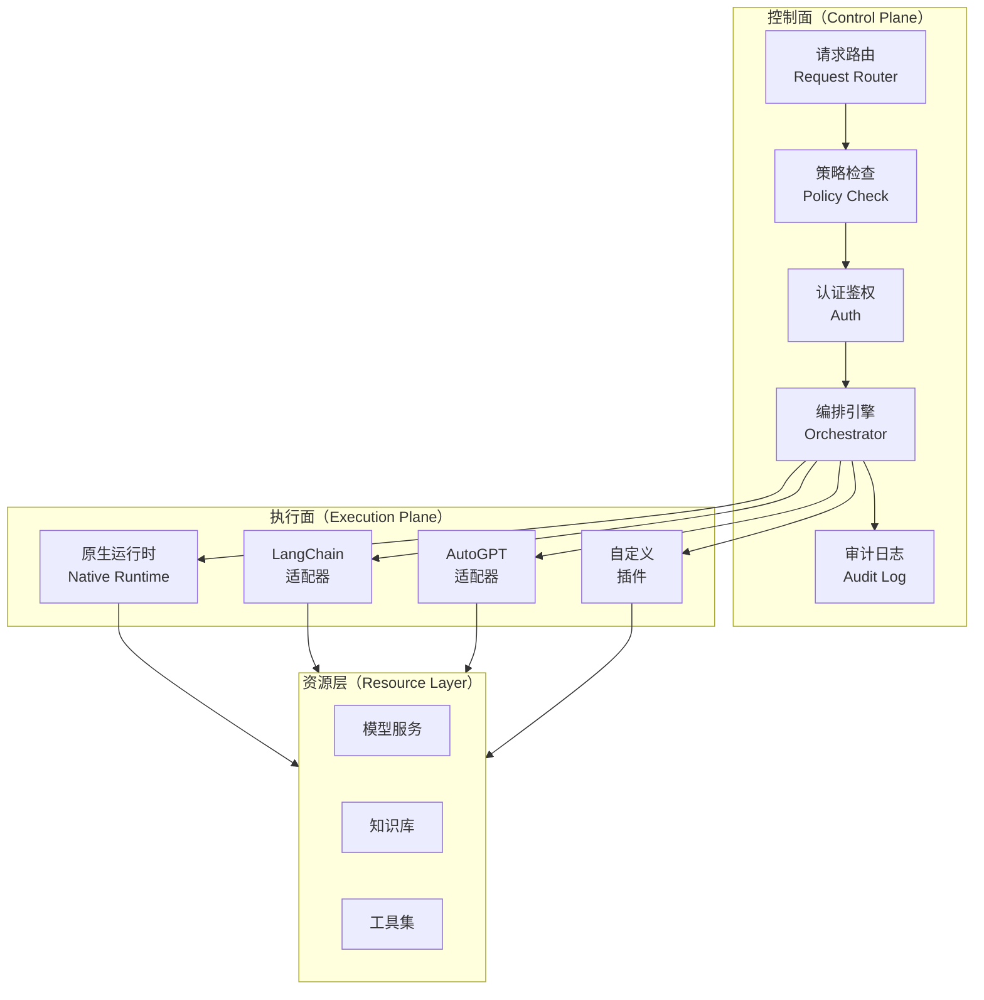

**设计优势**:

* **控制面**: 负责鉴权、路由、策略检查、审计记录等治理职责，统一管控
* **执行面**: 负责具体业务逻辑执行，支持多种运行时共存
* **松耦合**: 控制面与执行面通过标准协议交互，执行面可独立演进

#### 3.2.2 插件化运行时架构

为了兼容主流 AI 框架生态，OpenEAAP 设计了**插件化运行时（Pluggable Runtime）**架构：

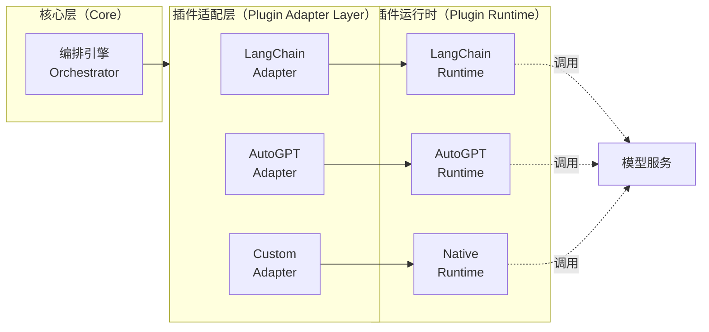

**插件协议规范**:

```go
// 插件运行时接口
type PluginRuntime interface {
    // 初始化插件
    Initialize(config *PluginConfig) error
    
    // 执行 Agent 任务
    Execute(ctx context.Context, task *AgentTask) (*AgentResult, error)
    
    // 流式执行（支持实时输出）
    ExecuteStream(ctx context.Context, task *AgentTask) (<-chan *AgentEvent, error)
    
    // 健康检查
    HealthCheck() error
    
    // 获取插件元数据
    Metadata() *PluginMetadata
}
```

### 3.3 数据流架构

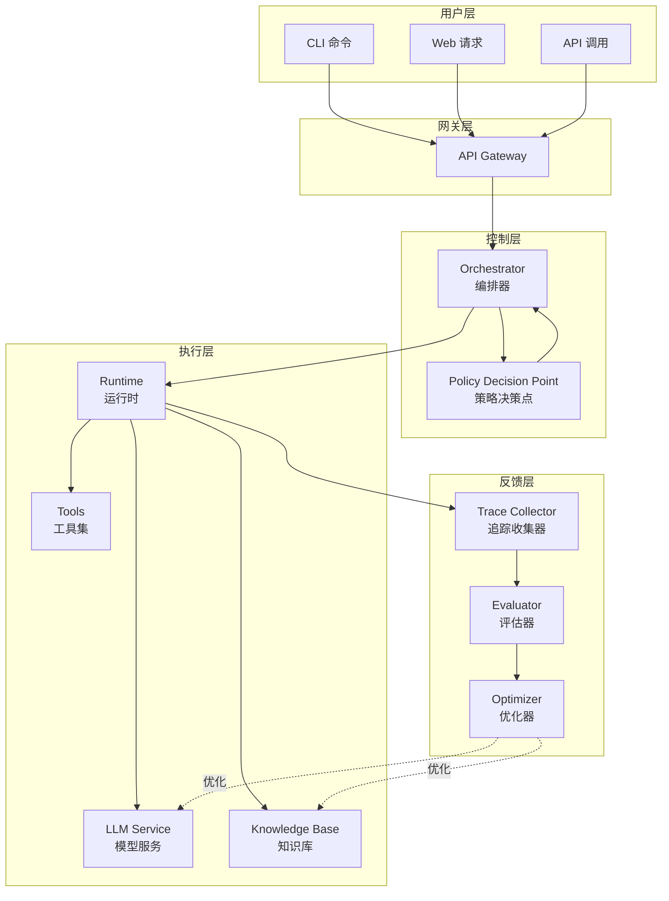

**数据流说明**:

1. **请求流**（1-6步）: 用户请求 → 网关 → 编排器 → 策略检查 → 运行时 → 资源层
2. **执行流**（7-9步）: 运行时调用模型、知识库、工具完成任务
3. **反馈流**（10-13步）: 追踪数据 → 评估 → 优化 → 回注到资源层

---

## 4. 核心组件详细设计

### 4.1 智能体工程平台（AEP）

#### 4.1.1 组件架构

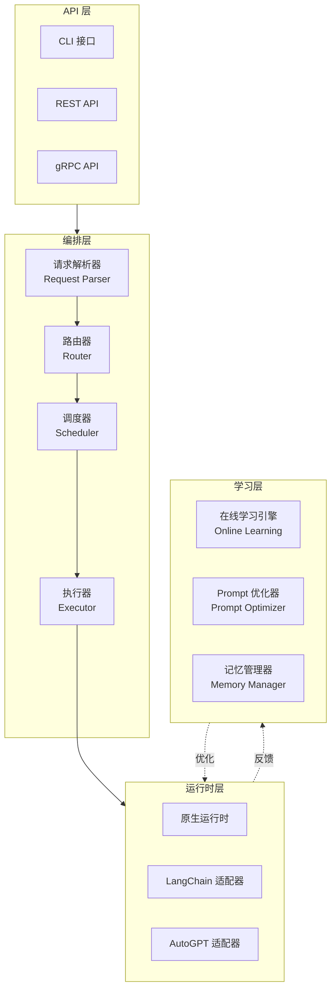

#### 4.1.2 CLI 引擎设计（基于 Cobra）

OpenEAAP CLI 采用 **Cobra** 框架构建，提供统一的命令行入口：

**命令结构**:

```
openeeap
├── agent          # Agent 管理命令组
│   ├── create     # 创建 Agent
│   ├── deploy     # 部署 Agent
│   ├── test       # 测试 Agent
│   └── delete     # 删除 Agent
├── workflow       # Workflow 管理
│   ├── run        # 运行 Workflow
│   ├── pause      # 暂停 Workflow
│   └── resume     # 恢复 Workflow
├── model          # 模型管理
│   ├── list       # 列出模型
│   ├── deploy     # 部署模型
│   └── monitor    # 监控模型
└── data           # 数据管理
    ├── import     # 导入数据
    ├── index      # 索引数据
    └── query      # 查询数据
```

**核心实现**:

```go
// CLI 根命令
type RootCommand struct {
    cobra.Command
    config     *Config
    logger     Logger
    httpClient *http.Client
}

// Agent 命令组
type AgentCommand struct {
    cobra.Command
    orchestrator Orchestrator
    validator    Validator
}
```

#### 4.1.3 编排器（Orchestrator）设计

编排器是 AEP 的核心组件，负责解析用户输入、加载插件、管理执行流程：

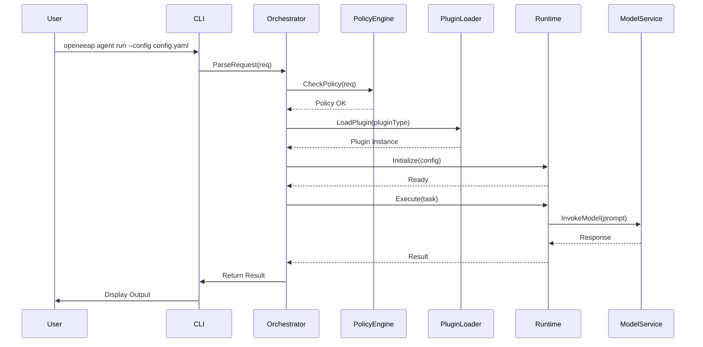

**核心接口**:

```go
// 编排器接口
type Orchestrator interface {
    // 解析并执行请求
    Execute(ctx context.Context, req *AgentRequest) (*AgentResponse, error)
    
    // 流式执行
    ExecuteStream(ctx context.Context, req *AgentRequest) (<-chan *AgentEvent, error)
    
    // 获取执行状态
    GetStatus(ctx context.Context, executionID string) (*ExecutionStatus, error)
    
    // 取消执行
    Cancel(ctx context.Context, executionID string) error
}

// Agent 请求
type AgentRequest struct {
    AgentID     string                 // Agent 标识
    Input       string                 // 用户输入
    Context     map[string]interface{} // 上下文
    Runtime     RuntimeType            // 运行时类型
    Config      *RuntimeConfig         // 运行时配置
    Constraints *ExecutionConstraints  // 执行约束（超时、预算等）
}
```

#### 4.1.4 插件接口设计

为了支持多种 AI 框架，OpenEAAP 定义了标准的插件接口协议：

```go
// 插件元数据
type PluginMetadata struct {
    Name        string   // 插件名称
    Version     string   // 版本
    Runtime     string   // 运行时类型（native/langchain/autogpt）
    Capabilities []string // 支持的能力
}

// 插件配置
type PluginConfig struct {
    Type          RuntimeType            // 运行时类型
    ModelConfig   *ModelConfig           // 模型配置
    ToolsConfig   []*ToolConfig          // 工具配置
    MemoryConfig  *MemoryConfig          // 记忆配置
    CustomConfig  map[string]interface{} // 自定义配置
}

// 插件运行时接口
type PluginRuntime interface {
    // 生命周期管理
    Initialize(config *PluginConfig) error
    Start() error
    Stop() error
    HealthCheck() error
    
    // 核心执行
    Execute(ctx context.Context, task *AgentTask) (*AgentResult, error)
    ExecuteStream(ctx context.Context, task *AgentTask) (<-chan *AgentEvent, error)
    
    // 元数据
    Metadata() *PluginMetadata
}
```

**LangChain 适配器示例**:

```go
type LangChainAdapter struct {
    config     *PluginConfig
    langchain  *langchain.Client
    logger     Logger
}

func (a *LangChainAdapter) Execute(ctx context.Context, task *AgentTask) (*AgentResult, error) {
    // 1. 转换 OpenEAAP 任务格式为 LangChain 格式
    lcTask := a.convertTask(task)
    
    // 2. 调用 LangChain 执行
    lcResult, err := a.langchain.Run(ctx, lcTask)
    if err != nil {
        return nil, err
    }
    
    // 3. 转换 LangChain 结果为 OpenEAAP 格式
    result := a.convertResult(lcResult)
    
    return result, nil
}
```

#### 4.1.5 在线学习引擎设计

在线学习引擎负责从执行反馈中持续优化 Agent 性能：

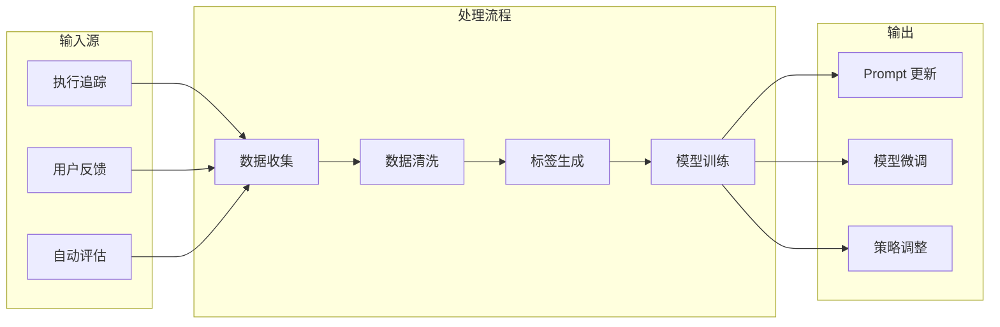

**核心组件**:

```go
// 在线学习引擎接口
type OnlineLearningEngine interface {
    // 收集反馈数据
    CollectFeedback(ctx context.Context, feedback *Feedback) error
    
    // 触发优化
    TriggerOptimization(ctx context.Context, target OptimizationTarget) error
    
    // 获取优化建议
    GetOptimizationSuggestions(ctx context.Context) ([]*Suggestion, error)
}

// 反馈数据
type Feedback struct {
    ExecutionID string                 // 执行 ID
    UserRating  float64                // 用户评分（0-1）
    Correction  string                 // 用户修正
    Metrics     map[string]interface{} // 自动化指标
    Timestamp   time.Time              // 时间戳
}
```

### 4.2 数据智能与知识编织平台（DIKF）

#### 4.2.1 组件架构

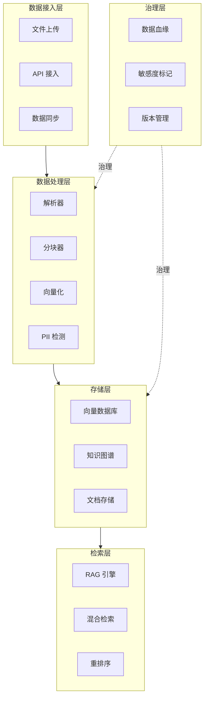

#### 4.2.2 高阶 RAG 管道设计

OpenEAAP 实现了多策略混合的高阶 RAG 引擎：

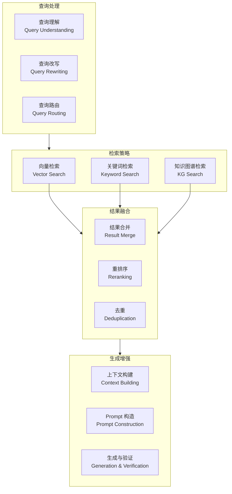

**核心技术**:

1. **查询理解**: 意图识别、实体抽取、查询扩展
2. **混合检索**: 向量检索（语义）+ 关键词检索（精确）+ 知识图谱检索（关系）
3. **智能重排序**: 基于相关性、新鲜度、权威性的多维度排序
4. **上下文优化**: 动态选择最相关片段，控制上下文长度

**接口设计**:

```go
// RAG 引擎接口
type RAGEngine interface {
    // 检索相关文档
    Retrieve(ctx context.Context, query *RetrievalQuery) (*RetrievalResult, error)
    
    // 生成答案
    Generate(ctx context.Context, query string, context *RetrievalResult) (*GenerationResult, error)
    
    // 端到端 RAG
    RAG(ctx context.Context, query string) (*RAGResult, error)
}

// 检索查询
type RetrievalQuery struct {
    Query       string           // 原始查询
    TopK        int              // 返回数量
    Strategies  []RetrievalStrategy // 检索策略
    Filters     map[string]interface{} // 过滤条件
    Reranker    RerankStrategy   // 重排序策略
}

// 检索策略枚举
type RetrievalStrategy string

const (
    StrategyVector   RetrievalStrategy = "vector"   // 向量检索
    StrategyKeyword  RetrievalStrategy = "keyword"  // 关键词检索
    StrategyKG       RetrievalStrategy = "kg"       // 知识图谱检索
    StrategyHybrid   RetrievalStrategy = "hybrid"   // 混合检索
)
```

#### 4.2.3 数据回流与反馈闭环设计

OpenEAAP 构建了从业务反馈到数据优化的全自动化闭环：

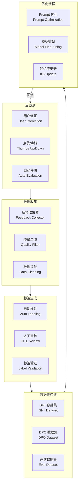

**反馈 Schema 定义**:

```go
// 反馈记录
type FeedbackRecord struct {
    ID            string    // 唯一标识
    ExecutionID   string    // 关联的执行 ID
    Query         string    // 原始查询
    Response      string    // Agent 响应
    Correction    string    // 用户修正（如有）
    Rating        float64   // 评分（0-1）
    FeedbackType  FeedbackType // 反馈类型
    Context       map[string]interface{} // 上下文
    CreatedAt     time.Time // 创建时间
}

// 反馈类型
type FeedbackType string

const (
    FeedbackThumbsUp   FeedbackType = "thumbs_up"
    FeedbackThumbsDown FeedbackType = "thumbs_down"
    FeedbackCorrection FeedbackType = "correction"
    FeedbackReport     FeedbackType = "report"
)
```

#### 4.2.4 数据治理设计

**PII 自动化脱敏**:

```go
// PII 检测器接口
type PIIDetector interface {
    // 检测文本中的 PII
    Detect(ctx context.Context, text string) ([]*PIIEntity, error)
    
    // 脱敏
    Mask(ctx context.Context, text string, entities []*PIIEntity) (string, error)
}

// PII 实体
type PIIEntity struct {
    Type       PIIType // PII 类型
    Value      string  // 原始值
    StartIndex int     // 起始位置
    EndIndex   int     // 结束位置
    Confidence float64 // 置信度
}

// PII 类型
type PIIType string

const (
    PIITypeName       PIIType = "name"       // 姓名
    PIITypeEmail      PIIType = "email"      // 邮箱
    PIITypePhone      PIIType = "phone"      // 电话
    PIITypeIDCard     PIIType = "id_card"    // 身份证
    PIITypeCreditCard PIIType = "credit_card" // 信用卡
    PIITypeAddress    PIIType = "address"    // 地址
)
```

**数据血缘追踪**:

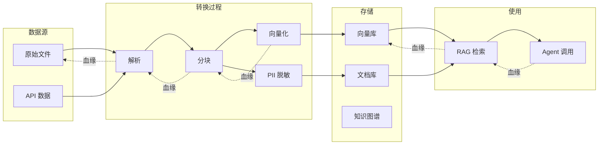

### 4.3 模型服务与推理网关（MSIG）

#### 4.3.1 组件架构

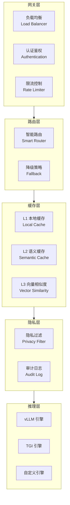

#### 4.3.2 高性能推理技术栈

OpenEAAP 基于 **vLLM** 构建高性能推理引擎，核心技术包括：

**技术特性对比**:

| 技术                      | 说明                        | 性能提升         |
| ----------------------- | ------------------------- | ------------ |
| **Continuous Batching** | 连续批处理，动态调整 Batch          | 吞吐量提升 10-20x |
| **PagedAttention**      | 分页注意力机制，优化 KV-Cache 管理    | 内存效率提升 50%   |
| **KV-Cache 共享**         | 多请求共享相同 Prefix 的 Cache    | 重复查询延迟降低 80% |
| **投机解码**                | Speculative Decoding，加速生成 | 生成速度提升 2-3x  |
| **量化加速**                | INT8/FP8 量化               | 吞吐量提升 2x     |

**vLLM 集成架构**:

```go
// vLLM 推理引擎接口
type VLLMEngine interface {
    // 同步推理
    Generate(ctx context.Context, req *GenerationRequest) (*GenerationResponse, error)
    
    // 流式推理
    GenerateStream(ctx context.Context, req *GenerationRequest) (<-chan *GenerationChunk, error)
    
    // 批量推理
    GenerateBatch(ctx context.Context, reqs []*GenerationRequest) ([]*GenerationResponse, error)
    
    // 健康检查
    HealthCheck() error
    
    // 获取引擎状态
    GetStatus() (*EngineStatus, error)
}

// 生成请求
type GenerationRequest struct {
    Prompt          string                 // 提示词
    MaxTokens       int                    // 最大生成 Token 数
    Temperature     float64                // 温度
    TopP            float64                // Top-p 采样
    StopSequences   []string               // 停止序列
    UseCache        bool                   // 是否使用缓存
    CacheKey        string                 // 缓存键
    CustomParams    map[string]interface{} // 自定义参数
}
```

#### 4.3.3 三级缓存架构

为降低重复查询成本，OpenEAAP 设计了三级缓存架构：

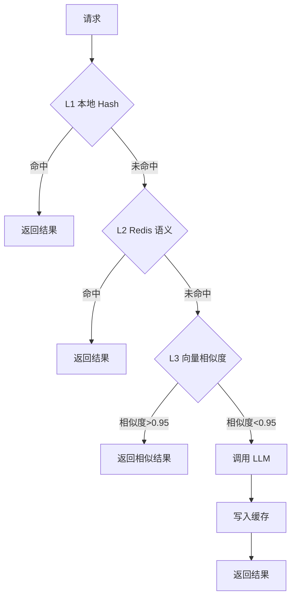

**缓存策略**:

| 层级     | 存储    | 匹配方式    | 命中率    | 延迟     |
| ------ | ----- | ------- | ------ | ------ |
| **L1** | 进程内存  | 精确 Hash | 20-30% | < 1ms  |
| **L2** | Redis | 语义 Hash | 30-40% | < 10ms |
| **L3** | 向量数据库 | 余弦相似度   | 10-20% | < 50ms |

**缓存接口**:

```go
// 缓存管理器接口
type CacheManager interface {
    // 查询缓存
    Get(ctx context.Context, key string) (*CachedResult, error)
    
    // 语义查询（L2/L3）
    GetSemantic(ctx context.Context, query string, threshold float64) (*CachedResult, error)
    
    // 写入缓存
    Set(ctx context.Context, key string, value *CachedResult, ttl time.Duration) error
    
    // 失效缓存
    Invalidate(ctx context.Context, key string) error
}

// 缓存结果
type CachedResult struct {
    Key        string    // 缓存键
    Value      string    // 缓存值
    Embedding  []float64 // 向量（用于 L3）
    Similarity float64   // 相似度（L3 命中时）
    TTL        time.Duration // 过期时间
    CreatedAt  time.Time // 创建时间
}
```

#### 4.3.4 智能模型路由

支持根据请求特征自动选择最优模型：

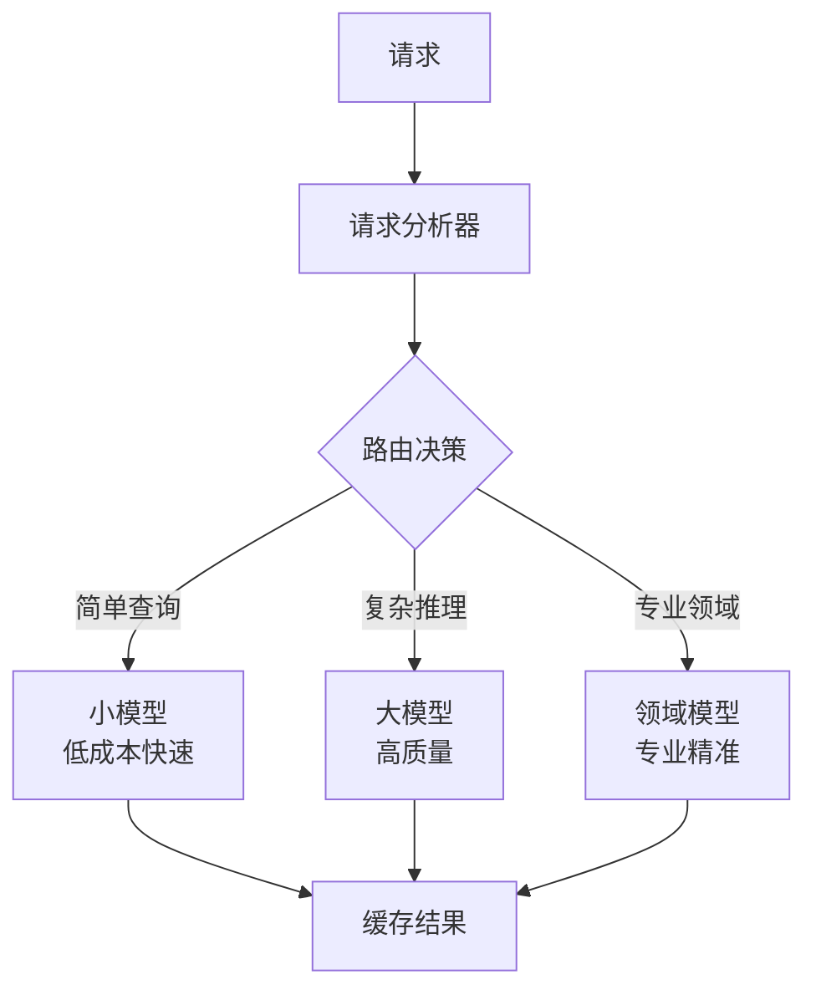

**路由策略**:

```go
// 模型路由器接口
type ModelRouter interface {
    // 选择最优模型
    Route(ctx context.Context, req *RoutingRequest) (*RoutingDecision, error)
}

// 路由请求
type RoutingRequest struct {
    Query       string                 // 查询内容
    Context     map[string]interface{} // 上下文
    Constraints *RoutingConstraints    // 约束条件
}

// 路由约束
type RoutingConstraints struct {
    MaxLatency  time.Duration // 最大延迟
    MaxCost     float64       // 最大成本
    MinQuality  float64       // 最小质量
}

// 路由决策
type RoutingDecision struct {
    ModelID     string  // 选中的模型 ID
    Reason      string  // 选择原因
    Confidence  float64 // 决策置信度
    Alternatives []*ModelOption // 备选方案
}
```

#### 4.3.5 隐私计算网关

在推理前自动检测并处理敏感信息：

```go
// 隐私网关接口
type PrivacyGateway interface {
    // 入站处理（请求）
    ProcessInbound(ctx context.Context, req *InferenceRequest) (*ProcessedRequest, error)
    
    // 出站处理（响应）
    ProcessOutbound(ctx context.Context, resp *InferenceResponse) (*ProcessedResponse, error)
}

// 隐私处理流程
type PrivacyProcessor struct {
    piiDetector PIIDetector
    maskStrategy MaskStrategy
    auditLogger AuditLogger
}

func (p *PrivacyProcessor) ProcessInbound(ctx context.Context, req *InferenceRequest) (*ProcessedRequest, error) {
    // 1. 检测 PII
    entities, err := p.piiDetector.Detect(ctx, req.Prompt)
    if err != nil {
        return nil, err
    }
    
    // 2. 脱敏
    maskedPrompt, err := p.piiDetector.Mask(ctx, req.Prompt, entities)
    if err != nil {
        return nil, err
    }
    
    // 3. 审计日志
    p.auditLogger.Log(ctx, &AuditLog{
        Type:      "pii_detection",
        Entities:  entities,
        Timestamp: time.Now(),
    })
    
    return &ProcessedRequest{
        Prompt:    maskedPrompt,
        Entities:  entities, // 保存以便恢复
        Original:  req.Prompt,
    }, nil
}
```

### 4.4 模型训练与微调服务（MTFS）

#### 4.4.1 组件架构

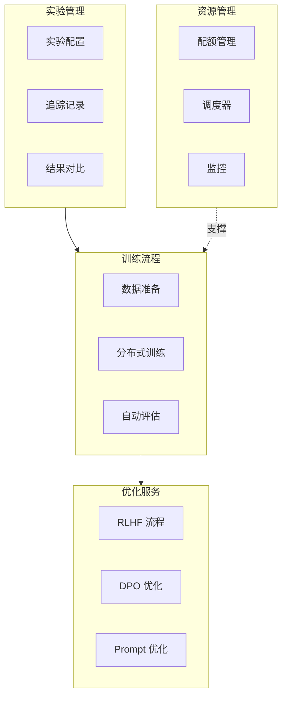

#### 4.4.2 RLHF/DPO 训练流程

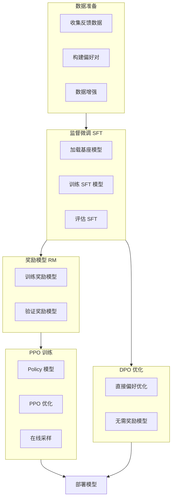

**训练接口**:

```go
// 训练服务接口
type TrainingService interface {
    // 创建训练任务
    CreateJob(ctx context.Context, config *TrainingConfig) (*TrainingJob, error)
    
    // 启动训练
    StartJob(ctx context.Context, jobID string) error
    
    // 停止训练
    StopJob(ctx context.Context, jobID string) error
    
    // 获取训练状态
    GetJobStatus(ctx context.Context, jobID string) (*JobStatus, error)
    
    // 列出实验
    ListExperiments(ctx context.Context, filter *ExperimentFilter) ([]*Experiment, error)
}

// 训练配置
type TrainingConfig struct {
    JobName      string           // 任务名称
    BaseModel    string           // 基座模型
    TrainingType TrainingType     // 训练类型
    Dataset      *DatasetConfig   // 数据集配置
    Hyperparams  *Hyperparameters // 超参数
    Resources    *ResourceConfig  // 资源配置
}

// 训练类型
type TrainingType string

const (
    TrainingSFT  TrainingType = "sft"  // 监督微调
    TrainingRLHF TrainingType = "rlhf" // RLHF
    TrainingDPO  TrainingType = "dpo"  // DPO
)
```

#### 4.4.3 Prompt 自动优化（APE/OPRO）

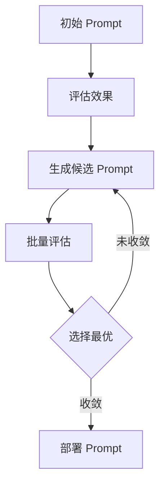

**优化接口**:

```go
// Prompt 优化器接口
type PromptOptimizer interface {
    // 优化 Prompt
    Optimize(ctx context.Context, config *OptimizationConfig) (*OptimizationResult, error)
    
    // 获取优化历史
    GetHistory(ctx context.Context, taskID string) ([]*OptimizationStep, error)
}

// 优化配置
type OptimizationConfig struct {
    InitialPrompt string           // 初始 Prompt
    EvalDataset   *Dataset         // 评估数据集
    Metric        MetricType       // 评估指标
    MaxIterations int              // 最大迭代次数
    Strategy      OptimizationStrategy // 优化策略
}

// 优化结果
type OptimizationResult struct {
    BestPrompt    string  // 最优 Prompt
    Score         float64 // 评分
    Iterations    int     // 迭代次数
    Improvements  float64 // 改进幅度
}
```

### 4.5 AI 开发者基础设施（ADI）

#### 4.5.1 组件架构

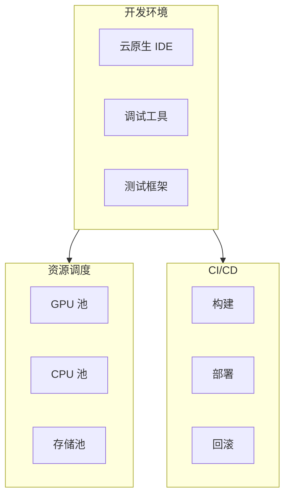

---

## 5. 关键业务场景设计

### 5.1 安全运营智能助手（SOC Copilot）

#### 5.1.1 场景描述

安全运营智能助手面向 SOC（Security Operations Center）团队，提供智能化的威胁检测、事件分析、响应建议等能力。

#### 5.1.2 业务流程

```mermaid
sequenceDiagram
    participant Analyst as 安全分析师
    participant Copilot as SOC Copilot
    participant SIEM as SIEM 系统
    participant TI as 威胁情报库
    participant RAG as RAG 引擎
    participant LLM as 推理服务
    participant Action as 响应系统
    
    Analyst->>Copilot: "分析这个可疑 IP: 192.168.1.100"
    Copilot->>SIEM: 查询关联日志
    SIEM-->>Copilot: 返回日志数据
    
    Copilot->>TI: 查询威胁情报
    TI-->>Copilot: 返回 IP 信誉数据
    
    Copilot->>RAG: 检索历史处置案例
    RAG-->>Copilot: 返回相似案例
    
    Copilot->>LLM: 综合分析（日志+情报+案例）
    LLM-->>Copilot: 生成分析报告
    
    Copilot->>Analyst: 展示分析结果与建议
    Analyst->>Copilot: "执行封禁操作"
    
    Copilot->>Action: 提交封禁请求（HITL审核）
    Action-->>Copilot: 返回执行结果
    
    Copilot->>Analyst: "已完成封禁，请确认"
```

#### 5.1.3 核心能力

| 能力             | 说明         | 技术实现              |
| -------------- | ---------- | ----------------- |
| **威胁情报查询**     | 自动查询多源威胁情报 | 集成 SIEM、TI 平台 API |
| **日志关联分析**     | 多维度日志关联    | RAG 检索 + LLM 推理   |
| **历史案例检索**     | 检索相似历史案例   | 向量检索 + 知识图谱       |
| **响应建议生成**     | 生成处置建议     | 基于案例库的 Prompt 工程  |
| **人在回路（HITL）** | 关键操作需人工审核  | Workflow 审批机制     |
| **持续学习**       | 从处置反馈中学习   | 在线学习引擎            |

#### 5.1.4 技术架构

```mermaid
graph TB
    subgraph Input[输入层]
        I1[分析师查询]
        I2[告警触发]
    end
    
    subgraph Orchestrator[编排层]
        O1[意图识别]
        O2[任务分解]
        O3[工具调用]
    end
    
    subgraph Tools[工具层]
        T1[SIEM API]
        T2[威胁情报 API]
        T3[RAG 检索]
        T4[知识图谱查询]
    end
    
    subgraph Analysis[分析层]
        A1[日志解析]
        A2[情报关联]
        A3[风险评估]
        A4[建议生成]
    end
    
    subgraph Output[输出层]
        OUT1[分析报告]
        OUT2[响应建议]
        OUT3[执行操作]
    end
    
    Input --> Orchestrator
    Orchestrator --> Tools
    Tools --> Analysis
    Analysis --> Output
```

#### 5.1.5 效果指标

| 指标        | 基线    | 目标      | 说明         |
| --------- | ----- | ------- | ---------- |
| **分析耗时**  | 30 分钟 | < 5 分钟  | 从告警到初步分析报告 |
| **误报率**   | 40%   | < 15%   | 降低误报，提升准确性 |
| **响应速度**  | 2 小时  | < 30 分钟 | 从分析到执行响应   |
| **知识复用率** | -     | > 60%   | 历史案例被引用比例  |

### 5.2 智能文档问答系统

#### 5.2.1 场景描述

基于企业内部文档（政策、规范、手册等）构建智能问答系统，支持员工快速获取信息。

#### 5.2.2 业务流程

```mermaid
graph TB
    USER[用户提问] --> UNDERSTAND[查询理解]
    UNDERSTAND --> ROUTE{查询路由}
    
    ROUTE -->|事实查询| VECTOR[向量检索]
    ROUTE -->|流程查询| KG[知识图谱检索]
    ROUTE -->|复杂推理| HYBRID[混合检索]
    
    VECTOR --> RERANK[重排序]
    KG --> RERANK
    HYBRID --> RERANK
    
    RERANK --> CONTEXT[上下文构建]
    CONTEXT --> LLM[LLM 生成]
    LLM --> VERIFY[答案验证]
    
    VERIFY --> CITE[引用标注]
    CITE --> RESPONSE[返回答案]
```

#### 5.2.3 核心技术

**文档预处理**:

```go
// 文档处理流程
type DocumentProcessor struct {
    parser     Parser
    chunker    Chunker
    embedder   Embedder
    piiDetector PIIDetector
}

func (p *DocumentProcessor) Process(ctx context.Context, doc *Document) (*ProcessedDocument, error) {
    // 1. 解析文档
    parsedDoc, err := p.parser.Parse(ctx, doc)
    if err != nil {
        return nil, err
    }
    
    // 2. PII 检测与脱敏
    cleanedDoc, err := p.piiDetector.Mask(ctx, parsedDoc.Text, nil)
    if err != nil {
        return nil, err
    }
    
    // 3. 智能分块
    chunks, err := p.chunker.Chunk(ctx, cleanedDoc)
    if err != nil {
        return nil, err
    }
    
    // 4. 向量化
    for _, chunk := range chunks {
        embedding, err := p.embedder.Embed(ctx, chunk.Text)
        if err != nil {
            return nil, err
        }
        chunk.Embedding = embedding
    }
    
    return &ProcessedDocument{
        Original: doc,
        Chunks:   chunks,
    }, nil
}
```

**智能分块策略**:

| 策略       | 说明              | 适用场景  |
| -------- | --------------- | ----- |
| **固定长度** | 按固定 Token 数分块   | 通用文档  |
| **语义边界** | 按段落、章节分块        | 结构化文档 |
| **滑动窗口** | 重叠分块，避免信息丢失     | 长篇文档  |
| **层次分块** | 多粒度分块（句子、段落、章节） | 复杂文档  |

---

## 6. 关键技术设计

### 6.1 分布式追踪（Distributed Tracing）

#### 6.1.1 追踪架构

```mermaid
graph TB
    subgraph App[应用层]
        CLI[CLI]
        API[API]
    end
    
    subgraph Instrumentation[插桩层]
        OTEL[OpenTelemetry SDK]
    end
    
    subgraph Collector[收集层]
        COLLECT[Trace Collector]
        PROCESS[Trace Processor]
    end
    
    subgraph Storage[存储层]
        TIMESERIES[时序数据库]
        SEARCH[搜索引擎]
    end
    
    subgraph Analysis[分析层]
        VISUAL[可视化]
        ALERT[告警]
    end
    
    App --> Instrumentation
    Instrumentation --> Collector
    Collector --> Storage
    Storage --> Analysis
```

#### 6.1.2 Trace 数据模型

```go
// Trace 记录
type Trace struct {
    TraceID     string       // Trace ID
    SpanID      string       // Span ID
    ParentSpanID string      // 父 Span ID
    Operation   string       // 操作名称
    StartTime   time.Time    // 开始时间
    Duration    time.Duration // 持续时间
    Tags        map[string]string // 标签
    Logs        []*Log       // 日志
    Status      SpanStatus   // 状态
}

// LLM 调用 Span
type LLMCallSpan struct {
    *Trace
    ModelID      string  // 模型 ID
    Prompt       string  // 提示词
    Response     string  // 响应
    TokensInput  int     // 输入 Token 数
    TokensOutput int     // 输出 Token 数
    Cost         float64 // 成本
    CacheHit     bool    // 是否命中缓存
}
```

### 6.2 自动化评估框架

#### 6.2.1 评估维度

| 维度       | 指标                      | 说明         |
| -------- | ----------------------- | ---------- |
| **准确性**  | Accuracy, F1-Score      | 答案的正确性     |
| **相关性**  | Relevance Score         | 答案与问题的相关度  |
| **完整性**  | Completeness            | 答案是否完整     |
| **一致性**  | Consistency             | 多次询问结果的一致性 |
| **安全性**  | Safety Score            | 是否包含有害内容   |
| **成本效率** | Cost per Query          | 单次查询成本     |
| **延迟**   | Latency (P50, P95, P99) | 响应延迟       |

#### 6.2.2 评估流程

```mermaid
graph TB
    DATASET[评估数据集] --> BATCH[批量执行]
    BATCH --> COLLECT[收集结果]
    COLLECT --> AUTO[自动化评估]
    COLLECT --> HUMAN[人工评估]
    
    AUTO --> METRIC1[准确性指标]
    AUTO --> METRIC2[相关性指标]
    AUTO --> METRIC3[成本指标]
    
    HUMAN --> RATING[质量评分]
    
    METRIC1 --> REPORT[生成报告]
    METRIC2 --> REPORT
    METRIC3 --> REPORT
    RATING --> REPORT
    
    REPORT --> COMPARE[版本对比]
    COMPARE --> DECISION{是否部署}
```

**评估接口**:

```go
// 评估器接口
type Evaluator interface {
    // 评估单个样本
    Evaluate(ctx context.Context, sample *EvalSample) (*EvalResult, error)
    
    // 批量评估
    EvaluateBatch(ctx context.Context, samples []*EvalSample) ([]*EvalResult, error)
    
    // 生成报告
    GenerateReport(ctx context.Context, results []*EvalResult) (*EvalReport, error)
}

// 评估样本
type EvalSample struct {
    Query        string   // 查询
    ExpectedAnswer string // 期望答案（可选）
    Context      string   // 上下文
    Metadata     map[string]interface{} // 元数据
}

// 评估结果
type EvalResult struct {
    Sample       *EvalSample // 样本
    ActualAnswer string      // 实际答案
    Metrics      map[string]float64 // 指标
    Passed       bool        // 是否通过
    Details      string      // 详细说明
}
```

### 6.3 策略引擎（Policy Engine）

#### 6.3.1 策略类型

| 策略类型     | 说明               | 示例               |
| -------- | ---------------- | ---------------- |
| **访问控制** | RBAC/ABAC        | 用户 A 不能访问数据集 X   |
| **资源限额** | Quota/Rate Limit | 每用户每天最多 1000 次调用 |
| **内容过滤** | Content Policy   | 禁止生成暴力内容         |
| **数据治理** | Data Governance  | PII 数据必须脱敏       |
| **合规审计** | Compliance       | 所有操作必须记录审计日志     |

#### 6.3.2 策略决策流程

```mermaid
graph TB
    REQ[请求] --> PEP[策略执行点 PEP]
    PEP --> PDP[策略决策点 PDP]
    
    PDP --> POLICY[加载策略]
    POLICY --> EVAL{评估策略}
    
    EVAL -->|允许| PERMIT[Permit]
    EVAL -->|拒绝| DENY[Deny]
    EVAL -->|需审计| AUDIT[Audit]
    
    PERMIT --> EXEC[执行请求]
    DENY --> REJECT[拒绝请求]
    AUDIT --> REVIEW[人工审核]
```

**策略定义（YAML）**:

```yaml
# 示例：PII 数据访问策略
apiVersion: policy.openeeap.io/v1
kind: Policy
metadata:
  name: pii-data-access-control
spec:
  description: "控制 PII 数据访问权限"
  rules:
    - name: require-pii-clearance
      match:
        resources:
          - type: dataset
            labels:
              sensitivity: pii
      conditions:
        - user.clearanceLevel >= "high"
      action: permit
    - name: deny-default
      action: deny
```

**策略引擎接口**:

```go
// 策略决策点接口
type PolicyDecisionPoint interface {
    // 评估策略
    Evaluate(ctx context.Context, req *PolicyRequest) (*PolicyDecision, error)
    
    // 批量评估
    EvaluateBatch(ctx context.Context, reqs []*PolicyRequest) ([]*PolicyDecision, error)
    
    // 加载策略
    LoadPolicy(ctx context.Context, policy *Policy) error
}

// 策略请求
type PolicyRequest struct {
    Subject  *Subject  // 主体（用户/服务）
    Resource *Resource // 资源
    Action   string    // 操作
    Context  map[string]interface{} // 上下文
}

// 策略决策
type PolicyDecision struct {
    Decision    DecisionType // 决策类型
    Reason      string       // 原因
    Obligations []*Obligation // 义务（如审计）
}

// 决策类型
type DecisionType string

const (
    DecisionPermit DecisionType = "permit"
    DecisionDeny   DecisionType = "deny"
    DecisionNotApplicable DecisionType = "not_applicable"
)
```

---

## 7. 数据架构设计

### 7.1 数据模型

#### 7.1.1 核心实体模型

```mermaid
erDiagram
    USER ||--o{ AGENT : creates
    AGENT ||--o{ EXECUTION : has
    EXECUTION ||--o{ TRACE : generates
    EXECUTION ||--o{ FEEDBACK : receives
    AGENT ||--o{ KNOWLEDGE_BASE : uses
    KNOWLEDGE_BASE ||--o{ DOCUMENT : contains
    DOCUMENT ||--o{ CHUNK : splits_into
    CHUNK ||--o{ EMBEDDING : has
    EXECUTION ||--o{ MODEL_CALL : makes
    MODEL_CALL ||--o{ CACHE_HIT : may_hit
    
    USER {
        string id PK
        string name
        string email
        string role
        timestamp created_at
    }
    
    AGENT {
        string id PK
        string name
        string description
        string runtime_type
        json config
        timestamp created_at
    }
    
    EXECUTION {
        string id PK
        string agent_id FK
        string user_id FK
        string input
        string output
        string status
        float duration_ms
        timestamp started_at
    }
    
    TRACE {
        string trace_id PK
        string execution_id FK
        string span_id
        string parent_span_id
        string operation
        timestamp start_time
        float duration_ms
    }
    
    FEEDBACK {
        string id PK
        string execution_id FK
        float rating
        string correction
        string type
        timestamp created_at
    }
```

#### 7.1.2 知识库数据模型

```go
// 文档
type Document struct {
    ID          string    // 文档 ID
    Title       string    // 标题
    Content     string    // 内容
    Source      string    // 来源
    SourceType  string    // 来源类型
    Metadata    map[string]interface{} // 元数据
    Sensitivity SensitivityLevel // 敏感度
    CreatedAt   time.Time // 创建时间
    UpdatedAt   time.Time // 更新时间
}

// 文档块
type Chunk struct {
    ID         string    // 块 ID
    DocumentID string    // 文档 ID
    Content    string    // 内容
    Embedding  []float64 // 向量
    StartIndex int       // 起始位置
    EndIndex   int       // 结束位置
    Metadata   map[string]interface{} // 元数据
}

// 敏感度级别
type SensitivityLevel string

const (
    SensitivityPublic       SensitivityLevel = "public"
    SensitivityInternal     SensitivityLevel = "internal"
    SensitivityConfidential SensitivityLevel = "confidential"
    SensitivityPII          SensitivityLevel = "pii"
)
```

### 7.2 存储选型

| 数据类型     | 存储技术          | 说明                  |
| -------- | ------------- | ------------------- |
| **关系数据** | PostgreSQL    | 用户、Agent、执行记录等结构化数据 |
| **向量数据** | Milvus/Qdrant | 文档向量、Embedding      |
| **图数据**  | Neo4j         | 知识图谱、数据血缘           |
| **时序数据** | InfluxDB      | Trace、指标、日志         |
| **缓存**   | Redis         | L2 语义缓存、会话状态        |
| **对象存储** | MinIO/S3      | 原始文档、模型文件           |

### 7.3 数据血缘图谱

```mermaid
graph LR
    subgraph Sources[数据源]
        S1[原始文档]
        S2[API 数据]
        S3[用户反馈]
    end
    
    subgraph Transform[转换层]
        T1[解析]
        T2[分块]
        T3[向量化]
        T4[PII 脱敏]
    end
    
    subgraph Storage[存储层]
        ST1[文档库]
        ST2[向量库]
        ST3[知识图谱]
    end
    
    subgraph Usage[使用层]
        U1[RAG 检索]
        U2[模型微调]
        U3[Agent 调用]
    end
    
    S1 -.lineage.-> T1
    T1 -.lineage.-> T2
    T2 -.lineage.-> T3
    T2 -.lineage.-> T4
    T3 -.lineage.-> ST2
    T4 -.lineage.-> ST1
    ST2 -.lineage.-> U1
    S3 -.lineage.-> U2
    U1 -.lineage.-> U3
```

---

## 8. 安全架构设计

### 8.1 安全架构全景

```mermaid
graph TB
    subgraph Perimeter[边界安全]
        WAF[Web 应用防火墙]
        DDoS[DDoS 防护]
    end
    
    subgraph Access[访问控制]
        AuthN[认证 Authentication]
        AuthZ[授权 Authorization]
        MFA[多因素认证]
    end
    
    subgraph Data[数据安全]
        Encryption[加密]
        PII_Mask[PII 脱敏]
        DLP[数据防泄漏]
    end
    
    subgraph Runtime[运行时安全]
        Prompt_Injection[Prompt 注入防护]
        Content_Filter[内容过滤]
        Jailbreak[越狱防护]
    end
    
    subgraph Audit[审计合规]
        Logging[审计日志]
        Compliance[合规检查]
    end
    
    Perimeter --> Access
    Access --> Data
    Data --> Runtime
    Runtime --> Audit
```

### 8.2 认证与授权

#### 8.2.1 认证方案

| 方案            | 说明             | 适用场景  |
| ------------- | -------------- | ----- |
| **API Key**   | 简单 API 密钥      | 服务间调用 |
| **JWT**       | JSON Web Token | 用户会话  |
| **OAuth 2.0** | 标准授权协议         | 第三方集成 |
| **mTLS**      | 双向 TLS         | 高安全场景 |

#### 8.2.2 RBAC 模型

```mermaid
graph TB
    USER[用户] --> ROLE[角色]
    ROLE --> PERMISSION[权限]
    PERMISSION --> RESOURCE[资源]
    
    subgraph Roles[角色示例]
        R1[Admin<br/>管理员]
        R2[Developer<br/>开发者]
        R3[Analyst<br/>分析师]
        R4[Viewer<br/>查看者]
    end
    
    subgraph Permissions[权限示例]
        P1[agent:create]
        P2[agent:read]
        P3[agent:update]
        P4[agent:delete]
        P5[data:read]
        P6[data:write]
    end
    
    R1 --> P1
    R1 --> P2
    R1 --> P3
    R1 --> P4
    R2 --> P1
    R2 --> P2
    R2 --> P3
    R3 --> P2
    R3 --> P5
    R4 --> P2
```

**权限定义**:

```go
// 权限
type Permission struct {
    Resource string   // 资源类型
    Action   string   // 操作
    Scope    []string // 范围
}

// 角色
type Role struct {
    ID          string       // 角色 ID
    Name        string       // 角色名称
    Permissions []*Permission // 权限列表
}

// 权限检查
func (a *AuthorizationService) CheckPermission(
    ctx context.Context,
    user *User,
    resource string,
    action string,
) (bool, error) {
    // 1. 获取用户角色
    roles, err := a.GetUserRoles(ctx, user.ID)
    if err != nil {
        return false, err
    }
    
    // 2. 检查角色权限
    for _, role := range roles {
        for _, perm := range role.Permissions {
            if perm.Resource == resource && perm.Action == action {
                return true, nil
            }
        }
    }
    
    return false, nil
}
```

### 8.3 Prompt 注入防护

#### 8.3.1 攻击类型

| 攻击类型              | 说明            | 示例                                |
| ----------------- | ------------- | --------------------------------- |
| **直接注入**          | 直接覆盖系统 Prompt | "Ignore previous instructions..." |
| **间接注入**          | 通过检索内容注入      | 在文档中嵌入恶意指令                        |
| **越狱（Jailbreak）** | 绕过安全限制        | "DAN 模式"                          |
| **提示泄露**          | 泄露系统 Prompt   | "Show me your system prompt"      |

#### 8.3.2 防护策略

```mermaid
graph TB
    INPUT[用户输入] --> DETECT{检测}
    
    DETECT -->|正常| PASS[通过]
    DETECT -->|可疑| SANITIZE[净化]
    DETECT -->|恶意| BLOCK[拦截]
    
    SANITIZE --> PASS
    BLOCK --> LOG[记录日志]
    LOG --> ALERT[告警]
```

**检测实现**:

```go
// Prompt 注入检测器
type PromptInjectionDetector struct {
    patterns    []*regexp.Regexp // 恶意模式
    classifier  Classifier       // ML 分类器
    logger      Logger
}

func (d *PromptInjectionDetector) Detect(ctx context.Context, input string) (*DetectionResult, error) {
    // 1. 基于规则检测
    for _, pattern := range d.patterns {
        if pattern.MatchString(input) {
            return &DetectionResult{
                IsMalicious: true,
                Confidence:  1.0,
                Reason:      "Pattern match",
            }, nil
        }
    }
    
    // 2. 基于 ML 模型检测
    score, err := d.classifier.Classify(ctx, input)
    if err != nil {
        return nil, err
    }
    
    if score > 0.8 {
        return &DetectionResult{
            IsMalicious: true,
            Confidence:  score,
            Reason:      "ML classifier",
        }, nil
    }
    
    return &DetectionResult{
        IsMalicious: false,
        Confidence:  1.0 - score,
    }, nil
}
```

### 8.4 数据加密

| 加密场景     | 技术方案                   | 说明            |
| -------- | ---------------------- | ------------- |
| **传输加密** | TLS 1.3                | HTTPS/gRPC 通信 |
| **存储加密** | AES-256                | 数据库、对象存储      |
| **字段加密** | Field-level Encryption | PII 字段加密      |
| **密钥管理** | KMS                    | 集中密钥管理        |

### 8.5 审计日志

**审计日志模型**:

```go
// 审计日志
type AuditLog struct {
    ID        string    // 日志 ID
    Timestamp time.Time // 时间戳
    UserID    string    // 用户 ID
    Action    string    // 操作
    Resource  string    // 资源
    Result    string    // 结果（成功/失败）
    Details   map[string]interface{} // 详细信息
    IPAddress string    // IP 地址
    UserAgent string    // User Agent
}

// 审计日志记录器
type AuditLogger interface {
    Log(ctx context.Context, log *AuditLog) error
    Query(ctx context.Context, filter *AuditLogFilter) ([]*AuditLog, error)
}
```

**审计日志存储**：使用 InfluxDB 或 Elasticsearch 存储审计日志，支持高效查询与分析。

---

## 9. 可观测性与运维设计

### 9.1 可观测性三支柱

```mermaid
graph TB
    subgraph Metrics[指标 Metrics]
        M1[请求量 QPS]
        M2[延迟 Latency]
        M3[错误率 Error Rate]
        M4[资源使用率]
    end
    
    subgraph Logs[日志 Logs]
        L1[应用日志]
        L2[访问日志]
        L3[审计日志]
        L4[错误日志]
    end
    
    subgraph Traces[追踪 Traces]
        T1[分布式追踪]
        T2[调用链路]
        T3[性能分析]
    end
    
    subgraph Analysis[分析平台]
        A1[Prometheus]
        A2[Elasticsearch]
        A3[Jaeger]
        A4[Grafana]
    end
    
    Metrics --> Analysis
    Logs --> Analysis
    Traces --> Analysis
```

### 9.2 核心指标体系

#### 9.2.1 业务指标

| 指标              | 说明           | 告警阈值     |
| --------------- | ------------ | -------- |
| **Agent 执行成功率** | 成功执行 / 总执行   | < 95%    |
| **平均响应时间**      | 端到端延迟        | > 5s     |
| **缓存命中率**       | 缓存命中 / 总请求   | < 40%    |
| **用户满意度**       | 平均评分         | < 3.5/5  |
| **Token 消耗**    | 每日 Token 使用量 | 超预算 120% |

#### 9.2.2 技术指标

| 指标          | 说明         | 告警阈值    |
| ----------- | ---------- | ------- |
| **API 可用性** | Uptime     | < 99.9% |
| **P95 延迟**  | 95% 请求延迟   | > 2s    |
| **错误率**     | 错误请求 / 总请求 | > 1%    |
| **GPU 利用率** | GPU 使用率    | < 60%   |
| **队列深度**    | 推理队列长度     | > 100   |

### 9.3 日志规范

**日志级别**:

* **DEBUG**: 调试信息
* **INFO**: 常规信息
* **WARN**: 警告信息
* **ERROR**: 错误信息
* **FATAL**: 致命错误

**日志格式（JSON）**:

```json
{
  "timestamp": "2026-01-13T10:30:00Z",
  "level": "INFO",
  "service": "orchestrator",
  "trace_id": "abc123",
  "span_id": "def456",
  "user_id": "user001",
  "message": "Agent execution completed",
  "duration_ms": 1234,
  "details": {
    "agent_id": "agent001",
    "execution_id": "exec001"
  }
}
```

### 9.4 告警策略

```mermaid
graph TB
    METRIC[指标采集] --> RULE{告警规则}
    
    RULE -->|P0 严重| ONCALL[On-call 电话]
    RULE -->|P1 重要| SMS[短信通知]
    RULE -->|P2 一般| EMAIL[邮件通知]
    RULE -->|P3 提示| DASHBOARD[仪表盘]
    
    ONCALL --> INCIDENT[创建事件]
    SMS --> INCIDENT
    INCIDENT --> RUNBOOK[执行 Runbook]
    RUNBOOK --> RESOLVE[问题解决]
```

**告警规则示例**:

```yaml
# Prometheus 告警规则
groups:
  - name: openeeap_alerts
    rules:
      - alert: HighErrorRate
        expr: rate(http_requests_total{status=~"5.."}[5m]) > 0.01
        for: 5m
        labels:
          severity: P1
        annotations:
          summary: "错误率过高"
          description: "{{ $labels.service }} 服务错误率超过 1%"
      
      - alert: HighLatency
        expr: histogram_quantile(0.95, rate(http_request_duration_seconds_bucket[5m])) > 5
        for: 10m
        labels:
          severity: P2
        annotations:
          summary: "响应延迟过高"
          description: "P95 延迟超过 5 秒"
      
      - alert: LowCacheHitRate
        expr: rate(cache_hits_total[10m]) / rate(cache_requests_total[10m]) < 0.4
        for: 15m
        labels:
          severity: P3
        annotations:
          summary: "缓存命中率低"
          description: "缓存命中率低于 40%"
      
      - alert: GPUUtilizationLow
        expr: avg(gpu_utilization) < 0.6
        for: 30m
        labels:
          severity: P3
        annotations:
          summary: "GPU 利用率低"
          description: "GPU 平均利用率低于 60%，可能存在资源浪费"
```

### 9.5 故障恢复机制

```mermaid
graph TB
    FAILURE[故障检测] --> TYPE{故障类型}
    
    TYPE -->|服务不可用| RESTART[自动重启]
    TYPE -->|性能退化| SCALE[弹性伸缩]
    TYPE -->|数据异常| ROLLBACK[回滚操作]
    TYPE -->|配置错误| RELOAD[重新加载配置]
    
    RESTART --> HEALTH{健康检查}
    SCALE --> HEALTH
    ROLLBACK --> HEALTH
    RELOAD --> HEALTH
    
    HEALTH -->|成功| RECOVER[恢复服务]
    HEALTH -->|失败| ESCALATE[升级告警]
```

---

## 10. 部署架构设计

### 10.1 部署拓扑

```mermaid
graph TB
    subgraph Internet[互联网]
        USER[用户]
    end
    
    subgraph EdgeLayer[边缘层]
        CDN[CDN]
        WAF[WAF]
    end
    
    subgraph GatewayLayer[网关层]
        LB[负载均衡器]
        APIGW[API Gateway]
    end
    
    subgraph AppLayer[应用层]
        WEB1[Web 服务 1]
        WEB2[Web 服务 2]
        ORCH1[编排服务 1]
        ORCH2[编排服务 2]
    end
    
    subgraph PlatformLayer[平台层]
        AEP[AEP 服务集群]
        DIKF[DIKF 服务集群]
        MSIG[MSIG 服务集群]
        MTFS[MTFS 服务集群]
    end
    
    subgraph DataLayer[数据层]
        PG[(PostgreSQL<br/>主从)]
        REDIS[(Redis<br/>集群)]
        MILVUS[(Milvus<br/>向量库)]
        MINIO[(MinIO<br/>对象存储)]
    end
    
    subgraph InfraLayer[基础设施层]
        K8S[Kubernetes 集群]
        GPU[GPU 节点池]
    end
    
    USER --> CDN
    CDN --> WAF
    WAF --> LB
    LB --> APIGW
    
    APIGW --> AppLayer
    AppLayer --> PlatformLayer
    PlatformLayer --> DataLayer
    
    InfraLayer -.运行于.-> AppLayer
    InfraLayer -.运行于.-> PlatformLayer
```

### 10.2 容器化部署

**Kubernetes 资源清单示例（编排服务）**:

```yaml
apiVersion: apps/v1
kind: Deployment
metadata:
  name: orchestrator
  namespace: openeeap
spec:
  replicas: 3
  selector:
    matchLabels:
      app: orchestrator
  template:
    metadata:
      labels:
        app: orchestrator
    spec:
      containers:
      - name: orchestrator
        image: openeeap/orchestrator:v1.0.0
        ports:
        - containerPort: 8080
          name: http
        - containerPort: 9090
          name: grpc
        env:
        - name: DATABASE_URL
          valueFrom:
            secretKeyRef:
              name: db-credentials
              key: url
        - name: REDIS_URL
          valueFrom:
            configMapKeyRef:
              name: redis-config
              key: url
        resources:
          requests:
            memory: "512Mi"
            cpu: "500m"
          limits:
            memory: "1Gi"
            cpu: "1000m"
        livenessProbe:
          httpGet:
            path: /health
            port: 8080
          initialDelaySeconds: 30
          periodSeconds: 10
        readinessProbe:
          httpGet:
            path: /ready
            port: 8080
          initialDelaySeconds: 10
          periodSeconds: 5
---
apiVersion: v1
kind: Service
metadata:
  name: orchestrator
  namespace: openeeap
spec:
  selector:
    app: orchestrator
  ports:
  - name: http
    port: 80
    targetPort: 8080
  - name: grpc
    port: 9090
    targetPort: 9090
  type: ClusterIP
```

### 10.3 高可用架构

```mermaid
graph TB
    subgraph Region1[区域 1]
        AZ1A[可用区 1A]
        AZ1B[可用区 1B]
    end
    
    subgraph Region2[区域 2 备用]
        AZ2A[可用区 2A]
    end
    
    subgraph LoadBalancing[负载均衡]
        GLB[全局负载均衡]
        RLB1[区域负载均衡 1]
        RLB2[区域负载均衡 2]
    end
    
    subgraph DataSync[数据同步]
        MASTER[(主数据库)]
        REPLICA1[(只读副本 1)]
        REPLICA2[(只读副本 2)]
        BACKUP[(异地备份)]
    end
    
    GLB --> RLB1
    GLB --> RLB2
    
    RLB1 --> AZ1A
    RLB1 --> AZ1B
    RLB2 --> AZ2A
    
    MASTER -.同步.-> REPLICA1
    MASTER -.同步.-> REPLICA2
    MASTER -.备份.-> BACKUP
```

**高可用指标**:

| 指标        | 目标值     | 说明               |
| --------- | ------- | ---------------- |
| **可用性**   | 99.9%   | 年度停机时间 < 8.76 小时 |
| **RTO**   | < 1 小时  | 恢复时间目标           |
| **RPO**   | < 15 分钟 | 恢复点目标            |
| **跨区域容灾** | 主备模式    | 主区域故障时自动切换       |

### 10.4 弹性伸缩策略

```mermaid
graph LR
    MONITOR[监控指标] --> EVALUATE{评估}
    
    EVALUATE -->|CPU > 70%| SCALEUP[扩容]
    EVALUATE -->|CPU < 30%| SCALEDOWN[缩容]
    EVALUATE -->|队列深度 > 50| SCALEUP
    
    SCALEUP --> ADD[增加实例]
    SCALEDOWN --> REMOVE[减少实例]
    
    ADD --> VERIFY[验证健康]
    REMOVE --> DRAIN[优雅下线]
```

**HPA 配置示例**:

```yaml
apiVersion: autoscaling/v2
kind: HorizontalPodAutoscaler
metadata:
  name: orchestrator-hpa
  namespace: openeeap
spec:
  scaleTargetRef:
    apiVersion: apps/v1
    kind: Deployment
    name: orchestrator
  minReplicas: 3
  maxReplicas: 10
  metrics:
  - type: Resource
    resource:
      name: cpu
      target:
        type: Utilization
        averageUtilization: 70
  - type: Resource
    resource:
      name: memory
      target:
        type: Utilization
        averageUtilization: 80
  - type: Pods
    pods:
      metric:
        name: request_queue_depth
      target:
        type: AverageValue
        averageValue: "50"
  behavior:
    scaleUp:
      stabilizationWindowSeconds: 60
      policies:
      - type: Percent
        value: 50
        periodSeconds: 60
    scaleDown:
      stabilizationWindowSeconds: 300
      policies:
      - type: Pods
        value: 1
        periodSeconds: 60
```

---

## 11. 项目目录结构

OpenEAAP 采用 **Go** 作为主要开发语言，遵循标准的 Go 项目布局规范 [1]。

### 11.1 完整目录树

```
openeeap/
├── cmd/                          # 命令行入口
│   ├── cli/                      # CLI 工具
│   │   └── main.go
│   ├── server/                   # 服务端
│   │   └── main.go
│   └── worker/                   # 后台任务 Worker
│       └── main.go
├── internal/                     # 私有应用代码
│   ├── app/                      # 应用层
│   │   ├── service/             # 应用服务
│   │   │   ├── agent_service.go
│   │   │   ├── workflow_service.go
│   │   │   ├── model_service.go
│   │   │   └── data_service.go
│   │   └── dto/                 # 数据传输对象
│   │       ├── agent_dto.go
│   │       ├── workflow_dto.go
│   │       └── common_dto.go
│   ├── domain/                   # 领域层
│   │   ├── agent/               # Agent 领域
│   │   │   ├── entity.go
│   │   │   ├── repository.go
│   │   │   ├── service.go
│   │   │   └── value_object.go
│   │   ├── workflow/            # Workflow 领域
│   │   │   ├── entity.go
│   │   │   ├── repository.go
│   │   │   └── service.go
│   │   ├── model/               # Model 领域
│   │   │   ├── entity.go
│   │   │   ├── repository.go
│   │   │   └── service.go
│   │   └── knowledge/           # Knowledge 领域
│   │       ├── entity.go
│   │       ├── repository.go
│   │       └── service.go
│   ├── infrastructure/          # 基础设施层
│   │   ├── repository/          # 仓储实现
│   │   │   ├── postgres/
│   │   │   │   ├── agent_repo.go
│   │   │   │   ├── workflow_repo.go
│   │   │   │   └── model_repo.go
│   │   │   └── redis/
│   │   │       └── cache_repo.go
│   │   ├── vector/              # 向量存储
│   │   │   ├── milvus/
│   │   │   │   └── milvus_client.go
│   │   │   └── interface.go
│   │   ├── storage/             # 对象存储
│   │   │   ├── minio/
│   │   │   │   └── minio_client.go
│   │   │   └── interface.go
│   │   └── message/             # 消息队列
│   │       ├── kafka/
│   │       │   └── kafka_client.go
│   │       └── interface.go
│   ├── platform/                # 平台核心组件
│   │   ├── orchestrator/        # 编排器
│   │   │   ├── orchestrator.go
│   │   │   ├── parser.go
│   │   │   ├── router.go
│   │   │   ├── scheduler.go
│   │   │   └── executor.go
│   │   ├── runtime/             # 运行时
│   │   │   ├── interface.go
│   │   │   ├── native/
│   │   │   │   └── native_runtime.go
│   │   │   ├── langchain/
│   │   │   │   └── langchain_adapter.go
│   │   │   └── plugin/
│   │   │       ├── loader.go
│   │   │       └── manager.go
│   │   ├── inference/           # 推理引擎
│   │   │   ├── gateway.go
│   │   │   ├── router.go
│   │   │   ├── cache/
│   │   │   │   ├── cache_manager.go
│   │   │   │   ├── l1_local.go
│   │   │   │   ├── l2_redis.go
│   │   │   │   └── l3_vector.go
│   │   │   ├── vllm/
│   │   │   │   └── vllm_client.go
│   │   │   └── privacy/
│   │   │       ├── pii_detector.go
│   │   │       └── privacy_gateway.go
│   │   ├── rag/                 # RAG 引擎
│   │   │   ├── rag_engine.go
│   │   │   ├── retriever.go
│   │   │   ├── reranker.go
│   │   │   └── generator.go
│   │   ├── learning/            # 在线学习
│   │   │   ├── learning_engine.go
│   │   │   ├── feedback_collector.go
│   │   │   └── optimizer.go
│   │   └── training/            # 训练服务
│   │       ├── training_service.go
│   │       ├── rlhf/
│   │       │   └── rlhf_trainer.go
│   │       └── dpo/
│   │           └── dpo_trainer.go
│   ├── governance/              # 治理层
│   │   ├── policy/              # 策略引擎
│   │   │   ├── pdp.go
│   │   │   ├── pep.go
│   │   │   └── policy_loader.go
│   │   ├── audit/               # 审计
│   │   │   ├── audit_logger.go
│   │   │   └── audit_query.go
│   │   └── compliance/          # 合规
│   │       └── compliance_checker.go
│   ├── observability/           # 可观测性
│   │   ├── trace/               # 追踪
│   │   │   ├── tracer.go
│   │   │   └── span.go
│   │   ├── metrics/             # 指标
│   │   │   └── metrics_collector.go
│   │   └── logging/             # 日志
│   │       └── logger.go
│   └── api/                     # 接口层
│       ├── http/                # HTTP API
│       │   ├── handler/
│       │   │   ├── agent_handler.go
│       │   │   ├── workflow_handler.go
│       │   │   └── model_handler.go
│       │   ├── middleware/
│       │   │   ├── auth.go
│       │   │   ├── ratelimit.go
│       │   │   └── cors.go
│       │   └── router.go
│       ├── grpc/                # gRPC API
│       │   ├── server.go
│       │   └── handler/
│       │       └── agent_grpc.go
│       └── cli/                 # CLI 接口
│           ├── cobra.go
│           └── commands/
│               ├── agent_cmd.go
│               ├── workflow_cmd.go
│               └── model_cmd.go
├── pkg/                         # 公共库
│   ├── errors/                  # 错误定义
│   │   ├── errors.go
│   │   └── codes.go
│   ├── types/                   # 通用类型
│   │   ├── types.go
│   │   └── enums.go
│   ├── utils/                   # 工具函数
│   │   ├── strings.go
│   │   ├── crypto.go
│   │   └── json.go
│   ├── config/                  # 配置管理
│   │   ├── config.go
│   │   └── loader.go
│   └── validator/               # 参数校验
│       └── validator.go
├── api/                         # API 定义
│   ├── openapi/                 # OpenAPI 规范
│   │   └── openapi.yaml
│   └── proto/                   # gRPC Proto 定义
│       ├── agent.proto
│       ├── workflow.proto
│       └── model.proto
├── docs/                        # 文档
│   ├── architecture.md          # 架构文档（本文档）
│   ├── apis.md                  # API 文档
│   ├── deployment.md            # 部署文档
│   └── development.md           # 开发指南
├── configs/                     # 配置文件
│   ├── default.yaml
│   ├── development.yaml
│   └── production.yaml
├── deployments/                 # 部署配置
│   ├── kubernetes/              # K8s 资源清单
│   │   ├── deployment.yaml
│   │   ├── service.yaml
│   │   └── ingress.yaml
│   ├── docker/                  # Docker 配置
│   │   └── Dockerfile
│   └── helm/                    # Helm Charts
│       └── openeeap/
│           ├── Chart.yaml
│           ├── values.yaml
│           └── templates/
├── scripts/                     # 脚本
│   ├── build.sh                # 构建脚本
│   ├── test.sh                 # 测试脚本
│   ├── migrate.sh              # 数据库迁移
│   └── generate.sh             # 代码生成
├── test/                        # 测试
│   ├── integration/            # 集成测试
│   ├── e2e/                    # 端到端测试
│   └── fixtures/               # 测试数据
├── migrations/                  # 数据库迁移
│   ├── 001_init.up.sql
│   └── 001_init.down.sql
├── go.mod                       # Go 模块定义
├── go.sum                       # Go 模块校验和
├── Makefile                     # Make 构建文件
└── README.md                    # 项目说明
```

### 11.2 目录说明

| 目录                           | 说明     | 职责                     |
| ---------------------------- | ------ | ---------------------- |
| **cmd/**                     | 命令行入口  | 包含可执行程序的 main 函数       |
| **internal/app/**            | 应用层    | 应用服务、DTO、业务流程编排        |
| **internal/domain/**         | 领域层    | 领域实体、值对象、领域服务、仓储接口     |
| **internal/infrastructure/** | 基础设施层  | 仓储实现、外部服务集成            |
| **internal/platform/**       | 平台核心   | 编排器、运行时、推理、RAG、训练等核心组件 |
| **internal/governance/**     | 治理层    | 策略引擎、审计、合规             |
| **internal/observability/**  | 可观测性   | 追踪、指标、日志               |
| **internal/api/**            | 接口层    | HTTP/gRPC/CLI 接口       |
| **pkg/**                     | 公共库    | 可被外部引用的公共代码            |
| **api/**                     | API 定义 | OpenAPI 规范、Proto 定义    |
| **docs/**                    | 文档     | 架构、API、部署、开发文档         |
| **configs/**                 | 配置文件   | 各环境配置                  |
| **deployments/**             | 部署配置   | K8s、Docker、Helm 配置     |
| **scripts/**                 | 脚本     | 构建、测试、部署脚本             |
| **test/**                    | 测试     | 集成测试、E2E 测试            |
| **migrations/**              | 数据库迁移  | SQL 迁移脚本               |

---

## 12. 预期效果与展望

### 12.1 预期效果

#### 12.1.1 技术效果

| 维度            | 基线              | 目标              | 提升幅度            |
| ------------- | --------------- | --------------- | --------------- |
| **推理延迟（P95）** | 5000ms          | 1500ms          | **降低 70%**      |
| **推理成本**      | $1.00/1K tokens | $0.40/1K tokens | **降低 60%**      |
| **缓存命中率**     | 0%              | 50%             | **新增能力**        |
| **GPU 利用率**   | 40%             | 75%             | **提升 87.5%**    |
| **系统可用性**     | 99.5%           | 99.9%           | **提升 80%**      |
| **开发效率**      | -               | -               | **缩短 50% 开发周期** |

#### 12.1.2 业务效果

| 业务场景       | 基线      | 目标      | 说明         |
| ---------- | ------- | ------- | ---------- |
| **安全事件响应** | 30 分钟   | 5 分钟    | 从告警到初步分析   |
| **威胁情报查询** | 10 分钟   | < 1 分钟  | 多源情报聚合     |
| **误报率**    | 40%     | 15%     | 提升分析准确性    |
| **知识复用率**  | 20%     | 60%     | 历史案例被引用比例  |
| **分析师效能**  | 10 事件/天 | 30 事件/天 | 处理能力提升 3 倍 |

#### 12.1.3 成本效果

```mermaid
graph TB
    subgraph Before[优化前]
        B1[推理成本<br/>$10,000/月]
        B2[GPU 空闲<br/>60%]
        B3[重复计算<br/>高]
    end
    
    subgraph After[优化后]
        A1[推理成本<br/>$4,000/月]
        A2[GPU 利用率<br/>75%]
        A3[缓存命中<br/>50%]
    end
    
    subgraph Savings[成本节约]
        S1[推理成本节约<br/>$6,000/月]
        S2[资源利用率提升<br/>价值 $3,000/月]
        S3[总计节约<br/>$9,000/月<br/>108% ROI]
    end
    
    Before --> After
    After --> Savings
```

### 12.2 技术演进路线图

```mermaid
gantt
    title OpenEAAP 技术演进路线图
    dateFormat  YYYY-Q
    
    section Phase 1 基础平台
    核心框架搭建          :2026-Q1, 2026-Q2
    编排器与运行时        :2026-Q1, 2026-Q2
    推理网关（vLLM）      :2026-Q2, 2026-Q2
    
    section Phase 2 数据智能
    RAG 引擎              :2026-Q2, 2026-Q3
    向量数据库集成        :2026-Q2, 2026-Q3
    知识图谱构建          :2026-Q3, 2026-Q3
    
    section Phase 3 持续优化
    在线学习引擎          :2026-Q3, 2026-Q4
    RLHF/DPO 训练流       :2026-Q3, 2026-Q4
    Prompt 自动优化       :2026-Q4, 2026-Q4
    
    section Phase 4 治理增强
    策略引擎              :2026-Q4, 2027-Q1
    隐私计算网关          :2026-Q4, 2027-Q1
    审计与合规            :2027-Q1, 2027-Q1
    
    section Phase 5 生态集成
    LangChain 适配器      :2027-Q1, 2027-Q2
    AutoGPT 适配器        :2027-Q1, 2027-Q2
    插件市场              :2027-Q2, 2027-Q2
```

### 12.3 未来展望

#### 12.3.1 多模态能力

扩展 OpenEAAP 支持多模态输入输出（图像、音频、视频），构建多模态 Agent：

* **视觉理解**：支持图像分析、OCR、视频分析
* **语音交互**：支持语音输入、TTS 输出
* **多模态 RAG**：检索图文混合文档

#### 12.3.2 边缘 AI 部署

支持将 Agent 部署到边缘设备，实现低延迟、离线可用：

* **模型量化**：INT8/FP16 量化
* **边缘推理**：支持移动端、IoT 设备
* **联邦学习**：边缘数据协同训练

#### 12.3.3 行业垂直解决方案

基于 OpenEAAP 构建行业垂直解决方案：

* **金融风控 Agent**：反欺诈、信用评估
* **医疗诊断 Agent**：辅助诊断、病历分析
* **法律助手 Agent**：合同审查、法律咨询
* **制造质检 Agent**：缺陷检测、质量预测

#### 12.3.4 自主 Agent 演进

探索更高级的自主 Agent 能力：

* **长期记忆**：跨会话记忆、个性化学习
* **多 Agent 协作**：Agent 间通信、任务分工
* **自我优化**：Agent 自主发现问题、自动优化策略
* **元学习**：Agent 学习如何学习

---

## 13. 参考资料

[1] Go 项目布局规范. [https://github.com/golang-standards/project-layout](https://github.com/golang-standards/project-layout)
[2] LangChain 官方文档. [https://python.langchain.com/docs/get_started/introduction](https://python.langchain.com/docs/get_started/introduction)
[3] vLLM 官方文档. [https://docs.vllm.ai/en/latest/](https://docs.vllm.ai/en/latest/)
[4] OpenTelemetry 规范. [https://opentelemetry.io/docs/](https://opentelemetry.io/docs/)
[5] RLHF 论文. [https://arxiv.org/abs/2203.02155](https://arxiv.org/abs/2203.02155)
[6] DPO 论文. [https://arxiv.org/abs/2305.18290](https://arxiv.org/abs/2305.18290)
[7] RAG 综述论文. [https://arxiv.org/abs/2312.10997](https://arxiv.org/abs/2312.10997)
[8] Prompt 注入攻击与防护. [https://github.com/Azure/PyRIT](https://github.com/Azure/PyRIT)
[9] Kubernetes 最佳实践. [https://kubernetes.io/docs/concepts/](https://kubernetes.io/docs/concepts/)
[10] SOC2 合规指南. [https://www.aicpa.org/soc](https://www.aicpa.org/soc)
