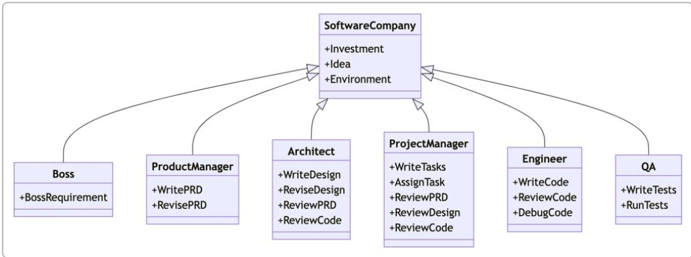

# 企业AI Agent平台（EAAP）调研报告

## 引言

Enterprise AI Agent Platform（EAAP）是指用于构建、部署和管理AI Agent的企业级平台，使其能够自主执行复杂业务任务的系统。这类平台兴起于大语言模型（LLM）能力提升的背景下，旨在将多个智能体（Agent）组合起来完成单个模型难以胜任的复杂、多步骤任务。EAAP通常提供从开发到上线的全流程支持，包括编排多智能体协作、集成企业内外部工具和数据源、保障安全合规和可监控性等[ 12 ]。对于希望在实际业务中利用AI实现自动化的企业来说，如何选择和构建合适的EAAP是一个关键问题——它关系到能否突破原型验证（PoC）阶段，在生产环境中大规模落地可控可靠的Agent解决方案[ 3 ]。

## 行业领先 EAAP 平台概览

当前业界出现了众多EAAP框架和解决方案，既包括开源社区提供的通用框架，也包括技术公司推出的商业平台。下面对其中具有代表性的领先平台做一概览：

### 开源平台

- LangChain - 一个著名的用于构建 LLM 应用的框架，提供了丰富的模块来连接模型与外部工具或数据。LangChain 支持链式思维（Chains）和 Agent 两大范式：开发者可以编排一系列 Prompt 形成固定流程，或使用内置的 Agent 让 LLM 按需调用工具完成用户请求。它拥有广泛的集成能力（对接数据库、检索、API 等）和活跃的社区生态。LangChain 灵活性强，适合复杂定制需求，但相对的，对开发者要求更高，需要手工设计 Prompt 流程和调试 Agent 的行为。在企业中，它常与向量数据库一起用于检索增强生成（RAG）型知识问答等场景，以连接私有数据。优势是丰富的组件和文档、社区支持；挑战是在没有高层抽象下，大型应用的工程复杂度和性能调优需要经验。

- Microsoft AutoGen - 由微软开源的多智能体对话协作框架。AutoGen 允许开发者创建多个可对话的 Agent，这些 Agent 可以是 LLM、工具执行器甚至人类，彼此通过异步消息通信协作完成任务 [ 6, 7 ]。它的特色在于聊天中心的编排模型：以事件驱动的对话替代简单同步循环，从而支持复杂的层级代理团队（例如让“项目经理”Agent 并行指派任务给“财务官”Agent 和“合规审查”Agent）[ 7 ]。这种架构极大提高了并发扩展性，官方测试可支撑成百上千 Agent 同时运行而不会像传统循环那样线性性能下降 [ 6 ]。AutoGen 提供了统一的 ConversableAgent 接口来封装各种参与者，并支持嵌套对话和多轮协商能力，使 Agent 间能进行类似人类的讨论、协商和分工。作为微软出品，它在企业集成方面有优势（例如结合 Azure 的身份管理、合规工具等 [ 8 ]），但目前仍在快速演进中（例如包名和 API 经历过变动 [ 9 ]），需要关注版本兼容。

- OpenAgents - 一个强调“开放协作”的多 Agent 网络框架。OpenAgents 支持创建Agent网络，让成百上千的 AI Agent 长期持续地在一个持久社区中协作 [ 10 ]。与传统一次性任务的 Agent 不同，OpenAgents 旨在打造“Agents 的互联网”：不同 Agent 可在网络中共享资源、建立长期关系、共同维护知识库（如维基、论坛） [ 11, 12 ]。每个网络就是一个数字社区，Agent 持续在线，超越单次任务生命周期，不断学习和积累集体知识 [ 13 ]。框架提供 Python SDK 和Web 可视化界面（OpenAgents Studio）来配置和管理 Agent 网络，并采用模块化可扩展架构方便定制 [ 14 ]。OpenAgents 非常适合长周期项目和开放合作场景，例如多个

Agent共同进行科研攻关并沉淀成果。其优势在于新颖的开放网络理念和持久内存机制，支持人类作为协作者融入其中[ 15 ]；劣势是这种范式尚属前沿，如何在典型企业业务中应用有待探索。

- CrewAI - 一个面向企业的多智能体自动化开源平台。CrewAI 提供从开发、部署到监控的端到端解决方案，帮助开发者快速构建多 Agent协同的自动化流程 [ 16, 17 ]。其特点是高度抽象的角色和流程定义：CrewAI 要求明确为每个 Agent 指定“角色”“目标”和“背景”，并通过内置的流程管理Agent来顺序或分层地编排团队协作 [ 18, 19 ]。这种强约束的设计可减少不确定的涌现行为，提高可靠性 [ 20 ]。CrewAI 甚至内置冲突解决机制，例如如果“研究员”和“验证员”Agent 结论不一致，会自动引入“专家审查”Agent 仲裁 [ 21 ]。框架提供可视化的 UI Studio和模板，使得既可零编码拖拽配置，也支持直接编写代码以满足高级需求 [ 22, 23 ]。其开放源码核心号称每月执行超过六千万次 Agent 调用 [ 24 ]。CrewAI 优势在于上手快（封装了很多模式）、企业级监控（提供Agent性能监测和ROI分析 [ 25, 26 ]）以及与云服务（如 NVIDIA 合作优化 Agent 能力 [ 27 ]）的整合；可能的不足是自由度略受限（必须遵循其预定的角色流程范式），非常复杂的非标准协作可能需要自定义扩展框架。

- MetaGPT - 一个以模拟软件公司协作而闻名的多 Agent 框架  [ 28 ]  。MetaGPT 将多个 GPT Agent 分配为产品经理、架构师、项目经理、工程师、测试等不同角色，让它们按照人类软件团队的工作流来接收任务、制定方案并编写代码  [ 29 ]  。其核心理念是将成熟的人类标准操作流程（SOP）固化为 Agent 团队的协作策略，用一句话来说就是“Code = SOP(Team)”  [ 30 ]  。开发者只需给出“一句话需求”，MetaGPT 即让各角色 Agent 分工合作，从用户故事、竞品分析、需求、设计到最终代码和文档，一步步产出对应结果  [ 29 ]  。这种方法在复杂项目（特别是软件开发）上展现了强大的结构化能力。此外，MetaGPT 开源项目非常活跃，GitHub 上有数万星标，并不断推出相关研究成果（如 ICLR 2025 的工作流自动化论文）以改进框架能力  [ 31 ]  。MetaGPT 的优势在于明确的多Agent分工模式，对软件开发等高度复杂任务有独特效果  [ 28 ] ；但相对而言，它的专用性较强（最初围绕代码生成场景设计），在其他类型任务上直接应用可能需要调整。同时，多角色协同带来高开销（使用GPT-4完成一个完整项目可能花费数美元API费用  [ 32 ] ），需在成本和收益间权衡。

- AgentVerse - 一个由研究社区提出的多 Agent 通用框架。AgentVerse 提供两种主要模式：其一是任务求解模式，用于将多个Agent组装成自动协作系统来解决复杂任务，例如多Agent协同的软件开发、咨询问答等[ 33 ]；其二是模拟模式，支持用户构建自定义环境来观察多个Agent之间的行为互动，用于游戏环境、社会行为研究等[ 34 ]。这一框架旨在模拟人类团队的协作过程，在学术上探索多智能体交互的涌现行为[ 35 ]。AgentVerse项目在2023年上线，相关论文已被接收至ICLR2024 [ 36 ]。目前框架支持工具使用、多Agent对话、以及接入本地LLM等功能，不断迭代中[ 37 ]。其优势在于学术前沿性和灵活性，既能用于实际任务执行，也能用于模拟实验；但由于尚在重构开发（例如模拟和任务模式代码曾独立分支，现在正整合[ 38 ]），文档和稳定性有待加强，短期内在企业生产环境中的直接应用案例还不多。

- SuperAGI - 一个“开发者优先”（dev-first）的开源自主 Agent 框架，定位为帮助开发者快速构建、管理和运行有用的自主 AI Agent [ 39, 40 ]。SuperAGI 支持同时运行多个 Agent 并行工作，并通过工具扩展赋予 Agent 操作外部世界的能力 [ 40, 41 ]。它自带 Web 图形界面，方便开发者在浏览器中创建和监控 Agent [ 42 ]；还有动作控制台，可让人类对 Agent 的关键操作进行交互确认或提供额外输入 [ 42 ]。SuperAGI 注重持久化和观测，提供 Agent 的长短期记忆存储以及性能遥测功能，方便观察每个步骤的输出、token 消耗等 [ 43, 44 ]。另外，它兼容多种向量数据库，以增强 Agent 的知识获取能力 [ 45 ]。作为一个流行项目（GitHub 上  $17\mathrm{k}+$  星），其社区和文档较完善 [ 46, 47 ]。SuperAGI 的优势在于功能全面（工具市场、技能SDK、日志监控一应俱全）且易于部署（提供Docker镜像等）；相对挑战在于作为通用框架可能需要根据具体业务做一定定制开发，以及如何在大规模多Agent情景下优化性能和控制开销。

- Aider - 一个面向开发者的专用 AI 助手工具。Aider 并非用于通用业务流程的 Agent 平台，而是一个命令行下的 AI 编程助手：它允许用户在终端或 IDE 中与大型模型进行对话，让 AI 帮助编写、编辑和重构代码 [ 48, 49 ]。作为开源项目，Aider 支持连接多种 LLM（包括本地模型）[ 50 ]。它的独到之处在于深度集成开发者工作流：会自动扫描整个代码库构建“地图”，以便在大型项目中保持全局上下文 [ 51 ]；支持 Git 集成，AI 对代码的修改会自动生成 commit，方便开发者审查和回滚 [ 52 ]；还能自动运行 lint 和测试，根据测试反馈让 AI 进一步修复代码 [ 53 ]。此外，Aider 允许用户通过在代码里添加注释来对 AI 发出指令，甚至可以接受图像/网页截图作为辅助输入，以及通过语音与之交流 [ 54, 53 ]。它在开发辅助领域广受欢迎（PyPI 下载超410万次 [ 55 ]）。尽管 Aider 不直接用于其他业务场景，但作为一个单一领域的 Agent 实例，展示了 AI Agent 如何与人类紧密协作：由人类提出需求、审阅修改，AI 自动执行代码变更及验证。这种人机共创模式也在许多企业场景中具有借鉴意义。

- Flowise - 一个提供所见即所得界面的开源平台，让用户可视化地构建 AI 工作流和 Agent [ 56 ]。Flowise 基于 Node.js 实现，提供类似数据流编排的拖拽界面，内部利用 LangChain.js 等库处理 LLM 调用 [ 57]。它支持两种主要的开发范式：[ 58, 59 ]一是 AgentFlow，用于创建复杂的多智能体流程，可以将多个协调的 Agent 以工作流方式串联（甚至分布式部署）来完成任务 [ 58 ]；二是 Chatflow，用于生成单 Agent 的对话机器人，支持调用工具以及从各种数据源进行知识检索（即 RAG）。Flowise 还特别关注 Human-in-the-Loop（HITL），允许在关键步骤引入人工审核或反馈 [ 60 ]。在监控方面，它提供完整的执行链路追踪，并可集成 Prometheus、OpenTelemetry 等监控工具以便于观测调优 [ 61 ]。Flowise 对企业用户也很友好：支持 100+ 种主流 LLM、Embedding 模型和向量库，允许本地部署或云部署，架构上可以通过消息队列和 worker 横向扩展以支撑高并发 [ 62 ]。实际上，Flowise 已被一些企业集成，如 Workday 公司于 2023 年收购了 Flowise 以增强其产品智能 [ 63 ]。总体来说，Flowise 的优势在于低代码/零代码，门槛低且易于与现有系统集成（通过 API 或嵌入部件） [ 64 ]；不足可能在于对于非常复杂的自定义逻辑，纯图形界面配置可能不如代码来得灵活，但 Flowise 也提供了直接调用其 SDK 在 TypeScript/Python 中进行扩展的选项 [ 64 ]。

### 商业平台

- Hexaware AgentVerse - 由 Hexaware 公司提供的企业级 AI Agent 商用平台。AgentVerse 内置 560+ 个可直接使用的企业 Agent 模板，针对不同应用场景预构建 [ 65 ]。它能够无缝连接企业现有的 CRM、IT 服务管理（ITSM）、知识库、数据平台、通信工具等系统，然后通过高级的多智能体编排引擎来自动化执行一系列操作，如对话回复、流程文档理解、后台事务处理等 [ 166 ]。AgentVerse 强调企业级治理和一致性，提供完善的权限管理（基于角色的访问控制）、隐私过滤、审计日志和监控，确保部署的大量 Agent 符合安全和合规要求 [ 67, 68 ]。其架构采用多 Agent Runtime，会根据任务上下文将工作分配给最合适的专长 Agent（例如预设的“检索者”“规划者”“推理者”“工具执行者”等），并利用共享记忆和策略约束（如使用工具需符合策略）来协调它们 [ 2 ]。平台还内置持续优化机制，通过评价指标、人工反馈来迭代提升 Agent 表现 [ 69 ]。Hexaware 提供 AgentVerse 主要是为帮助企业快速从试点走向规模化：其预构建连接器和Agent库使得一个用例的Agent可以迅速部署并复制到多个场景，实现真正的业务价值 [ 3 ]。在实际应用中，AgentVerse 已在多个领域取得效果，例如：客户交互领域的“参与型Agent”处理全渠道咨询并从知识库中检索准确答案，提高客户满意度 [ 70, 71]；IT与业务运营中，Agent 可作为ITSM助手自动分类工单、提出解决方案并执行重复性修复 [ 72 ]；金融领域的Agent帮忙汇总数据并撰写合规报告，确保全过程可追溯 [ 73 ]；制造零售中Agent协助需求预测、库存校准并触发供应链行动等 [ 74 ]。作为商业平台，Hexaware AgentVerse 的优势在于端到端企业适配（内建大量行业Best Practice、强大的安全治理）、可快速复制扩展；劣势则可能是灵活度不及开源框架（预设模板之外的特殊需求可能需要定制开发），以及商业产品的成本因素。

- OpenAI / Microsoft Copilot 类产品 - 大模型厂商也在推出企业Agent解决方案。例如 OpenAI 正在其产品中引入 Function Calling/Agents API，使GPT-4能够基于函数接口自主决策调用工具，被视为构建 Agent的基础。Microsoft 则在Copilot、GitHub Copilot X 等产品中嵌入了Agent能力，并提供Semantic Kernel这类SDK帮助企业开发自有的Copilot。这些商业方案通常与特定生态绑定（如Azure平台），优势是与现有办公软件或开发工具深度集成，并提供了身份权限集成、合规审计等企业所需功能；劣势在于可定制性有限且受制于厂商云环境，对于有严格数据本地化要求的企业可能不理想。不过，这类商业Copilot在办公文档助手、软件开发助手等垂直领域已经显示出可用性和价值，未来可能进一步开放成为通用的EAAP。

- 其他商业解决方案 - 市场上还有不少初创公司的 EAAP 产品，例如 Apify（强调Agent流程的构建和变现[ 75 ]）、Moveworks（主攻 IT 支持服务自动化）、IBM Watson Orchestrate（IBM 推出的数字员工 Agent，擅长执行日常业务任务）等等。这些商业方案各有侧重，但共同点是提供友好的界面和预置模板，帮助非 AI 专家的业务人员也能配置和使用 Agent，以此降低落地门槛。不过，在功能完整性和灵活性上，很多商业平台相较开源框架并无明显优势，核心竞争力更多在于售后支持和与自家产品的集成。因此企业在选择时，应综合考虑自身团队能力、定制需求、预算投入以及厂商可靠性等因素。

（以上列举并不穷尽当前所有 EAAP 项目，但涵盖了不同类型和代表性的方案。接下来将对这些平台所采用的技术架构、Agent能力模型、应用案例和优劣对比进行深入分析。）

### 技术架构与设计模式

不同 EAAP 平台在技术架构上各有侧重，但一些共性和趋势值得关注：

- 多智能体体系：EAAP的核心特征是同时调度多个Agent协同工作，而非单一AI模型独立完成任务。这些Agent通常在系统中承担不同角色或功能模块，通过通信机制交互。比如AutoGen将每个参与方抽象为ConversableAgent，通过异步消息总线交流，实现复杂的多方对话和任务委派；CrewAI引入流程管理Agent统一控制多个角色Agent的执行顺序和信息传递，避免无序竞争；Hexaware AgentVerse则采用多Agent运行时，基于任务类型把工作路由给特定能力的Agent（检索型、推理型等）处理。值得一提的是，一些框架支持分层/分布式的Agent结构：例如AutoGen可以创建嵌套的子团队来并行处理子任务；OpenAgents则通过网络拓扑让Agent分散在不同节点协作。总体来说，多Agent架构带来了并行化和专业化的好处，但也引入了分布式系统的挑战，如状态同步、冲突处理等，需要通过架构设计（如共享内存、事务型对话等）加以应对。

- 检索增强生成（RAG）集成：几乎所有 EAAP 都支持或强调将知识检索纳入 Agent 流程，以弥补 LLM 对企业专有数据的不足。常见做法是在 Agent 需要知识时检索向量数据库或文档库，将结果纳入 Prompt。这在客户支持、知识管理等场景尤为重要。很多框架直接提供了此类集成功能：LangChain/LlamaIndex 本身就是为连接 LLM 与外部数据而生；Flowise 的 Chatflow 明确支持针对各种数据源（文本、PDF等）做嵌入式查询；SuperAGI 允许对接多种向量库扩展 Agent 的知识面；Hexaware AgentVerse 的 Agent 也会充当“检索者”从知识库提取策略正确的答案。采用 RAG 的架构通常包含索引构建、查询接口、缓存机制等模块，以确保在满足实时性同时尽量避免公开敏感数据。RAG 的挑战在于检索结果质量和引用时的上下文整合，各平台通过调优 Prompt 模板或引入工具（如浏览器 Agent 访问内网资料）等手段来改进。

- 工具调用与插件机制：赋予 Agent 操作执行力是 EAAP 的另一大支柱。几乎所有框架都允许 Agent 调用外部工具或API，常见方式包括函数式接口（OpenAI function calling）、工具集合（如 SuperAGI 的工具库、LangChain的工具链）等。工具可以是检索类的（如数据库查询）、计算类的（如执行代码、运行数学计算）、业务系统操作类的（如调用CRM接口下单）。AutoGen 允许Agent对接代码执行器或其它服务作为特殊Agent参与对话；LangChain提供了标准的Tool接口，可轻松地将自定义工具包装给Agent使用；CrewAI 和 AgentVerse 等也都支持工具使用的示例。技术架构上，这通常通过预定义插件或工具包(Toolkit）实现，Agent先通过自然语言提出要求，由框架匹配到相应工具函数，执行后再将结果反馈给Agent。需要注意的是，企业应用里对工具使用往往需要严格约束，如Hexaware AgentVerse提到采用策略感知的工具使用（policy-aware tool use）来保证安全[ 2 ]。因此，高级EAAP会在工具层加入权限控制、输入校验和审计功能，以防止Agent滥用指令或调用未授权系统。

- 工作流引擎与状态管理：复杂任务往往涉及多步骤流程和决策分支，这需要EAAP具备一定的工作流控制能力。有的框架选择与现有工作流引擎集成，也有的在内部实现DSL或状态机。例如LangChain可以看作轻量的工作流框架，通过链式调用形成DAG流程；而新兴的LangGraph则更明确地将Agent流程表示为有向图或循环图，使Agent可以在图中循环，进行迭代式的自我改进[ 78, 79 ]。这种显式状态管理解决了早期Agent一次对话有限的缺陷，让Agent能够持续跟踪中间状态并多轮优化[ 80 ]。SuperAGI也提供了任务序列和计划功能，支持定义Agent执行顺序和迭代。OpenAgents通过其事件系统和频道通信实现了对持续对话、多人协作的状态管理[ 81 ]。技术上，状态管理需要考虑存储介质（内存、数据库）、一致性和恢复等问题，一些平台实现了检查点和断点续跑功能（如MetaGPT提供了序列化和断点恢复指南），以方便长流程出错后的调试和继续。

- 微服务与可扩展部署：在企业生产环境，EAAP 需要考虑水平扩展和与现有基础架构的对接。许多平台支持将Agent或其组件以微服务形式部署：OpenAgents 提供 HTTP/GRPC 等传输层，可将每个Agent独立为服务并通过网络组成Agent网 [ 82 ]；Flowise 允许worker节点处理Agent任务，并用消息队列调度，从而实现负载均衡和并发扩展 [ 83 ]。Hexaware AgentVerse 则有大量预建连接器用于连接不同企业系统 [ 66 ]，本质上也是通过微服务/API集成来嵌入Agent能力。对于要求本地部署的场景，开源框架一般都支持 Docker 化，企业可以将其纳入容器编排平台（如 Kubernetes）来管理。扩展性的另一个方面是跨框架互操作，随着 Agent生态的发展，不同系统间Agent通信需求上升。OpenAgents在倡导开放网络，允许外部Agent加入；TowardsAI 对未来框架评估也将跨框架通信作为指标之一 [ 84 ]。目前部分平台通过标准协议（如 HTTP API、LangChain工具标准）实现基本的互通，但要达到真正异构Agent系统的互操作，可能需要行业标准的推动。

- 安全与治理机制：企业对AI Agent的采用还取决于是否具备完善的安全治理能力。这直接体现在架构上对日志审计、权限控制、人类监督等的支持。CrewAI 强调其监控和审计功能，提供对每个Agent任务的时长、工具使用频次、人机用力对比等细粒度数据监控，以评估ROI和风险[ 25, 26 ]。Hexaware AgentVerse将治理作为核心卖点之一，通过角色权限确保Agent只能访问授权资源，隐私过滤避免违规数据输出，并记录所有交互供审计[ 85 ]。许多开源框架也开始重视这点，比如 SuperAGI 添加了操作日志和Telemetry，LangChain引入调用链观察（可用 LangSmith 或 Langfuse 来集中监控）等[ 86, 87 ]。另外，人类审阅（HITL）功能在企业环境相当关键，Flowise、SuperAGI 等均允许配置某些步骤需要人工批准才能继续[ 60 ]。这种在架构上留出“人工网关”的设计，可以大大增加系统的可靠性和可控性。在选择 EAAP 时，企业应优先考虑那些内置了完善治理机制或能够与自家安全体系集成的平台。

### AI Agent 能力模型与协作方式

EAAP平台不仅在技术架构上有所不同，在其内部Agent的能力定义、角色分工、调度协作方式等“参考模型”层面也存在多种范式。下面总结几种典型模式：

- 明确的角色职责划分：许多平台要求在设计时就为每个Agent指定扮演的角色和职责范围，从而减少歧义。比如CrewAI强制开发者定义Agent的角色(Role)、目标(Goal)以及背景(Backstory)[ 88 ]。这样，在执行时每个Agent有清晰的行为边界，也方便引入基于角色的权限管理。又如MetaGPT明确区分出产品经理、架构师、项目经理、工程师、QA等角色，每个角色Agent只能执行特定类型的任务（写PRD、画设计、写代码、测代码等）[ 29 ]。这种专业化提高了多Agent协作效率，就像真正的团队各司其职。此外，一些平台通过角色继承或模板来快速创建Agent，例如AgentVerse提供了一些内置Agent类型（如工具用户Agent、聊天Agent等）供继承扩展。角色划分模式的优点是行为可预测、易于监管，缺点是灵活性稍弱，可能需要预见任务拆分方式。

图：MetaGPT 框架将多个 GPT Agent 分配为产品经理（PM）、架构师（Architect）、项目经理（Project Manager）、工程师（Engineer）、测试（QA）等角色，协作模拟一个“AI 软件公司”来完成复杂的软件开发任务。上图展示了 MetaGPT 中多 Agent 的角色划分和协作关系：需求由“Boss”提供，PM 根据需求撰写产品文档（PRD），Architect 进行系统设计，Project Manager 分配任务并审查，Engineer 编写代码，QA 编写并运行测试。各角色通过中心的“SoftwareCompany”模块（体现预定义的 SOP 流程）进行协调沟通，保障任务从需求到代码的有序推进。这种明确分工和 SOP 指导下的多智能体协作，有助于产生可追溯、结构化的输出，降低涌现风险。

- 自主调度与协商：另一类模型赋予 Agent 更多自治权，由它们自行通过对话协商来确定分工和步骤。AutoGen 就是典型代表：它把多个Agent放在一个异步对话环境中，不预先指定严格流程，而是依靠 Agent 间的自然语言沟通来逐步推进任务 [ 6 ]。例如，一个AutoGen场景中可以有负责总体规划的Agent和具体执行的Agent，规划Agent会通过对话请求执行Agent去干某事，执行Agent完成后再反馈，可能再引出新子任务，诸如此复。这种模式的特点是高灵活性，Agent 可以根据实时情况调整策略，甚至可以出现某种角色动态演化（谁最适合当前子任务谁来）。OpenAgents 的开放网络在一定程度上也是这个理念，每个Agent自主决定在社区中承担何种贡献 [ 11, 89 ]。自主协商模式的好处是适应性强，能处理非预期情形，但代价是难以监管——如果没有引导，多个LLM连续对话可能偏离主题或浪费资源。因此，在企业场景中通常需要结合系统信息或监督Agent来引导协商过程保持正轨。例如，有研究引入“Critic(评论员)”Agent对对话进行监控和适时纠偏，这也是AutoGen等框架支持的模式之一。

- 流程管理与层级控制：为兼顾上述两种模式的优点，不少平台采用了分层调度的协作机制。即在Agent团队中引入一个或多个管理者Agent或元调度器。CrewAI的Process Manager Agent就是一个例子：它相当于团队的项目主管，按照预设业务规则管控信息流和决策流，必要时引入特定Agent解决分歧[ 21 ]。这样普通任务由基础Agent自主处理，一旦出现冲突或重要决策，管理Agent介入协调。类似地，MetaGPT虽然划分了角色，但其核心也是由一个主控模块根据SOP先后调用各角色Agent完成任务[ 30 ]。在这种层级结构下，低层Agent专注各自工作，高层Agent负责监督和汇总，层次清晰。Hexaware AgentVerse描述的“将工作路由给合适专家Agent”也隐含了一个中心调度者的存在2。层级控制模式通常带来更高可靠性和可解释性（因为决策路径固定），非常适合需要严谨审计的场景。不过其设计需要投入额外精力定义流程和规则，好在一些平台（如CrewAI）已经内置常用模式供选择。

- 人类在环协同：几乎所有 EAAP 都支持或鼓励将人类纳入 Agent 环路，形成“Human-AGI Teaming”。这既是出于对 AI 能力局限的弥补，也是降低业务风险的必然要求。实现方式包括：人工确认 - 在Agent执行关键操作前暂停请求人工批准（如SuperAGI的Action Console可让用户授予Agent执行某步的权限[ 42 ]）；人工反馈-Agent给出结论后由人审阅并纠偏，下次Agent会学习改进（CrewAI在PwC案例中集成了实时咨询师反馈回路来完善文档[ 90）；人工提问-允许用户随时介入与Agent对话，以提供新信息或调整方向；人工作为特殊Agent-有些框架甚至将人封装成一个Agent节点，使其可以在多Agent对话里发言，例如AutoGen的ConversableAgent可以是Human，OpenAgents网络更是欢迎人类成员加入[ 15 ]。在企业应用中，人类与Agent协同的典型场景如：AI客服处理用户80%常见咨询，疑难问题转人工；AI决策支持系统给出方案后，由专家审核再执行；AI代码助手写代码，人来做Code Review并测试。良好的EAAP会提供易用界面或API支持这类协同。Flowise的HITL模块就是专门为让人工便捷地插入审核而设计的[ 60 ]。值得注意的是，引入人类能极大提升最终结果质量和信任度，但过频的停顿也会牺牲自动化效率。因此平台常提供策略来定义何时需要人（比如低置信度回答时，或每笔金额超一定阈值的交易需人工复核等）。

- Agent 能力定义与自学习：不同平台在定义 Agent 能力（Abilities/Skills）方面细粒度不同。有的偏重静态配置，例如在Semantic Kernel中需要预先定义好每个Skill及其实现；有的则希望 Agent 动态自我进化。OpenAgents 强调Agent在社区中“持续学习、积累知识”，Agent之间甚至可以共享Wiki来丰富彼此知识 [ 12 ]。AgentVerse 等研究项目探讨让Agent通过模拟长期互动来产生新行为模式。这一方向还在早期，但一些实用功能已在框架中出现，如 SuperAGI 提供Agent记忆存储用于积累对话和经验 [ 92 ]；CrewAI 则允许对 Agent 的提示和行为做A/B测试和持续训练优化，从而迭代提高结果质量 [ 93, 26 ]。未来我们可能看到 Agent 具备半自主的学习调整能力，例如通过强化学习从人类反馈（RLHF）或自主反馈（Self-Reflection）来改进。企业若有此需求，应考察EAAP是否方便地接入训练管道或调优接口。目前大多商用平台还是以规则配置和少量Prompt调优为主，开源的则在积极探索让Agent更智能地自我改进。

综上，各EAAP在Agent协作模型上或多或少体现出以上元素的组合。对企业而言，并不存在“一刀切”的最佳模式，往往需要结合具体应用选择合适的范式：例如高可靠性场景可以选用强流程管控+人审模式；创新探索场景可以尝试自主协商模式让Agent自由发挥；知识密集场景务必加入检索Agent；长期运行任务则考虑持续学习机制等等。

## 实际应用案例与场景分析

为了更具体地了解 EAAP 的价值，我们来看一些当前的参考实现案例和典型应用场景。

- 软件研发助理：EAAP在软件工程领域已有成功应用。例如PwC咨询公司利用CrewAI打造代码生成和文档编写的AI助手[ 94, 90 ]。该系统由多个Agent组成：一些Agent根据自然语言需求生成特定领域的代码，另一些Agent负责执行代码并根据日志进行实时验证，还有Agent整理生成技术规格文档，期间人类顾问可以随时查看和反馈。上线后效果显著——代码生成准确率从原先的约10%跃升到70%以上[ 95 ]。这表明多Agent配合（生成+执行+验证+文档）可以极大提升自动编码的可靠性。另一开源案例是MetaGPT及其衍生产品，模拟一个AI开发团队来完成从需求到交付的全过程。一些创业公司基于MetaGPT开发了“AI开发者团队”服务，让不会编码的客户只需提出创意，AI团队就能产出原型应用[ 96 ]。可以预见，在软件测试、运维等子领域，也会出现更多Agent协作的辅助工具（例如Agent自动生成单元测试用例、Agent监控系统日志自动执行修复等）。

- 客户服务与知识问答：这是企业引入 AI Agent 最普遍的场景之一。传统 FAQ ChatBot 升级为 Agent 后，不仅能从知识库答疑，还能执行操作。例如电商客户咨询退货政策，Agent 不仅回答规则，还可以直接调用订单系统为其办理退货（需要调用 API 并遵守权限）。Hexaware 提供的案例中，有企业部署了全渠道客服 Agent，通过 AgentVerse 连接客服后台、FAQ 数据库和通信渠道，让 Agent 自动响应来自聊天、邮件、电话的查询，实现  $60 - 80\%$  询问更快响应  $97 - 98$  。在 IT 支持方面，IT 帮助台Agent 可以读取公司内部知识库，为员工解答常见技术问题，碰到故障类问题还能调用运维系统执行诸如密码重置、权限开通等操作。典型例子是Moveworks的虚拟IT助理，在许多大企业中每日处理大量重复IT请求。通过EAAP支持的RAG+工单系统集成，Agent能理解员工用自然语言描述的问题，然后检索内部知识得到方案，必要时直接调用系统操作或为疑难问题创建工单，大幅减轻了一线支持团队负担。

- 业务流程自动化（RPA2.0）：AI Agent正在赋能新一代的机器人流程自动化。在许多日常业务操作中，Agent可充当智能机器人完成流程。比如银行与财务领域，有公司用Agent来汇总数据并起草报告：多个Agent分别从不同系统拉取财务数据，一个Agent进行合并分析并生成监管报告草稿，然后另一个Agent（可能是法律合规角色）审阅确保措辞和法规匹配[ 71 ]。整个过程确保每一步都有记录，方便审计监管。在供应链领域，制造企业让Agent协助产销规划：Agent从库存系统、销售预测系统提取数据，运行优化模型（Agent可以调用Python库计算），给出生产计划并直接通知采购部门调整原料订单。这类任务过去可能需要人工花费数天协调，Agent团队可以在短时间内反复试算并提出方案，提高决策速度和精度[ 99 ]。相较传统RPA固定脚本，Agent具有更高智能（能理解非结构化数据、处理异常情况）和灵活适应性，因此被称作RPA2.0。Flowise等平台因其可视化和与各类数据库/API连接的便利，非常适合在这些场景下快速构建原型并集成。

- 知识管理与内容生成：企业内部知识库的维护和利用是另一个Agent大显身手的场景。内部知识中台Agent可以定期抓取公司文档、会议记录，并用向量数据库更新知识索引，然后在员工提问时作为检索Agent提供依据，或者主动生成知识简报推送给相关人员。Agent甚至可以负责文档的分类归档：读取一份新文件内容后自动决定其标签和存放位置。这在咨询、法律等文档密集行业很有价值。再如市场运营场景下，Agent可以帮忙撰写内容：多个Agent一个充当创意文案，另一个充当审校（风格、品牌一致性检查），还有一个负责从产品数据库抓取最新参数插入内容，以协作生成一份市场推广文档。此前OpenAI的函数调用示例就包括营销Agent先拟定活动方案，再调用电子邮件接口群发给客户。大量日常办公内容（报告、邮件、通知）的写作也可以由类似Agent自动完成初稿，再交由人工调整。微软Copilot等产品实际上已经把这变成现实应用。

- 复杂决策支持：在需要综合多方面信息进行决策的场景下，Agent团队可以作为智能助理提供支持。例如企业战略或投标场景，可以有“研究分析Agent”负责搜索和汇总外部信息，“头脑风暴Agent”生成可能的方案，“评估Agent”根据预设指标打分筛选方案，最后生成决策建议报告。这种场景下，Agent并不直接做决定，而是扩充人的能力，让人类决策者可以参考更加全面的信息和中立的分析视角。Anthropic曾披露他们构建了一个多Agent研究系统，让Claude模型的多个实例分别检索文献、汇总见解、相互review，最终合成一份研究分析[ 100 ]。这与人类研究小组的模式类似。虽然这类系统还处于实验性质，但一些前沿企业已经在尝试将其用于情报分析、投资决策支持等高价值领域。

需要强调的是，每个成功的应用案例背后，往往都有对平台能力的巧妙组合和对业务需求的深入理解。EAAP并非万能钥匙，落地时需要解决很多细节问题：如Agent错误如何容错？运行慢如何优化？与现有IT流程如何衔接？等等。因此不少企业采取“小步试错”的策略，在一个垂直用例上验证Agent平台的效果，再逐步扩展到更多领域[ 3 ]。在这些探索过程中，开源EAAP提供了低成本试验田，而商业EAAP则可在试点成功后提供更完善的支撑（比如SLA保障、技术支持）。下面一节，我们将综合前文，对比分析主要平台的优劣与适用性，为企业选型提供参考。

## 平台对比与优劣分析

基于以上调研，我们从多个维度对几个代表性EAAP平台的特性、优劣进行对比：

- 功能全面性：大体上，商业平台（如 AgentVerse）在功能上更“一站式”，内置了安全、监控、连接器等企业需要的所有模块 [ 67 ]。开源框架各有专攻：LangChain/LlamaIndex 偏重数据连接和工具调用 [ 5 ]AutoGen/CrewAI/MetaGPT 偏重多Agent协作编排、Flowise 注重可视化和易用性等。对于要求全套功能且快速上线的企业，商业方案省事但受限于模板；需要定制创新的场景，组合使用多个开源框架往往更灵活。

- 易用性与抽象层：CrewAI、Flowise 等提供了高抽象和图形界面，降低了使用门槛，即使非AI专业人士也能上手构建简单Agent流程 [ 22, 58 ]。这种高抽象的好处是开发快捷（CrewAI 被称为“最快投入生产的多Agent系统” 88），缺点是灵活性受限（必须按框架预设方式思考问题）。相反，LangChain、Semantic Kernel 这类只是提供库的框架，灵活度极高但要求开发团队有较强能力设计整体架构。介于两者之间的如 SuperAGI，提供GUI方便操作也允许深入编码扩展 [ 42, 101 ]。企业需要根据团队能力选择：技术力量薄弱者可考虑有界面和模板的产品，追求差异化者则宁可选灵活框架投入开发。

- 多Agent协作能力：如果应用场景确实需要多个Agent并行/对话完成，CrewAI、AutoGen、OpenAgents、MetaGPT这几款在协作逻辑上更成熟。例如CrewAI的结构化进程适合严谨场景（金融、医疗等需要可控输出）；AutoGen 的异步会话适合需要实时讨论的场景（创意策划、多方博弈）。LangChain单Agent为主，如果用其实现多Agent，需要开发者自行安排通信。SuperAGI则支持并行运行多个Agent但主要仍是各自执行子任务后归并，缺少Agent之间深度交流。AgentVerse和OpenAgents提供更“社交式”的多Agent交互环境，适合模拟社区或游戏等。不过，一般企业应用很少真的需要超过3-5个Agent同时协作，大部分需求仍可通过单Agent串行调用工具解决。所以要谨慎评估是否真的需要复杂多Agent，以免徒增系统复杂度。

- 工具生态与集成：LangChain的一大优势在于其海量的工具和集成模块（Web搜索、数据库查询、邮件发送等等应有尽有），可直接拿来用。Flowise、SuperAGI也有类似工具市场或插件机制，方便扩展Agent能力。AutoGen/AgentVerse等则偏框架本身，对于工具基本依赖开发者接入。商业平台通常提供和主流企业软件的预集成（如AgentVerse内置SAP/ServiceNow等连接），这在需要连通众多老旧系统时是优势。总的来说，如果应用场景需要用到很多外围系统API，选择工具生态丰富的框架会事半功倍；反之如果只是少数几个接口，任何框架都能通过定制代码满足。

- 性能与可扩展性：多Agent系统很容易遇到性能瓶颈。据报道，很多2024年的框架在同时500个Agent运行时就变得困难[ 103 ]。为解决此问题，AutoGen采用了事件驱动异步架构，大幅提升高并发表现[ 6 ]；LangGraph则通过明确有状态循环减少无谓开销[ 104 ]。CrewAI尽管抽象层高，但由于流程受控反而避免了Agent无效对话，资源利用率较好[ 105 ]。Flowwise等支持水平扩展，可将Agent分布到多机处理[ 83 ]。商业AgentVerse宣称可弹性扩展到企业需要的规模，同时通过治理防止资源滥用[ 2 ]。对于小规模内部应用（几个Agent，每天调用量有限）性能不是主要问题；但如果计划让Agent触达大量用户或7x24小时运行，就要关注框架在并发、长时运行下的稳定性。此时选择有明确架构支撑高并发的（AutoGen等）或支持分布式部署的（OpenAgents、Flowwise等）会更好。

- 安全合规：在数据敏感行业，确保Agent不泄露隐私或做出不当行为是第一位的。LangChain 这类工具对安全没有内置考虑，需要在调用层面由开发者自己把关（如屏蔽敏感字段、设置防止特定操作等）。微软 Semantic Kernel 提供了AI原则工具可以过滤不良输出，对企业友好 [ 8 ]。CrewAI、AgentVerse 等通过角色和策略对Agent权限做了限定 [ 2 ]。此外，日志审计能力在合规中非常重要：SuperAGI、Flowwise 都支持输出详细日志甚至接入SIEM系统。对于金融、医疗这类强监管行业，使用通过了认证的商业EAAP可能更让管理层安心，而开源方案需要自己花时间做安全评估和加固。如果采用开源框架，务必在架构周边添加必要的安全组件，比如网络隔离、API权限管理、内容审核（可以用OpenAI的Moderation等）等措施，使整个应用达到企业安全标准。

- 社区与支持：最后一个维度是社区活跃度和技术支持。LangChain拥有最大的社区和丰富的教程资料，新特性更新也很快。MetaGPT在国内外开发者圈都有大量讨论，可以获取经验分享。CrewAI虽是新项目但发展迅速，有自己的论坛和Discord社区[ 106 ]。SuperAGI则有Slack/Discord帮助开发者互助。相对的，一些学术项目（AgentVerse等）文档不全，社区不大，遇到问题可能需要自行解决。商业平台在这方面提供正式的技术支持和培训，这对于缺乏AI专业人才的团队是加分项。综合来看，如果企业希望紧跟前沿、有内部能力解决问题，选择社区活跃的开源框架更容易获得最新想法；若更看重稳妥落地，商业支持服务的价值不容忽视。

综上，并不存在绝对完美的EAAP，只有适合特定场景和团队的选择。在实际决策时，可以考虑以下建议：

- 从需求出发：梳理清楚期望Agent完成的任务种类、涉及的系统接口、并发用户量、安全要求等，然后匹配最符合这些要求的平台。比如高度依赖自有知识库的，就需要RAG能力强的框架；涉及复杂业务流程的，要关注流程编排能力。

- 先试点验证：可先用开源框架做一个小规模PoC验证Agent效果，再决定是否投入更大成本采购商业方案或深度定制。正如Hexaware所言，很多组织停留在PoC阶段无法产出价值，关键在于打通从试验到生产的壁垒3。选择一个易于从开发过渡到生产的框架（如CrewAI这类自带部署/监控工具的[ 22, 107 ]）会有所帮助。

- 关注生态演进：EAAP 领域变化极快，新的框架和工具层出不穷。应持续关注社区动态和成功案例。例如OpenAI、微软等大厂可能推出更完善的Agent框架标准，开放网络协议也可能诞生。企业应避免过度绑定在一个不再更新的方案上，保持灵活性以便根据技术演进调整路线[ 108 ]。

- 团队能力提升：无论选什么平台，人是最终主导。培训团队掌握Prompt工程、多Agent设计原则、错误调优方法非常必要。正如一位开发者所说：“框架是否'企业级’，很大程度取决于你围绕它构建的流程和架构”[ 109 ]。换言之，治理和可靠性不仅是框架自带功能，也包括企业自身的开发运维规范。

## 结论

Enterprise AI Agent Platform正在从概念走向现实，2025-2026年被视为多智能体系统在企业中规模化落地的关键窗口[ 110 ]。本报告调研的众多EAAP平台各有侧重：开源项目为创新和定制提供了沃土，商业方案则在集成和治理上更贴近企业需求。对于希望借助AI自动化提升业务的组织来说，EAAP提供了一种全新的技术路径——通过orchestrating多个专能Agent，企业能够应对更复杂、更动态的业务场景，实现过去难以想象的效率提升和成本节约[ 111, 112 ]。

当然，EAAP也伴随着挑战，包括技术上的（如多Agent协调失控、LLM幻觉和错误）、管理上的（如人员信任、流程变更）以及伦理合规上的（如AI决策透明性）。这需要企业在采用EAAP时，既拥抱其带来的范式转变，又保持审慎，通过人机协同和严谨的治理来驾驭这股新力量。

总的来说，EAAP正引领企业迈向“Agent经济”时代——一个智能Agent团队在后台协同工作，前台人与AI自然互动的时代[ 113 ]。选择合适的平台并逐步积累实践经验，将使企业在这一波技术浪潮中抢占先机，释放出前所未有的生产力。在这一旅程中，希望本报告提供的分析对各位有所裨益，为EAAP的选型和应用指明方向。[ 109, 1 ]

## 参考文献

1. **[1, 2, 3, 65–74, 85, 97–99, 111–112]**
   **Hexaware AgentVerse | Enterprise AI Agents Platform**
   [https://hexaware.com/platforms/agentverse/](https://hexaware.com/platforms/agentverse/)

2. **[4, 5, 8, 9, 75, 108–109]**
   **What AI Agent Framework/Stack Do You Recommend for Enterprise Use?**
   Reddit · r/AI_Agents
   [https://www.reddit.com/r/AI_Agents/comments/1nhi0yq/what_ai_agent_frameworkstack_do_you_recommend_for/](https://www.reddit.com/r/AI_Agents/comments/1nhi0yq/what_ai_agent_frameworkstack_do_you_recommend_for/)

3. **[6, 7, 18–21, 77–80, 84, 86–88, 102–105, 110, 113]**
   **Rosario, D. (2025). *The 4 Best Open Source Multi-Agent AI Frameworks 2026*. Towards AI**
   [https://pub.towardsai.net/the-4-best-open-source-multi-agent-ai-frameworks-2026-9da389f9407a](https://pub.towardsai.net/the-4-best-open-source-multi-agent-ai-frameworks-2026-9da389f9407a)

4. **[10–15, 76, 81–82, 89, 91]**
   **OpenAgents Documentation – Overview**
   [https://openagents.org/docs/getting-started/overview](https://openagents.org/docs/getting-started/overview)

5. **[16, 17, 22, 93, 107]**
   **CrewAI – The Leading Multi-Agent Platform**
   [https://www.crewai.com/](https://www.crewai.com/)

6. **[23, 24, 27, 106]**
   **CrewAI – Open Source**
   [https://www.crewai.com/open-source](https://www.crewai.com/open-source)

7. **[25, 26, 90, 94, 95]**
   **CrewAI Case Study: PwC Accelerates Enterprise-Scale GenAI Adoption**
   [https://www.crewai.com/case-studies/pwc-accelerates-enterprise-scale-genai-adoption-with-crewai](https://www.crewai.com/case-studies/pwc-accelerates-enterprise-scale-genai-adoption-with-crewai)

8. **[28, 31, 96]**
   **MetaGPT: The Multi-Agent Framework**
   GitHub Repository: [https://github.com/FoundationAgents/MetaGPT](https://github.com/FoundationAgents/MetaGPT)
   Documentation: https://docs_deepwisdom.ai/main/en/guide/get_started/introduction.html

9. **[33–38]**
   **AgentVerse: A Multi-Agent Framework for Task Solving and Simulation**
   GitHub Repository: [https://github.com/OpenBMB/AgentVerse](https://github.com/OpenBMB/AgentVerse)

10. **[39, 46]**
    **SuperAGI**
    GitHub Repository: [https://github.com/TransformerOptimus/SuperAGI](https://github.com/TransformerOptimus/SuperAGI)

11. **[40–45, 47, 92, 101]**
    **SuperAGI Documentation – Introduction**
    [https://superagi.com/docs/](https://superagi.com/docs/)

12. **[48]**
    **Aider: AI Pair Programming in Your Terminal**
    GitHub Repository: [https://github.com/magnusahlden/aider_ollama](https://github.com/magnusahlden/aider_ollama)

13. **[49–55]**
    **Aider – AI Pair Programming in Your Terminal (Official Site)**
    [https://aider.chat/](https://aider.chat/)

14. **[56]**
    **Flowise Documentation**
    [https://docs.flowiseai.com/](https://docs.flowiseai.com/)

15. **[57]**
    **Found a fun little open source project called Flowise**
    Reddit · r/aipromptprogramming
    [https://www.reddit.com/r/aipromptprogramming/comments/14a86iu/found_a_fun_little_open_source_project_called/](https://www.reddit.com/r/aipromptprogramming/comments/14a86iu/found_a_fun_little_open_source_project_called/)

16. **[58–64, 83]**
    **Flowise – Build AI Agents, Visually**
    [https://flowiseai.com/](https://flowiseai.com/)
